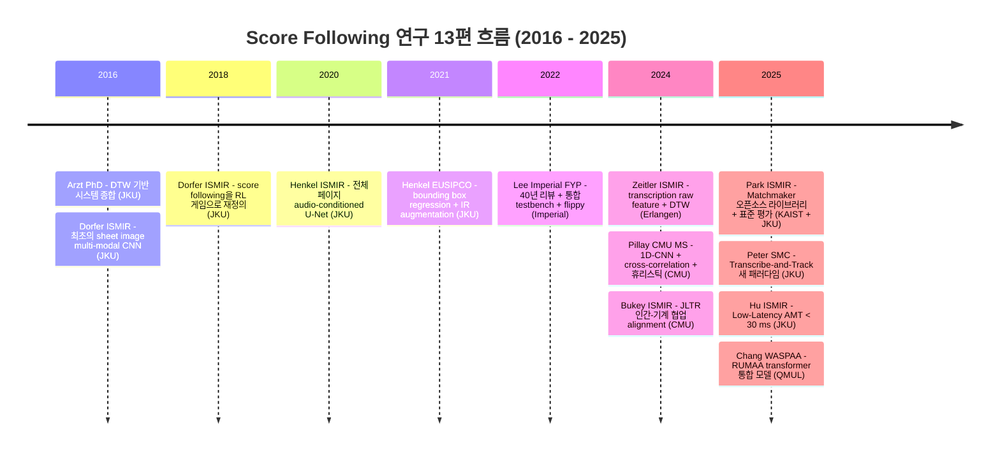
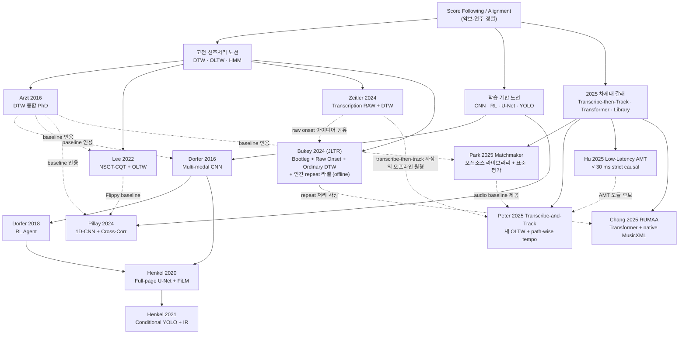

# Score Following 연구 13편의 관계도와 흐름

## 도입: 13편을 한 자리에 놓는 이유

이 문서는 Score Following 분야의 서로 다른 시점·접근·기관에서 나온 13편의 논문을 한 자리에 모아, "이 분야가 어떤 문제를 어떻게 정의하고, 어떤 도구로 풀어 왔으며, 어디까지 와 있는가"를 한 번에 조망하기 위해 만들어졌다. 각 논문에 대해서는 이미 개별 분석 보고서와 비전공자 해설이 따로 존재한다. 그러나 13편을 따로따로 읽으면, "Dorfer 2016과 Dorfer 2018은 같은 사람이 같은 데이터로 무엇을 바꾼 것인가", "Henkel 2020의 U-Net과 Henkel 2021의 YOLO는 왜 같은 그룹에서 1년 차이로 나온 것인가", "Arzt 2016 박사논문과 Lee 2022 학부 보고서는 무엇을 공유하고 무엇이 다른가", "JKU 그룹이 2025년에 동시 발표한 세 편(Matchmaker, Transcribe-and-Track, Low-Latency AMT)이 어떻게 한 응용 스택으로 묶이는가" 같은 비교가 시야에서 사라진다. 본 문서는 그 빈 자리를 메우기 위해, 13편을 시간선·계보·표상·기여·인용 관계라는 다섯 축에서 교차 정리한다.

내용 구성은 산문 위주이며, 도식 두 개와 표 세 개를 섞어 한 화면에서 분야 전체를 훑어볼 수 있게 했다. 13편은 각각 (1) Arzt 2016, (2) Dorfer 2016, (3) Dorfer 2018, (4) Henkel 2020, (5) Henkel 2021, (6) Lee 2022, (7) Zeitler 2024, (8) Pillay 2024, (9) Bukey 2024, (10) Park 2025 Matchmaker, (11) Peter-Hu-Widmer 2025 Transcribe-and-Track, (12) Hu-Peter-Schlüter-Widmer 2025 Low-Latency AMT, (13) Chang-Dixon-Benetos 2025 RUMAA이다. 9번째 논문(Bukey 2024, JLTR)은 엄밀히 말해 실시간 score following이 아니라 오프라인 audio-to-score alignment를 다루는 인접 분야의 작업이고, 13번째 논문(RUMAA)도 1분 청크 한정의 오프라인 통합 모델이지만, 두 편 모두 분야 전체에 결정적 시사점을 주기에 포함했다. 10-13번 네 편(Tier 1)은 모두 2025년에 발표된 작업으로, 분야가 18개월 동안 실제로 어떻게 움직였는지를 결정하는 네 갈래 흐름 — 표준화된 평가 인프라(Matchmaker), transcribe-then-track 패러다임(11번), 저지연 real-time AMT(12번), transformer + native MusicXML 통합 모델(RUMAA) — 을 각각 대표한다. 모든 인용·비교는 각 분석 보고서의 "선행연구와 비교", "방법론과 데이터", "후속 연구와 핵심 참고문헌" 섹션에 명시된 사실에서만 가져왔다.

## 시간선과 계보 한 눈에

먼저 13편을 발표 연도와 형태별로 한 줄에 펼쳐 보면 분야의 골격이 단번에 드러난다.

13편 가운데 여덟 편(1, 2, 3, 4, 5와 10, 11, 12)이 오스트리아 린츠의 Johannes Kepler University 소속 연구진(Arzt, Dorfer, Henkel, Widmer, Peter, Hu, Schlüter, 그리고 KAIST와 공동 출판한 Park-Cancino-Chacón-Chiruthapudi)에게서 나온다는 점이 눈에 띈다. 이 그룹은 2016년 박사학위논문(Arzt)으로 DTW 노선을 종합한 직후, 같은 해 신참 연구자(Dorfer)의 손을 거쳐 sheet image 기반 CNN으로 패러다임을 전환했고, 이후 2018·2020·2021로 매년 한 단계씩 출력 표상을 바꾸며 학습 기반 노선을 다듬었다. 그리고 2025년에 들어 같은 그룹이 세 편(10번 Matchmaker, 11번 Transcribe-and-Track, 12번 Low-Latency AMT)을 동시에 발표하며 분야의 다음 10년을 위한 인프라를 구축했다 — 라이브러리, 시스템, 그리고 그 시스템의 저지연 모듈이 한 응용 스택을 이룬다. 이에 비해 Lee 2022는 영국 Imperial College의 학부 졸업 프로젝트, Zeitler 2024는 독일 Erlangen의 International Audio Laboratories, Pillay 2024와 Bukey 2024는 모두 미국 CMU, RUMAA(13번)는 영국 QMUL의 작업이다. 특히 13번 RUMAA는 JKU 라인이 도달하지 못한 한 가지 — transformer로 alignment·transcription·mistake detection을 통합하면서 native MusicXML 반복 기호를 처리 — 를 정조준하면서, 분야가 어디로 더 갈 수 있는지를 보여주는 또 다른 갈래다.

이 시간선을 영향 관계로 다시 그리면 세 갈래가 분명해진다(2025년에 새 갈래가 합류).

학습 기반 노선이 거의 일직선으로 JKU 그룹 안에서 진화하는 반면, 고전 신호처리 노선은 외부 그룹들에 흩어져 있고 서로 직접 잇는 화살표가 약하다. 2025년의 차세대 갈래는 다시 JKU 그룹(10번 Matchmaker는 KAIST와 공동, 11-12번은 JKU 단독)이 세 편 + QMUL이 한 편(13번 RUMAA)을 동시에 내놓으면서, 분야의 무게중심이 이 두 그룹으로 다시 이동한 모습이다. Arzt 2016 박사논문은 후속 학습기반 논문들과 외부 학부/석사 작업들, 그리고 2025년의 Matchmaker baseline에서까지 모두 "DTW 시대의 종합판이자 비교 기준선"으로 거듭 인용된다. 가장 인상적인 영향 관계는 Zeitler 2024와 Bukey 2024(JLTR)에서 나타난 "raw onset 확률을 정렬에 그대로 사용하자"는 사상이 Peter 2025(11번)에서 transcribe-then-track이라는 분명한 패러다임으로 응축되었다는 점이다. JLTR 자체가 알고리즘으로는 ordinary DTW에 머물지만 입력 표현 측에서 학습된 표상을 차용한다는 점에서 Zeitler와 사상이 닿아 있고, Peter 2025는 그 사상을 실시간 시스템으로 끌어올리면서 audio OLTW의 정확도 plateau를 정량으로 입증한다.

## 두 갈래 노선: 고전 신호 처리와 학습 기반의 분기

2024년까지의 9편을 알고리즘 패러다임으로 가르면 자연스럽게 두 갈래가 된다(2025년의 네 편은 뒤의 "세 번째 갈래"에서 따로 다룬다).

**고전 신호처리 노선**은 손으로 설계한 음향 특징(chroma, onset, CQT, sliCQ, 멀티레이트 필터뱅크)을 입력으로 두고, DTW나 그 온라인 변형(OLTW), 또는 HMM/그래프 모델로 정렬을 푼다. 이 갈래의 대표 논문은 Arzt 2016, Lee 2022, Zeitler 2024, Bukey 2024 네 편이다. Arzt는 ODTW에 tempo model, distance normalization, multi-performance reference, fingerprint retrieval, multi-agent hypothesis tracking을 모듈식으로 결합해 한 시스템 안에 모았다. Lee는 정확히 그 OLTW 단계를 그대로 두고, 입력 측 특징 추출만 FFT 기반 pseudo-CQT에서 sliCQ로 갈아끼워 봄으로써 "특징 선택이 실시간 score following 성능을 얼마나 좌우하는가"를 깔끔한 ablation으로 보였다. Zeitler는 한 발 더 나아가 hand-crafted feature 자체를 신경망 transcription 모델의 raw onset/frame 확률로 대체하면서도, 정렬 알고리즘만큼은 기존 Sync Toolbox의 MrMsDTW를 그대로 쓴다. Bukey 2024(JLTR)는 Zeitler와 거의 같은 사상을 오프라인 audio-to-score alignment 쪽으로 가져온다. 즉 score 측에는 bootleg score(image)에 measure detection을 끼워 넣고, audio 측에는 Onsets and Frames의 raw onset probability를 그대로 쓰며, 정렬은 librosa의 ordinary DTW로 푼다. 다만 자동 jump 처리를 시도하지 않고, 사용자가 페이지당 ~6초의 클릭으로 repeat을 라벨링하게 한다는 점이 결정적으로 다르다. 이 노선 전체는 "DTW를 둔 채 입력 표현만 점점 정교하게 만드는" 방향으로 진화해 왔고, JLTR은 거기에 "인간 라벨링이라는 저비용 외부 신호를 한 번 끼워 넣자"는 실용적 설계 결정을 추가한다고 요약할 수 있다.

**학습 기반 노선**은 Dorfer 2016에서 출발한다. 그 전까지 score following이 의존하던 MusicXML, MIDI 같은 기호 표현 의존성을 깨고, 악보 이미지와 스펙트로그램을 end-to-end 멀티모달 CNN에 그대로 입력해 위치를 분류 문제로 푸는 시도가 처음으로 등장한다. 그 다음 Dorfer 2018은 동일한 데이터·동일한 CNN 백본을 거의 그대로 쓰면서 출력 헤드와 학습 패러다임만 강화학습으로 바꾼다. 이 작은 변경만으로 Nottingham에서 완주율이 0.43에서 0.96으로 뛴다는 사실은, 분야의 병목이 알고리즘 패러다임 자체에 있었음을 보여준다. Henkel 2020은 입력 측을 staff snippet에서 전체 페이지로 키워 OMR 의존성을 마지막까지 제거하고, 출력 측은 referring image segmentation으로 재정의해 audio-conditioned U-Net + FiLM 구조를 도입한다. Henkel 2021은 그 segmentation 출력을 단일 bounding box 회귀로 다시 한 번 단순화하면서, 학습 시점에 IR(Impulse Response)을 컨볼루션해 합성-실제 도메인 갭을 절반 가량 메운다. Pillay 2024는 같은 학습 노선이지만 입력을 sheet image가 아니라 piano roll로 잡고, attention/U-Net 대신 가벼운 1D-CNN 인코더 둘과 교차상관을 결합해 ms 단위의 추론 지연을 노린다.

두 노선의 차이는 근본적이다. 고전 신호처리 노선은 정렬 비용 함수가 명시적이고 통제 가능한 대신, 입력 특징의 표현력이 천장이 된다. 학습 기반 노선은 표현력의 천장은 데이터로 깨뜨릴 수 있지만, 그 대가로 합성 도메인에 과적합되거나 반복 패턴에서 모드 점프를 일으키는 등 새로운 종류의 실패를 떠안는다. 앞선 9편을 함께 읽었을 때 가장 분명해지는 사실은 이 두 노선이 별개로 가는 것이 아니라, "Zeitler 2024가 학습된 transcription을 DTW에 끼워 넣고", "Pillay 2024가 신경 매처에 휴리스틱 규칙을 결합하며", "Bukey 2024가 학습된 bootleg/onset 표상에 사람의 라벨링까지 결합하는" 식으로 점차 섞이고 있다는 점이다. 특히 JLTR은 "완전 자동화"라는 분야의 오랜 목표를 한 번 비틀어, 사람이 단 두 번 클릭함으로써 발생하는 비용을 받아들이는 대신 정확도를 33%에서 82%로 끌어올린다는 또 다른 형태의 절충을 제시한다.

## 세 번째 갈래: 2025년의 차세대 노선

2025년에 등장한 네 편(10-13번)은 위의 두 갈래 어느 쪽에도 깔끔히 들어가지 않는 새로운 패턴을 만든다. 이를 차세대 갈래라 부른다 — 분야의 다음 10년이 어떤 모습일지 결정하는 네 가지 흐름이 동시에 분기한 것이다.

**(1) 표준화된 평가 인프라.** 분석 10번 Matchmaker는 score-following 분야가 40년 동안 갖추지 못한 공통 평가 트랙을 만들었다. OLTW-Dixon, OLTW-Arzt, HMM 세 알고리즘을 동일 인터페이스로 구현하고, (n)ASAP·Batik·Vienna4x22 184 연주에서 공평하게 비교한다. 결론은 분명하다 — **OLTW-Arzt + log-spectral-energy(LSE) 조합이 정확도와 지연 모두에서 가장 균형잡힌 baseline**. 이 결과는 후속 논문이 새로운 알고리즘을 발표할 때 반드시 넘어야 할 기준선이 되었고, partitura를 통한 MusicXML/MIDI/MEI 통합 입력과 두 줄짜리 API는 응용 개발자가 score following을 박사과정 통합 작업이 아닌 라이브러리 호출로 다룰 수 있게 만들었다.

**(2) Transcribe-then-track 패러다임.** 분석 11번 Peter-Hu-Widmer는 audio OLTW가 정확도 plateau에 도달했다는 분야 진단을 4종 audio 특징(NS·NC·LNSO·LNCO)의 동일 알고리즘 ablation으로 정량 입증하고, 그 plateau를 돌파하는 새 패러다임 — 오디오를 한 번 음표 시퀀스로 변환한 뒤 심볼 도메인에서 정렬 — 을 제시한다. 새 OLTW는 pitch error + path-wise tempo 기반 time error의 결합 거리 함수와 directional weight + tempo matrix를 갖는다. 결과는 robustness 91.67%·≤100 ms quantile 88%로 audio-only baseline 대비 큰 폭의 우위. 이 사상의 가장 직접적인 선행은 같은 분야의 분석 7번 Zeitler 2024(transcription raw feature를 오프라인 DTW에 투입)이며, 분석 11번은 그것을 실시간 + 새 OLTW로 끌어올린 후속이라 읽힌다.

**(3) 저지연 real-time AMT.** 분석 12번 Hu-Peter-Schlüter-Widmer는 분야가 그동안 무비판적으로 사용해 온 "online" 개념을 정조준한다. 보고된 지연 174 ms의 Mobile-AMT(Kusaka-Maezawa 2024)에 SE 층의 10초 lookahead가 숨어 있다는 지적부터, strict causality 보장 + STFT 비대칭 윈도우 + acoustic stack 공유까지 세 갈래의 ablation으로 30 ms 지연에서 비-causal baseline 수준 정확도가 가능함을 보인다. 10 ms 지연에서는 정확도 손실이 크다는 negative finding을 정직하게 보고. 본 논문이 분석 11번의 transcription 모듈로 결합되면, 174 ms 지연이 30 ms 수준으로 떨어지면서 자동 반주 같은 시간 민감 응용까지 가능해진다.

**(4) Transformer + native MusicXML 통합 모델.** 분석 13번 RUMAA는 위의 세 갈래와 분명히 다른 트랙을 간다. 하나의 transformer로 alignment + score-informed transcription + mistake detection 세 task를 통합 처리하면서, 사람이 미리 unfold한 score 없이 MusicXML의 반복 기호를 native로 처리한다. CLaMP2의 사전학습 M3 score encoder + YourMT3+의 사전학습 audio encoder를 그대로 가져와 6-block hierarchical cross-attention decoder를 새로 학습하는 모듈러 결합. 결과는 인상적 — 비-반복 악보에서 F_align 98.4(SOTA HMM 99.0과 1% 차이), 반복 악보에서는 RUMAA 98.4 vs 베이스라인 12.7-36.4(최대 87% drop). 1분 청크 한정과 피아노 솔로 한정이라는 한계는 분명하지만, 분야가 transformer + native MusicXML로 진입할 수 있음을 처음 정량 검증.

이 네 갈래가 한 응용 스택으로 어떻게 묶이는가는 본 프로젝트의 별도 문서 `12_페이지터너_적용_권고.md`에서 페이지 터너 응용 관점으로 정리한다. 핵심만 짚으면 — Matchmaker(10번)가 백엔드 라이브러리, Peter 2025(11번)가 그 안에 끼워 넣을 가장 정확한 정렬 모듈, Hu 2025(12번)가 그 모듈의 저지연 AMT 컴포넌트, RUMAA(13번)가 곡 추가 단계의 사전 정렬 + 반복 자동 처리 — 이 네 편은 **분야의 다음 10년을 위한 한 응용 스택의 네 부품**이라는 점이 가장 자연스러운 읽기다.

## 3가지 입력 표상 비교

같은 score following / alignment 문제라도 "score 측을 컴퓨터에게 어떻게 보여주는가"는 시기와 그룹에 따라 크게 달랐다. 2024년까지의 9편을 그 축에서 정리하면 세 갈래가 보인다.

| 표상 (score 측) | 해당 논문 | 핵심 |
|---|---|---|
| Symbolic (MIDI / MusicXML / piano roll) | Arzt 2016, Lee 2022, Zeitler 2024, Pillay 2024 | 컴퓨터가 직접 읽을 수 있는 기호 표현. DTW/OLTW의 거리 비용 또는 cross-correlation 매칭에 즉시 사용 가능. 데이터 준비 비용은 OMR 또는 사람 입력에 의존. |
| Sheet image (악보 이미지) | Dorfer 2016, Dorfer 2018, Henkel 2020, Henkel 2021, Bukey 2024 | 악보를 픽셀로 직접 입력. OMR과 기호 변환을 모두 우회. 단성 staff snippet에서 시작해 전체 페이지로 확장. JLTR(Bukey 2024)은 sheet image PDF에 measure detection을 끼운 뒤 bootleg score(notehead+staff line의 binary matrix)로 변환해 사용. |
| Transcription raw feature | Zeitler 2024, Bukey 2024 | 오디오에서 학습 기반 transcription 모델이 만든 onset/frame 확률을 score 또는 audio 양 쪽 모두의 입력 표현으로 사용. 실질적으로는 "soft piano roll". JLTR은 audio 측에 Onsets and Frames의 raw onset probability를 그대로 쓴다. |

Arzt 2016은 symbolic score를 전제로 한 박사논문 시대의 정점이다. Dorfer 2016은 "MIDI/MusicXML 의존성을 깬다"는 단 하나의 슬로건으로 sheet image 노선을 열었고, Dorfer 2018·Henkel 2020·Henkel 2021로 이어지면서 입력 단위가 staff snippet → unrolled image → 전체 페이지로 점점 커지고, 출력 표상이 1D bucket → segmentation mask → bounding box로 점점 의미론적으로 명료해진다. Lee 2022는 다시 symbolic score로 돌아오지만, 이때의 symbolic은 "audio-to-MIDI 라인 안에서 offline ground truth를 자동 생성하는 ASM 정렬기"라는 새로운 역할을 부여받는다. Pillay 2024는 piano roll을 학습 가능한 잠재 표현으로 한 번 압축한 뒤 그 위에서 cross-correlation을 한다는 점에서, symbolic 표상과 학습 기반 표상의 경계에 서 있다. Zeitler 2024는 가장 새롭다. 네트워크가 만든 onset/frame 확률을 thresholding 하지 않고 그대로 DTW의 입력으로 쓰기 때문에, 이 표상은 symbolic도 image도 아닌 "학습된 부드러운 piano roll"이라는 제3의 위치에 자리한다. Bukey 2024(JLTR)는 score 측에서는 sheet image 노선(Yang et al.의 bootleg + Waloschek의 measure detection을 결합)을 이어받고, audio 측에서는 Zeitler와 같은 raw onset 확률 사상을 채택해, 두 갈래 표상을 한 시스템 안에서 동시에 사용한다는 점에서 표상 통합의 한 사례를 이룬다.

이 표상의 변화가 곧 score following / alignment 분야의 진화의 줄거리다. 처음에는 score를 사람이 미리 컴퓨터가 읽을 수 있게 정리해 주어야 했고, 다음에는 사진 한 장만 있어도 되도록 학습으로 그 차이를 흡수했으며, 가장 최근에는 오디오에서 추출된 학습된 표현이 다시 score 표현으로 회수되는 단계로 가고 있다.

## 핵심 contribution 매트릭스

13편을 나란히 두면 어떤 차원이 어떻게 옮겨갔는지 표 한 장으로 보인다.

| 논문 | 입력 modality | 알고리즘 | 학습 여부 | Polyphony | Real-time | 핵심 contribution |
|---|---|---|---|---|---|---|
| Arzt 2016 (PhD) | 오디오 + symbolic score | ODTW + tempo model + fingerprint retrieval + multi-agent hypothesis tracking | No (모듈형 공학) | Yes (오케스트라 포함) | Yes (실연 시연) | DTW 노선 종합. 추적·작품식별·강건성을 한 시스템으로 통합 |
| Dorfer 2016 (ISMIR) | 오디오 + 단일 staff sheet image | Multi-modal CNN, soft-target bucket classification | Yes (지도학습) | No (단성, 단일 staff) | Online 시나리오 모사 | OMR 없이 sheet image로 직접 score following 가능함을 첫 입증 |
| Dorfer 2018 (ISMIR) | 오디오 + unrolled sheet image | A2C/REINFORCE 강화학습, 속도 제어 MDP | Yes (RL) | Yes (Mutopia 다성) | Yes (Gym 환경) | Score following을 시퀀스 결정 문제(게임)로 재정의 |
| Henkel 2020 (ISMIR) | 오디오 + 전체 페이지 sheet image | Audio-conditioned U-Net + FiLM, referring image segmentation | Yes (지도학습) | Yes (피아노 다성) | Yes | OMR 없이 full page에서 fine-grained 정밀도 SOTA |
| Henkel 2021 (EUSIPCO) | 오디오 + 전체 페이지 sheet image | Conditional YOLO + FiLM, bounding box regression, IR augmentation | Yes (지도학습) | Yes (피아노 다성) | Yes (~20 fps) | 출력을 단일 박스로 단순화 + IR로 합성-실제 갭 절반으로 |
| Lee 2022 (Imperial FYP) | 오디오 + symbolic score | NSGT-CQT + OLTW (실시간), ASM (오프라인 GT 생성) | No (sliCQ는 신호처리) | Yes (Bach10, BWV846) | Yes | 통합 testbench + QualScofo 데이터셋 + flippy 코드 공개 |
| Zeitler 2024 (ISMIR) | 오디오 (양 측 모두) | Transcription RAW feature + MrMsDTW, T3 fine-tuning | 부분적 (transcription 학습된 것) | Yes (피아노) | No (오프라인 동기화) | Transcription의 중간 확률을 그대로 DTW 입력으로 |
| Pillay 2024 (CMU MS) | Piano roll (오디오 → MIDI 변환 후) | 1D-CNN 인코더 + cross-correlation + 휴리스틱 | Yes (지도학습) | Yes (피아노) | Yes (1.1ms 추론) | 신경 매처 + 휴리스틱 + MIDIOgre 공개 |
| Bukey 2024 (ISMIR, JLTR) | Sheet image (PDF) + 오디오 | Bootleg score + measure detection + raw onset 확률 + ordinary DTW + 인간 repeat 라벨 | 부분적 (transcription/measure detection 사전학습) | Yes (피아노 + 일부 multi-instrument) | No (오프라인 alignment) | Human-in-the-loop alignment(페이지당 ~6초 클릭으로 33%→82% MAcc) + measure-aware 평가 + 코드 공개 |
| Park 2025 Matchmaker (ISMIR) | 오디오 + symbolic score (MusicXML/MIDI/MEI via partitura) | OLTW-Dixon, OLTW-Arzt(Cython), HMM 세 알고리즘 모듈식 | No (라이브러리 자체) | Yes (피아노) | Yes (라이브 audio device 입력) | 표준화된 오픈소스 라이브러리 + (n)ASAP·Batik·Vienna4x22 184 연주 공평 비교 + 두 줄 API |
| Peter 2025 Transcribe-and-Track (SMC) | 오디오 (실시간 AMT 후 심볼) + symbolic score | 새 심볼 레벨 OLTW + pitch+time pairwise distance + path-wise tempo matrix | 부분적 (Kwon-Jeong-Nam AMT 사전학습) | Yes (피아노) | Yes (174 ms AMT 지연) | Audio OLTW plateau 정량 입증 + transcribe-then-track 새 패러다임 + audio-only 대비 큰 폭 우위 |
| Hu 2025 Low-Latency AMT (ISMIR) | 오디오 (실시간 AMT) | Causal-AMT — 모든 conv strict causal + SE 제거 + acoustic stack 공유 + 비대칭 STFT 윈도우 | Yes (지도학습) | Yes (피아노) | Yes (10-30 ms 알고리즘적 지연) | Online ≠ Real-time 진단 + 30 ms baseline 오픈소스 + Mobile-AMT의 숨은 SE 지연 폭로 |
| Chang 2025 RUMAA (WASPAA) | 오디오 + MusicXML (반복기호 native) | 6-block transformer decoder + hierarchical cross-attention + tri-stream parallel decoding | Yes (M3 + YourMT3+ 사전학습 + 새 디코더) | Yes (피아노) | No (1분 청크 오프라인) | Alignment + transcription + mistake detection 통합 + native repeat 처리(F_align 98.4 vs 베이스라인 12.7) |

이 표만 보면 분야가 그동안 무엇을 한 것인지가 한눈에 들어온다. (1) 입력은 symbolic → sheet image → transcription raw feature → piano roll로 다양해졌고, JLTR에 와서 sheet image와 transcription raw feature가 한 시스템 안에 동시에 들어온다. (2) 학습 비중은 0%(Arzt, Lee)에서 100%(Dorfer 2016/2018, Henkel 2020/2021, Pillay)로 옮겨갔고, 2024년의 Zeitler·Bukey는 다시 학습 기반 입력 + 고전 정렬 알고리즘이라는 하이브리드로 돌아온다. (3) Polyphony 처리는 처음엔 단성에서 시작했지만 2018년 이후 모든 논문이 다성을 다룬다. JLTR은 일부 multi-instrument(비-피아노)까지 평가에 포함시킨 첫 사례에 가깝다. (4) Real-time은 Zeitler·Bukey·RUMAA(오프라인 1분 청크)를 빼면 모두 충족하지만, 실제 무대 실연에 적용 가능한 수준의 강건성은 여전히 어느 한 편도 단독으로 충분하다고 주장하지 않는다. (5) JLTR은 "사람이 잠깐 라벨링한다"는 새로운 축을 도입함으로써, 자동화율과 정확도의 trade-off 곡선 자체를 바꾼 첫 번째 작업이다.

## 누가 누구를 어떻게 인용·발전시켰는가

앞선 9편을 읽고 나면 "JKU 한 그룹의 5편이 거의 한 사람의 박사 연구처럼 이어진다"는 인상이 분명해진다. 그 줄거리를 따라가 보자.

Arzt 2016은 출발선이다. 이 박사논문이 제시한 ODTW + tempo model + multi-agent tracking이라는 모듈 조합은 이후 모든 논문에서 "DTW 시대의 종합 baseline"으로 인용된다. Dorfer 2016은 같은 그룹의 후배 연구자로서 Arzt의 baseline을 직접 비교 대상으로 삼지는 않지만, 같은 응용(자동 페이지 넘김, 콘서트 시각화 동기화, 자동 반주)을 동기로 가져오면서 "그러나 그 시스템은 모두 기호 악보에 의존한다"는 약점을 정면으로 공격한다. 즉 Dorfer 2016의 존재 이유 자체가 Arzt 라인을 "기호 의존성" 한 점으로 환원해 비판하는 데 있다.

Dorfer 2018은 Dorfer 2016의 직속 후속작이다. 데이터·CNN 백본·입력 표현을 거의 그대로 둔 채 "매 시점 독립 위치 분류" 출력만 RL 시퀀스 결정으로 갈아끼웠다. 이 변경이 단성 Nottingham에서 완주율을 두 배 이상 끌어올렸다는 사실은, 본문에서 "출력 표상의 시간적 일관성이 이 분야의 핵심 병목"이라는 해석으로 정리된다. Henkel 2020은 Dorfer 2016과 Dorfer 2018을 모두 baseline으로 두고, 입력 측을 snippet/unrolled에서 전체 페이지로 키웠다. 핵심 building block인 FiLM은 비전 분야의 Perez 등의 외부 작업이지만, score following에 audio→sheet conditioning 형태로 끌어온 것은 이 논문이 처음이다. Henkel 2021은 같은 audio + full page + FiLM 구도를 그대로 가져가되 출력 헤드만 segmentation에서 YOLO 박스 회귀로 바꾼다. 본인의 분석 보고서에서도 "FiLM/오디오 인코딩은 [15]에서 이미 도입된 기제이며, 본 논문의 새로움은 주로 출력 형태(분할 → 박스)와 IR augmentation에 집중"되어 있다고 명시한다. 즉 JKU 라인은 한 그룹이 "입력 단위 (snippet → page) → 출력 표상 (1D bucket → 2D segmentation → bbox) → 도메인 일반화 (IR aug)"의 세 축을 차례로 닫아간 5년 프로젝트로 읽힌다.

외부 그룹 네 편(Lee, Zeitler, Pillay, Bukey)은 이 줄거리에 대한 다른 각도의 응답이다. Lee 2022는 학부 졸업 보고서이지만 의외로 인용 그래프에서 중요한 노드다. 본문에서 Arzt 2016 박사논문은 "audio-based tracker 중 가장 견고한 사례 중 하나"로, Henkel-Kelz-Widmer 2020은 "이미지 입력 score following의 패러다임 전환"으로 명시적으로 정리된다. Lee는 Henkel 라인의 sheet image 학습 노선을 일부러 따라가지 않고, "audio-to-MIDI 라인을 그대로 발전시킨다"고 선언한 뒤 OLTW와 sliCQ를 결합해 자기 계열을 다시 정비한다. 그 결과물인 Flippy는 Pillay 2024의 베이스라인으로 다시 인용된다. Zeitler 2024는 Erlangen의 Müller 그룹의 색이 짙다. 이 논문은 같은 그룹의 Sync Toolbox(MrMsDTW)를 알고리즘 백본으로 그대로 쓰고, Maman & Bermano(T1)와 Kong et al.(T2)의 transcription 모델을 raw feature 추출원으로 빌려 온다. 그래서 Zeitler 2024는 score following 자체보다는 "동기화"라는 더 큰 우산 안에서 오디오-오디오 정렬 문제까지 함께 다루지만, BPSD/ASAP 결과를 통해 "실시간 score following의 부트스트랩으로 60~120ms 정밀도가 충분"이라고 자기 위치를 잡는다.

Pillay 2024는 가장 흥미로운 인용 구도를 가진다. CMU의 석사논문답게 Dannenberg의 1984년 정의에서부터 시작해, Raphael의 HMM, Dixon의 OLTW, Arzt의 multi-agent를 차례로 인용하지만, 직접 비교 대상으로는 Lee 2022의 Flippy를 NSGT-CQT online 모드로 베이스라인 삼는다. 그러면서 동시에 Peter 2023의 offline DRL + attention + tempo extractor와 자신을 묶어 "DL + 휴리스틱 하이브리드"의 새로운 가족을 정의한다. 즉 Pillay는 외형상 JKU 라인(Dorfer 2018 RL)과 가까운 학습 기반이지만, 실제로는 Lee 2022의 testbench 위에서 자기 시스템을 평가하면서 "1980년대 정의를 다시 끌어올려 DL에 이식한다"는 자세를 취한다.

Bukey 2024(JLTR)는 인용 구도가 또 다른 결을 갖는다. 직접 baseline은 Shan & Tsai의 hierarchical DTW + bootleg score 라인(2020-2021)이며, 본 논문은 그 라인이 시도한 "자동 jump 처리"가 실제 데이터에서 MAcc 0.33-0.36으로 무너진다는 사실을 정면으로 보고한다. 그 위에서 (i) Yang et al.의 bootleg score(2019)를 가져와 measure detection을 끼우고, (ii) Hawthorne et al.의 Onsets and Frames(2018) 출력의 raw onset probability를 그대로 쓰며, (iii) Maman & Bermano(ICML 2022)의 "raw prediction probability를 학습 신호로 활용한다"는 사상에서 영감을 받아, 이 raw onset 사용을 alignment에까지 끌어왔다고 명시한다. 이 사상이 같은 해의 Zeitler 2024와 정확히 같은 방향이라는 사실은 우연이 아니다. 두 논문은 서로를 직접 인용하지는 않지만, "thresholding 이전의 transcription 확률 자체가 이미 좋은 정렬 특징"이라는 발견을 동시에 두 다른 그룹(Erlangen, CMU)에서 독립적으로 보고했다는 점에서, 분야의 표상 패러다임이 막 바뀌고 있음을 보여주는 짝패다. 또한 JLTR은 동기화 평가 측면에서 Thickstun et al.(2020)의 "granularity-aware metric" 주장을 measure-level 메트릭(MDiff/MAcc/MErr/MDev)으로 구체화하는데, 이는 Lee 2022가 제기한 "MIREX의 한계와 자체 testbench 필요성"과 같은 문제의식의 또 다른 응답이다.

## 풀린 문제와 풀리지 않은 문제

이 13편을 함께 읽었을 때, 분야가 풀어낸 것과 여전히 열려 있는 것이 분명히 갈린다.

**풀린(또는 적어도 통제된) 문제**는 첫째, **단순 단성 정렬 문제**이다. Arzt 2016은 piano-only Chopin/Mozart 코퍼스에서 0.25초 허용오차 기준 0.71-0.97의 추적률을 보였고, Dorfer 2018은 합성 단성 Nottingham에서 96% 완주를 달성했다. 둘째, **OMR/기호 변환 의존성**이다. Dorfer 2016이 출발점이고 Henkel 2020이 전체 페이지 단위까지 닫아, 합성 환경에서는 OMR 없이도 ≤0.05초 정렬 비율 73.3%를 기록했다. JLTR은 여기에 더해 "OMR이 어려운 in-the-wild 스캔에서도 bootleg score + measure detection만으로 충분히 작동한다"는 점을 보였다. 셋째, **다성 환경 처리**이다. 2018년 이후 모든 학습 기반 논문이 다성을 기본으로 다루며, Mutopia/MSMD/MAESTRO에 모두 적용 가능하다. 넷째, **출력 표상 선택 문제**도 어느 정도 정리되어 있다. 1D bucket(Dorfer 2016) → 2D segmentation(Henkel 2020) → bounding box(Henkel 2021)로 옮겨가는 과정 자체가 "음악적 의미가 더 명확한 출력이 학습과 평가 모두에 유리하다"는 결론을 보여준다. 다섯째, **반복 마디에서의 모드 점프** 문제는 Bukey 2024가 "사람이 페이지당 6초 클릭으로 jump를 라벨링한다"는 우회 해법으로 사실상 운영 가능 수준에서 닫았다. 다만 이 해법은 "완전 자동"이라는 분야의 원래 목표와는 다른 절충임을 분명히 해 둘 필요가 있다.

**풀리지 않은 문제**는 더 구체적으로 다섯 가지다. 첫째, **합성-실제 도메인 갭**이다. Henkel 2020에서 룸 마이크 녹음의 ≤0.05초 정확도가 9.4%로 OMR(22.6%) 절반 이하로 떨어졌고, Henkel 2021의 IR augmentation으로 0.563까지 끌어올렸지만 여전히 합성 환경(0.830)에는 미치지 못한다. Zeitler 2024의 T3 fine-tuning이 이 문제의 또 다른 답이지만, 본인 분석에서도 "단일 데이터셋(BPSD)에 한정"임을 인정한다. JLTR은 in-the-wild 스캔 + 실제 연주 오디오를 직접 다룬 사례로서 이 갭에 또 다른 각도로 답하지만, 평가 데이터(MeSA-13 13곡 + SMR 60곡)가 작아 통계적 신뢰 구간이 넓다는 한계가 있다. 둘째, **구조적 변형(repeats, jumps, da capo, cadenza, ornament)의 자동 처리**이다. Arzt 2016이 인용한 Grachten 2013에서부터 Henkel 2020 본문, Lee 2022 future work까지 일관되게 미해결로 명시되었고, JLTR은 자동 처리를 명시적으로 포기하고 인간 라벨링으로 대체했다. 즉 "사람을 빼는" 마지막 한 발자국은 여전히 열려 있다. 셋째, **비서양·비클래식 음악**이다. 13편 중 어느 것도 재즈, 팝, 비서양 전통음악, 즉흥 연주를 본격 평가하지 않는다. JLTR도 윤리 섹션에서 이 한계를 명시적으로 언급한다. 넷째, **반복 마디에서의 모드 점프**의 자동 해결은 위에서 본 것처럼 여전히 미해결이며, JLTR은 이를 "인간이 한 번 클릭하면 전역적으로 풀리는 문제"로 격하시킴으로써 운영적 해법을 제시했을 뿐이다. 다섯째, **정밀도와 강건성의 동시 달성**이다. 13편 어느 것도 "≤0.05초 정확도 80% 이상 + 룸 녹음 + 실시간"을 동시에 충족했다고 주장하지 않는다. 가장 가까운 Henkel 2021도 룸에서 0.05초 정확도 0.563에 그친다. JLTR은 이 트레이드오프 자체에 새로운 축(인간 라벨링)을 추가해 "정확도-자동화율" 절충을 처음으로 정량화한 작업이라 할 수 있다.

흥미로운 점은, Arzt 2016이 다룬 다섯 가지 도전(template robustness, tempo variation, 합성 한계, 작품 미지정, 검색 결과 안정화)이 학습 기반 노선에서 형태만 바꿔 다시 등장한다는 사실이다. tempo variation은 Dorfer 2018의 속도 제어 RL이, 합성 한계는 Henkel 2021의 IR augmentation이, 작품 미지정은 Pillay 2024의 out-of-context global search 제안이 각자 일부씩 다시 떠안았고, JLTR은 in-the-wild 입력 자체를 데이터셋에 끌어와 합성 한계 문제를 데이터 측면에서 정면으로 다시 본다. 즉 이 분야는 동일한 문제 집합을 알고리즘 패러다임만 바꾸어 가며 다시 푸는 구조에 가깝다.

또한 JLTR이 분명히 보여 주는 한 가지 새로운 관점은 "완전 자동화가 분야의 유일한 목표일 필요는 없다"는 것이다. 페이지당 6초의 클릭이 33%에서 82%의 정확도 도약으로 이어진다면, "자동화율을 약간 양보하고 정확도를 결정적으로 끌어올리는" 인간-기계 협업 설계가 적어도 데이터 큐레이션·연구용 정렬·연주 학습 동반 같은 응용에서는 완전 자동보다 더 합리적인 절충일 수 있다. 이는 다른 8편이 일관되게 추구해 온 "완전 자동 실시간"이라는 단일 목표를, 응용 시나리오별로 갈래쳐 다시 보게 만드는 시사점이다.

## 사용자가 직접 읽을 추천 순서

목적에 따라 다른 순서를 권한다.

**비전공자 입문 코스**라면 Lee 2022 → Dorfer 2016 → Henkel 2020 → Arzt 2016 순서가 좋다. Lee 2022는 학부 보고서답게 score following 자체의 정의·역사·도전과제를 가장 친절하게 풀어 두었고, 본문 첫 부분의 40년 리뷰만 읽어도 분야 전체의 골격이 잡힌다. 그 다음 Dorfer 2016은 짧고 명료한 ISMIR 논문으로 "왜 sheet image를 직접 보는 것이 중요한가"라는 문제의식을 가장 분명하게 제시한다. Henkel 2020은 그 의식이 4년 만에 어디까지 갔는지 확인하기 좋은 마일스톤이고, 마지막으로 Arzt 2016 박사논문으로 돌아가 "학습 이전 시대의 system engineering이 무엇을 다 해 두었는가"를 음미하면 그림이 닫힌다.

**연구자 코스**라면 Arzt 2016 → Dorfer 2016 → Dorfer 2018 → Henkel 2020 → Henkel 2021 → Zeitler 2024가 가장 정통이다. 이 순서는 분야의 알고리즘 진화를 그대로 따라간다. ODTW + tempo + multi-agent의 종합(Arzt) → 학습 기반 sheet image 분류(Dorfer 2016) → RL 시퀀스 결정(Dorfer 2018) → conditional segmentation(Henkel 2020) → conditional bbox + IR aug(Henkel 2021) → transcription RAW feature를 DTW에 다시 끼우는 하이브리드(Zeitler 2024)로 한 줄로 이어진다. 각 논문이 무엇을 baseline으로 삼는지, 무엇을 새 기여로 주장하는지가 비교적 깔끔하게 추적 가능하다.

**실무 응용 코스**라면 Lee 2022 → Henkel 2021 → Pillay 2024 → Bukey 2024 순서가 적합하다. Lee 2022는 GitHub의 flippy 시리즈(quantitative + qualitative testbench, QualScofo, follower 코드 약 1만 LoC)를 모두 GPLv3로 공개해, 자기 시스템을 만들거나 평가하려는 실무자에게 가장 현실적인 출발점이 된다. Henkel 2021은 IR augmentation이라는 저비용·고효과 도메인 어댑테이션 기법을 그대로 이식 가능하며, 코드도 공개되어 있다. Pillay 2024는 추론 지연 1.1ms 수준의 가벼운 신경 매처와 MIDIOgre라는 polyphonic MIDI 증강 라이브러리를 공개하여, 다른 학습 기반 시스템에 즉시 재활용할 수 있다. Bukey 2024(JLTR)는 실시간 score following이 아니라 오프라인 alignment지만, "in-the-wild 스캔 악보 + 실제 연주를 정렬해 데이터셋이나 연습 도구를 만들고 싶다"는 응용에서는 가장 현실적인 출발점이다. 코드(GitHub `irmakbky/jltr-alignment`), measure-aware 평가 메트릭, 웹 라벨링 인터페이스가 모두 공개되어 있고, 페이지당 ~6초의 클릭으로 33%→82%의 도약을 얻는다는 비용-효용비는 어떤 자동화 시스템에도 좋은 비교 기준이 된다.

마지막으로, 분야의 평가 표준에 관심이 있는 독자에게는 Lee 2022(MIREX의 한계와 자체 testbench), Zeitler 2024(BPSD의 measure transfer, ASAP의 note onset transfer 같은 무주석 평가 휴리스틱), Henkel 2020(픽셀 단위 + 음악적 시간 오차 임계값 5단계), Bukey 2024(MDiff/MAcc/MErr/MDev로 정의된 measure-level 평가)을 묶어 읽는 것을 권한다. 이 네 편을 함께 보면 "score following / alignment를 어떻게 평가해야 하는가" 자체가 아직 닫히지 않은 문제임을 분명히 알 수 있다.

## 결론: 13편을 묶는 한 줄

Score Following이라는 단일 문제를, Arzt 2016이 모듈형 DTW 시스템으로 한 번 종합한 뒤, 같은 JKU 그룹이 sheet image 학습 라인(Dorfer → Henkel)을 5년에 걸쳐 입력 단위·출력 표상·도메인 일반화의 세 축으로 차례로 다듬었고, 외부 그룹들이 학부 testbench(Lee), transcription raw feature(Zeitler), 신경 cross-correlation 매처(Pillay), 그리고 인접 분야인 오프라인 alignment에서 인간-기계 협업(Bukey/JLTR)으로 그 라인을 비판·보완·확장한 9편의 누적이 2024년까지의 분야의 좌표축이다. **2025년에는 같은 JKU 그룹이 세 편(Matchmaker, Transcribe-and-Track, Low-Latency AMT)과 QMUL이 한 편(RUMAA)을 동시에 발표하면서, 분야가 다음 10년의 응용 스택을 위한 네 부품을 한꺼번에 내놓았다.** JLTR이 던졌던 시사점 — "완전 자동화가 분야의 유일한 목표일 필요는 없으며, 페이지당 단 몇 초의 사람 라벨링이 결정적인 정확도 도약을 만들 수 있다" — 은 2025년에 RUMAA가 학습으로 같은 문제를 푸는 갈래를 추가하면서 더 풍부한 trade-off 공간으로 진화한다. 그리고 그 모든 진화의 뒤에는, **분야가 audio OLTW의 정확도 plateau에 도달했음을 정량으로 인정하고 transcribe-then-track으로 패러다임을 전환했다**는 분석 11번의 진단이 분야 전체의 무게중심을 옮긴 한 줄이 있다.
