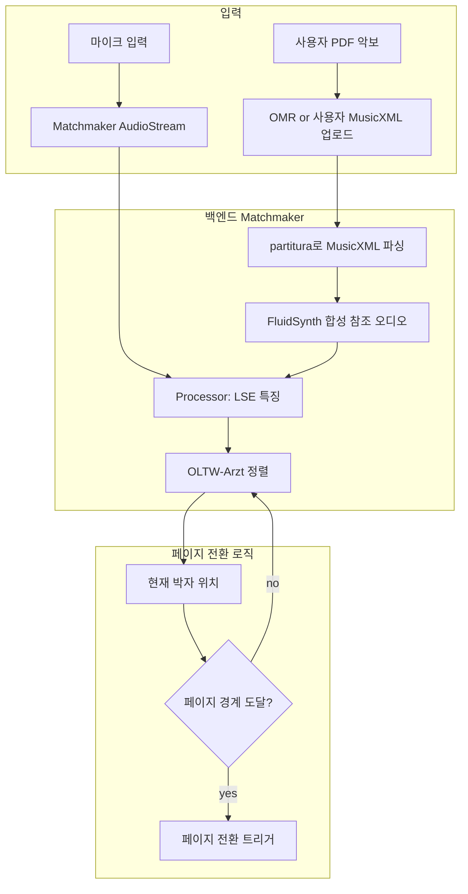

# 페이지 터너 응용 적용 권고 — 13편 분석을 한 응용 스택으로

## 도입: 13편을 한 응용 결정으로 응축

본 프로젝트의 13편(첫 9편 + Tier 1 4편) 분석과 13편의 Tier 2/3 흐름 정리는 결국 한 가지 실용적 질문에 답하기 위한 자원이다 — **사용자가 만들고 있는 페이지 터너 응용(피아노/바이올린/첼로/기타)의 백엔드를 어떻게 구성해야 하는가**. 본 문서는 그 구체적 권고를 한 자리에 정리한다. 결론부터 말하면 — 피아노는 즉시 구현 가능, 일렉기타는 자료가 막 갖춰진 시점이라 fine-tuning 작업이 필요, 첼로/바이올린은 분야의 빈 공간이라 응용 개발 자체가 분야 기여가 된다.

문서 구성: (1) 응용의 4가지 사용자 시나리오 정리, (2) 각 시나리오별 추천 백엔드, (3) 시나리오 무관 공통 결정, (4) 단계별 개발 로드맵, (5) 분야 기여로 환원 가능한 지점 식별.

## 4가지 사용자 시나리오

페이지 터너 응용은 사용자 악기에 따라 다음 4가지 시나리오로 갈라진다. 각 시나리오의 분야 자원 성숙도가 다르므로 권고도 달라진다.

| 시나리오 | 자원 성숙도 | 권장 우선순위 | 근거 |
|---|---|---|---|
| 피아노 | ⭐⭐⭐⭐⭐ 매우 성숙 | 1순위(MVP) | Matchmaker + transcribe-then-track 즉시 사용 가능 |
| 일렉기타 | ⭐⭐⭐ 자료 갓 갖춰짐 | 2순위 | GOAT + Guitar-TECHS 학습 가능, AMT fine-tune 필요 |
| 바이올린 | ⭐⭐ 부분적 baseline | 3순위 | Cowley 2025가 유일한 2025 정량, 자체 데이터 필요 |
| 첼로 | ⭐ 분야 빈 공간 | 4순위 | 2025 시점 첼로 전용 follower 또는 데이터셋 없음 |

## 시나리오별 백엔드 권고

### 시나리오 A — 피아노 (1순위 MVP)

**즉시 구현 가능한 단순 스택**



핵심 결정 4가지:
1. **Matchmaker**(분석 10번)를 백엔드로. pip install + 두 줄짜리 API.
2. **OLTW-Arzt + LSE 특징**의 조합 채택 — Matchmaker 논문 자체의 권고이자 가장 균형잡힌 baseline.
3. **JLTR**(분석 9번)의 반복 기호 라벨링 UX 차용. 사용자가 곡을 처음 추가할 때 페이지당 6초 클릭으로 반복 구조를 알려 주면, 그 후로는 자동으로 따라간다.
4. **PDF 입력**: 단계 1(MVP)에서는 사용자가 MusicXML 업로드. OMR(Sheet Music Benchmark 학습 모델)은 단계 2에서 추가.

**정확도 향상 옵션 (단계 2-3)**

- 분석 11번의 transcribe-then-track으로 정렬 모듈 교체. Matchmaker 인터페이스 안에서 OLTW-Arzt 자리에 끼움. 정확도 ≤100 ms 분위 73% → 88%로 도약.
- 분석 12번의 Causal-AMT로 transcription 모듈 교체. 174 ms → 30 ms 지연 단축. 페이지 터너에는 큰 차이 없으나 응용을 자동 반주로 확장할 때 결정적.
- 분석 13번 RUMAA로 자동 반복 처리 + 실수 검출 추가. 단 1분 청크 한정이므로 곡 전체에 적용하기보다는 곡 추가 단계의 사전 정렬에 활용.

**페이지 전환 트리거 설계**

페이지 경계 N 마디 전부터 점진적으로 전환 준비 — 예를 들어 마지막 마디 시작 시 다음 페이지 로드, 마지막 박자 진입 시 fade-in. 사용자의 fermata나 ritardando를 견디려면 단순 "지금 박자 X에 도달했다"가 아니라 "박자 X-1에서 X로 가는 평균 tempo가 정상 범위인가"를 추가 조건으로 두는 것이 권장된다. 분석 11번의 path-wise tempo matrix가 이 정보를 제공한다.

**오류 복구 UX**

OLTW가 jump를 잘못 추적하거나 빠른 패시지에서 lost 되었을 때, 사용자가 빠르게 동기화를 재설정할 수 있어야 한다. Yucong Jiang 2025 PIANO PRECISION(Tier 3)의 user study 결과를 참고해, 화면 탭 한 번으로 "지금 여기서 다시 시작" 트리거를 두는 방식이 권장된다. 분석 11번의 새 OLTW window 초기화로 구현 가능.

### 시나리오 B — 일렉기타 (2순위)

**fine-tuning 작업이 필요한 스택**

```mermaid
flowchart TB
    subgraph 학습 (개발 단계)
    L1[GOAT 35.4시간] --> L3
    L2[Guitar-TECHS] --> L3
    L3[일렉기타 AMT fine-tune<br/>분석 12번 Causal-AMT 베이스]
    L3 --> L4[Guitar-AMT 모델]
    end
    subgraph 런타임
    R1[기타 마이크/DI] --> R2[Guitar-AMT]
    R2 --> R3[음표 시퀀스]
    R4[Guitar Pro 탭<br/>또는 변환된 MusicXML] --> R5[Score Sequence]
    R3 --> R6[심볼 레벨 OLTW<br/>분석 11번]
    R5 --> R6
    R6 --> R7[현재 위치]
    end
```

핵심 결정:
1. **GOAT + Guitar-TECHS 위에 Causal-AMT fine-tune**. 분석 12번의 모델 + 학습 코드를 출발점으로, GOAT의 29.5시간 재앰핑 데이터로 톤/게인/이펙트 강건성 학습.
2. **Score 입력**: Guitar Pro 탭(.gpx, .gp5)을 standard MusicXML로 변환. 단 일부 기법(slide, bend, vibrato)은 MusicXML로 깔끔히 변환되지 않을 수 있어, 이 경우 그 마디는 fingering-aware로 따로 처리.
3. **transcribe-then-track 노선 채택**(분석 11번). audio OLTW는 일렉기타의 distortion이나 effects에 약하므로, audio→symbol 변환 후 symbol 도메인에서 정렬하는 것이 강건.
4. **응용 한정**: clean tone(잡음 적은 톤) → distortion(고게인) 스펙트럼에서 정확도가 떨어진다. 단계 1에서는 clean tone 위주로 검증.

**개발 자원**

- 코드: 분석 12번의 oss baseline.
- 학습 데이터: GOAT(GitHub `JackJamesLoth/GOAT-Dataset`) + Guitar-TECHS.
- 평가: Guitar-TECHS의 multi-mic 채널로 사용자 환경별 정확도 측정.
- GPU 시간 예상: GOAT의 30시간 + augmentation 위에서 분석 12번 모델을 fine-tune할 경우, RTX 4090 한 대에서 약 48-72 시간.

### 시나리오 C — 바이올린 (3순위)

**Cowley 2025 + 자체 데이터의 hybrid**

분야의 자원이 빈 환경이라 권고는 다음 두 갈래로 갈라진다.

**경로 1 — Cowley 2025 baseline 위에서 시작**. arXiv:2502.10426의 GP+HMM follower를 reference로 구현. 바이올린/플루트/오보에에서 정량 결과를 보고한 유일한 2025 작업이라는 점이 결정적. 단점은 deep learning 베이스가 아니라 향후 확장이 어렵고, 본 논문의 코드 공개 여부가 명시되지 않은 점.

**경로 2 — Matchmaker + 자체 fine-tune**. PDMX에서 바이올린 작품을 추출하고 FluidSynth로 합성 audio 생성. URMP(2018, Rochester)의 바이올린 자원을 합쳐 Matchmaker의 Processor를 학습된 특징으로 교체. 단점은 학습 데이터 규모가 작아 강건성이 부족할 가능성.

**현실적 권고는 두 경로의 결합**. 단계 1에서 Matchmaker + chroma 특징의 baseline을 그대로 사용해 MVP를 만들고, 단계 2에서 사용자 데이터(동의를 받은 사용자의 바이올린 연주 + 정렬된 악보)를 모아 학습 자원을 구축. 이 단계 2의 자원은 다음 시나리오 D(첼로)와 합쳐 분야 기여로 환원 가능.

### 시나리오 D — 첼로 (4순위)

**분야 빈 공간이 응용 개발의 기여 지점**

본 프로젝트가 다룬 13편(9 + Tier 1 4) + Tier 2/3 13편 모두에서 첼로 전용 follower나 데이터셋이 등장하지 않는다. 즉 페이지 터너 응용을 첼로 사용자에게도 제공하려면, 응용 개발 자체가 분야의 빈 공간을 메우는 작업이 된다.

**현실적 단계 권고**

1. **MVP**: Matchmaker + chroma 특징을 그대로 사용. 첼로의 monophonic 또는 weakly polyphonic 특성이 chroma에 우호적이라 baseline이 의외로 작동할 가능성. PDMX의 첼로 작품 + FluidSynth 합성 audio로 사전 검증.
2. **자체 데이터 수집**: 동의를 받은 사용자의 첼로 연주 + MusicXML 악보를 수집. 1년 기준 100시간 이상 모이면 분야 최초의 첼로 paired 데이터셋이 된다.
3. **분야 환원**: 그 데이터를 익명화·전처리해 CC-BY 4.0으로 공개. Cowley 2025의 GP+HMM 또는 Matchmaker의 학습 모듈 baseline을 함께 공개. ISMIR 또는 SMC late-breaking demo로 발표 가능한 분명한 학술 가치.

## 시나리오 무관 공통 결정

### Repeat 처리

분석 9번 JLTR의 UX 차용이 가장 비용 효율적. 사용자가 곡을 처음 추가할 때 한 번만 "여기서 처음으로 돌아간다, 여기서 끝낸다"의 두 클릭. 자동 처리(분석 13번 RUMAA)는 정확도가 더 높지만 1분 청크 한정 + 피아노 한정이라 응용 백엔드로는 적합하지 않음. 단 곡 추가 단계의 *사전* 정렬(곡 등록 시 한 번만 실행)에는 RUMAA가 가능.

### 사용자 인터페이스의 동기화 보정

PIANO PRECISION(Yucong Jiang 2025, Tier 3) 스타일의 "탭으로 재동기화" 트리거가 권장. 사용자가 정렬이 잘못된 시점을 발견하면 화면 탭 한 번으로 OLTW window를 그 위치 주변으로 재초기화. 분석 11번의 새 OLTW가 이 재초기화를 자연스럽게 지원.

### 시각 단서 활용 (선택)

태블릿 전면 카메라가 사용 가능한 환경이라면 PianoVAM(Kim et al. 2025)의 hand landmarks 사상을 차용. fermata나 페이지 끝 마디에서 audio-only가 흔들릴 때 손/자세 단서로 보완. Choi-Kwon-Nam 2025 (Tier 3)의 multimodal 모델이 플루트에서 같은 사상을 입증.

### 데이터 프라이버시

사용자 연주 녹음을 백엔드로 보내지 않는 on-device 처리가 권장. 분석 10번 Matchmaker는 Python 라이브러리이므로 모바일 환경에서는 PyTorch Mobile, Core ML, 또는 ONNX Runtime으로 변환이 필요. 분석 12번 Causal-AMT는 작은 모델(160 GFLOPs)이므로 모바일에서도 실시간 가능.

## 단계별 개발 로드맵 (권장)

| 단계 | 기간(권장) | 산출물 | 담당 시나리오 |
|---|---|---|---|
| 0 — 기획 + 디자인 | 2-4주 | UX 와이어프레임, 백엔드 설계 | 모든 시나리오 |
| 1 — 피아노 MVP | 4-6주 | Matchmaker 백엔드 + 피아노 페이지 터너 | A |
| 2 — JLTR 반복 UX 통합 | 2-3주 | 곡 추가 시 반복 라벨링 인터페이스 | A (확장 시 모두) |
| 3 — OMR 추가 | 4-6주 | PDF 업로드 → MusicXML 자동 변환 | A |
| 4 — 일렉기타 fine-tune | 6-8주 | GOAT 학습 + Guitar-AMT 모델 | B |
| 5 — 첼로/바이올린 MVP | 4-6주 | Matchmaker baseline 위에서 + 사용자 데이터 수집 시작 | C, D |
| 6 — Causal-AMT 통합 | 4-6주 | 30 ms 지연 모듈로 정확도 향상 | A, B |
| 7 — 자동 반복 처리(선택) | 4-6주 | RUMAA 사전 정렬 통합 | A (단계 7+) |
| 8 — 자체 데이터 분야 기여 | (병렬) | 첼로/바이올린 paired 데이터셋 공개 | C, D |

## 분야 기여로 환원 가능한 지점

페이지 터너 응용이 그 자체로 학술 기여로 환원될 수 있는 지점이 분야 흐름상 분명하다.

**1. 페이지 터너 시스템의 user study**. 본 프로젝트가 다룬 18개월 동안 audio-driven 페이지 터너의 user study 논문이 NIME 2025·CHI 2025·UIST 2025 어디에도 없다. 사용자 N명(권장 N≥15)을 대상으로 한 정확도 + UX 평가가 분명한 학술 가치를 가진다.

**2. 첼로/바이올린/일렉기타 paired 데이터셋**. 본 프로젝트의 사용자 데이터(동의받은) 100시간 이상이 모이면, 분야 최초의 해당 악기 paired 데이터셋으로 환원 가능. CC-BY 4.0 공개 시 ISMIR/SMC LBD 발표 가능.

**3. MERT/MuQ × score following 첫 정량 비교**. 분야의 가장 큰 빈 공간 — 음악 foundation model을 score follower의 특징 모듈로 사용한 정량 비교 — 은 본 프로젝트 응용의 부산물로 자연스럽게 가능. Matchmaker의 Processor 자리에 MERT-95M 또는 MuQ embedding을 끼우고, 같은 OLTW-Arzt 정렬 위에서 chroma 대비 정확도 비교만 보고해도 분야 첫 결과.

**4. 비-피아노 transcribe-then-track의 정량 입증**. 분석 11번이 피아노에서 입증한 audio OLTW plateau 돌파를 일렉기타·바이올린·첼로에서 동일한 ablation으로 입증하면, 분석 11번의 사상이 일반화 가능함을 보이는 첫 결과가 된다.

이 4가지 학술 기여는 모두 응용 개발의 자연스러운 부산물로 — 즉 추가 연구 비용 없이 — 가능하다. 본 프로젝트의 응용 개발 일정을 그대로 따라가면서, 단계 5-7에서 정량 평가만 추가로 보고하면 된다.

## 한 줄 요약

피아노는 Matchmaker(분석 10번) + JLTR repeat UX(분석 9번)로 즉시 시작, 일렉기타는 GOAT 위에서 Causal-AMT(분석 12번) fine-tune, 첼로/바이올린은 Cowley 2025 baseline + 자체 데이터 수집을 병행. 분야 빈 공간(페이지 터너 user study, 비-피아노 paired 데이터셋, MERT × score following)이 응용 개발의 자연스러운 학술 기여 지점.
