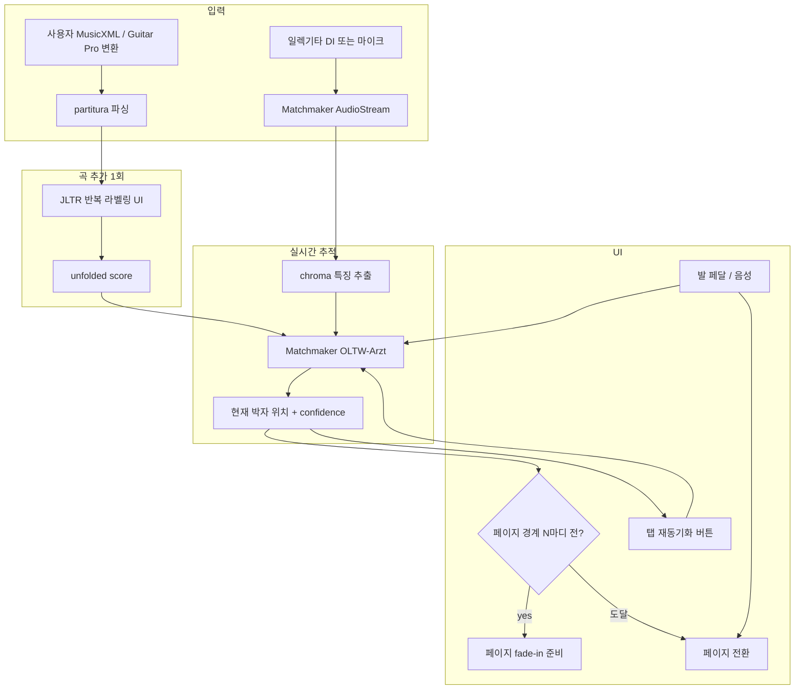

# 페이지 터너 어플리케이션 제작 로드맵 — 단기 MVP 중심 정리

## 도입 — 이 문서가 다른 문서들과 어떻게 다른가

본 프로젝트에는 이미 두 개의 큰 정리가 있다. **12번 적용 권고**는 13편 분석을 4가지 악기 시나리오별로 응축한 백엔드 권고이고, **13번 종합 옵션 카탈로그**는 일렉기타·첼로 한정으로 70개의 가능 옵션을 보수안부터 엽기안까지 망라한다. 둘 다 "넓이"의 문서다.

본 문서는 그 반대 방향이다. 70개 중 *지금 당장* 손에 잡히는 것만 골라, 4-6주 안에 시연 가능한 단기 MVP의 단계별 작업 목록을 압축한다. 중·장기는 큰 결정 지점만 표시하고, 세부는 기존 두 문서로 되돌려 보낸다. 즉 본 문서의 70%는 단기 MVP, 20%는 중기 분기점, 10%는 장기 방향이다.

전제: 단독 개발자, 일렉기타와 첼로 둘 다 시야에 두지만 **MVP는 한 악기를 먼저 끝내고 다른 악기로 확장**하는 흐름. MVP는 가정 연습실 시연 수준 — 무대 시연 품질은 중기로 미룬다.

## 단기 (MVP) — 4~6주, 당장 시연 목표

### MVP의 정의

MVP의 합격선은 다음 다섯 가지를 동시에 만족하는 것이다.

첫째, **악보 한 곡(2~4페이지)을 끝까지 자동으로 따라가야 한다**. 둘째, **반복·D.S.·Coda 같은 점프가 한 번 이상 들어 있어야 한다** — 직선 진행만으로는 시연 가치가 없다. 셋째, **사용자가 페이지를 안 만져도 자동 전환되어야 한다** — 안 그러면 "녹화 메트로놈"이지 페이지 터너가 아니다. 넷째, **시스템이 추적을 잃었을 때 사용자가 1초 안에 복구 가능해야 한다** — 발 페달이든 음성이든 화면 탭이든 한 가지는 반드시 작동해야 한다. 다섯째, **데모 환경에서 일관되게 작동해야 한다** — 가정 연습실 마이크, 큰 잡음 없는 환경에서 5번 시도 중 4번은 곡 끝까지 따라가야 한다.

이 다섯 가지가 만족되지 않은 것은 MVP가 아니라 프로토타입이다.

### 어느 악기를 먼저 — 일렉기타 vs 첼로

둘 다 시야에 있지만 MVP는 **하나만** 끝내는 게 정직하다. 권고는 다음과 같다.

**일렉기타를 먼저 권한다**. 이유 세 가지. (1) DI 신호로 룸 acoustics를 우회할 수 있어 시연 환경 변동성이 작다. (2) GOAT 데이터셋 + Causal-AMT가 이미 공개되어 있어 전사 모듈 fine-tune의 자원이 분명하다. (3) 일렉기타는 일반적으로 polyphonic이지만 코드는 chroma에 잘 잡힌다 — chroma baseline의 첫 동작이 비교적 쉽다.

**첼로 먼저는 다음 경우에만 권한다**: 사용자가 첼로 연주자 본인이라 자체 평가 audio를 즉시 생성 가능하고, weakly polyphonic 환경(첼로 솔로 무반주)으로 한정 가능할 때. 이 경우 자유 템포·비브라토 한계는 인정하고 들어간다.

이하 본 절은 일렉기타 MVP 흐름으로 작성한다. 첼로로 분기할 때 다른 결정을 표 형태로 짧게 부기한다.

### MVP 스택 — 다섯 컴포넌트만

종합 카탈로그 70개 중 다섯 개만 쓴다.

| # | 옵션 | 역할 | 카탈로그 출처 |
|---|---|---|---|
| 1 | Matchmaker + chroma baseline | 정렬 엔진 | 옵션 1 |
| 2 | JLTR 반복 라벨링 UX | 곡 추가 시 점프 처리 | 옵션 8 |
| 3 | PIANO PRECISION 스타일 탭 재동기화 | 추적 실패 시 사용자 복구 | 옵션 9 |
| 4 | 발 페달 또는 음성 명령 fallback | 1초 복구 보장 | 옵션 34 / 35 |
| 5 | DI 입력 (일렉기타 한정) | 시연 환경 변동성 축소 | 옵션 29 |

이 다섯 가지는 모두 "검증된 컴포넌트"에 속한다 — 분야 첫 시도가 하나도 없다. 이것이 MVP의 의도다. 분야 첫 시도(MERT, Diffusion, Federated 등)는 단기에서 명시적으로 배제한다.

### 시스템 구성도 (MVP)



### 6주 단계별 작업 목록

| 주차 | 산출물 | 검증 방법 |
|---|---|---|
| 1주 | Matchmaker `pip install` + 합성 audio 위에서 partitura MusicXML과 정렬 동작 확인. **piano sample**부터 시작해 라이브러리가 살아있음을 확인. | 분석 10번 논문이 보고한 ASAP 정확도 ±5% 안에 들어오는지 확인 |
| 2주 | 일렉기타 DI sample 1곡(2페이지) 직접 녹음 + Guitar Pro → MusicXML 변환 + Matchmaker 실행 | 곡 끝까지 추적 성공률 5회 중 3회 이상 |
| 3주 | JLTR 스타일 반복 라벨링 웹 UI(페이지당 6초 클릭) — 사용자가 D.C., D.S., Coda를 클릭으로 표시 → unfolded score 자동 생성 | 분석 9번이 보고한 33→82% 정확도 향상 패턴 재현 |
| 4주 | 페이지 전환 트리거 로직 — 마지막 마디 시작 시 다음 페이지 fade-in, 마지막 박자 진입 시 전환. fermata/ritardando 처리는 path-wise tempo 활용 (분석 11번 사상) | 일부러 fermata를 길게 두고 페이지 안 넘어가는지 확인 |
| 5주 | 탭 재동기화 + 발 페달(or 음성) fallback. 화면 탭 = 그 위치에서 OLTW window 재초기화. Web Speech API로 "next" "back" 음성 명령 | 일부러 마이크 끄고 추적 잃은 뒤 1초 안에 복구 가능한지 |
| 6주 | 시연 시나리오 다듬기 + 5회 연속 시연 안정성 검증 + 짧은 시연 영상 녹화 | 가족·동료 1명 앞에서 곡 끝까지 자동 진행 |

### 즉시 시연 가능한 가장 작은 단계 — 1주 데모

만약 6주가 너무 길고 "이번 주말에 뭔가 보여줄 게 필요하다"면, 다음 단계만 한다.

**데이 1**: Matchmaker `pip install` → 분석 10번 GitHub 저장소의 example notebook 실행 → 합성 piano audio 정렬 결과를 console에 출력.

**데이 2**: 자기 일렉기타로 단순한 곡(반복 없는 16마디, clean tone) DI 녹음 → MusicXML 작성(MuseScore 또는 손으로) → Matchmaker로 정렬 → 현재 박자 위치를 console에 1초마다 출력.

**데이 3**: 그 박자 위치를 단일 페이지 HTML 위의 빨간 커서로 시각화. 페이지 전환은 안 다룬다 — 한 페이지짜리 곡으로 한정.

이 3일짜리 데모만으로도 "Matchmaker 위에서 일렉기타 추적이 작동한다"는 사실은 시연 가능하다. **이게 진짜 MVP의 시작점**이다. 6주 일정의 1-2주에 해당.

### MVP에서 명시적으로 *안 하는* 것

이 목록을 명시하는 이유는, 단기 단계에서 욕심을 부리면 6주가 6개월이 되기 때문이다.

**OMR(PDF→MusicXML)은 안 한다**. 사용자가 MusicXML을 직접 업로드하거나 MuseScore로 변환한 것을 받는다. 12번 권고의 단계 3(OMR 추가)은 중기 작업이다.

**Causal-AMT fine-tune은 안 한다**. chroma baseline이 작동하는지부터 본다. AMT fine-tune은 정확도 한계가 분명해진 뒤 4-6주 추가 작업으로 더한다(중기 작업).

**무대/협주곡 시나리오는 안 한다**. 옵션 10(Tsai Dense-Sparse DTW)·옵션 51(Stem separation)은 중기. MVP는 가정 연습실 한정.

**카메라·IMU·시선 추적은 안 한다**. 옵션 26·27·32는 모두 중기 이후.

**Distortion/effect 환경은 안 한다**. clean tone 한정. distortion은 옵션 47(Effects-aware feature)이 다룰 중기 문제.

**모바일 앱은 안 한다**. 데스크톱 Python + 브라우저 UI로 시연. 모바일 패키징은 중기.

이 6가지를 단기에 끌어들이면 일정이 깨진다.

### MVP 검증 지표 (구체적)

6주 끝에 다음 숫자를 본다.

| 지표 | 합격선 | 측정 방법 |
|---|---|---|
| 곡 끝까지 추적 성공률 | 5회 중 4회 (80%) | clean tone DI, 반복 1회 포함 곡 |
| 페이지 전환 정확도 | ±2초 안에 전환 | 사람 정답과 비교 |
| 추적 실패 시 복구 시간 | 1초 이내 | 일부러 추적 끊은 뒤 페달/탭 |
| 곡 추가 라벨링 시간 | 페이지당 6초 이하 | 분석 9번 JLTR 기준 |
| 시연 5분간 깨짐 횟수 | 0회 | 시연 영상 녹화 시 |

이 다섯 지표 중 셋 이상이 합격선 미달이면 MVP가 아니라 다음 시도의 baseline이다 — 솔직히 인정하고 단기 단계에서 정확도 향상 작업으로 분기한다(중기 진입).

### MVP가 *못 할 가능성이 높은* 경우 — 미리 인정

분야 흐름상, 다음 경우에는 chroma baseline 자체가 안 작동할 가능성이 높다. 미리 인정하고 들어간다.

**일렉기타 distortion이 강한 곡**. chroma는 fundamental에 의존하는데 distortion이 강하면 harmonic 분포가 비표준적이라 chroma가 흔들린다. → MVP는 clean tone 한정.

**첼로의 비브라토가 강한 솔로**. 비브라토 폭이 ±50 cents 이상이면 chroma의 12-bin 양자화가 흔들린다. → MVP에 첼로를 넣을 경우 비브라토 적은 곡으로 한정.

**자유 템포(rubato)가 큰 표현적 패시지**. OLTW-Arzt는 tempo 변동에 어느 정도 강건하지만, ±50% 이상의 급격한 변동에서는 lost가 잦다. → MVP 곡 선택에서 명시적으로 배제.

**페이지 끝의 fermata**. fermata에서 audio가 사라지면 OLTW가 앞으로 misalign할 수 있다. → 옵션 33(워치 햅틱)으로 보완하지만 단기에서는 단순히 발 페달 fallback에 의존.

이 네 가지 한계가 MVP의 시연 곡 선택을 좌우한다. **시연 곡은 (a) clean tone, (b) 비브라토 적음, (c) 자유 템포 작음, (d) 페이지 끝 fermata 없음 — 네 조건을 모두 만족하는 곡으로 골라야 한다**. 분야 baseline의 정직한 한계 안에서 작동하는 곡.

## 중기 (1~6개월) — 분기점만 표시

MVP가 합격하면, 다음 6개월은 다음 네 갈래 중 한 곳으로 무게를 옮긴다. 어디로 갈지의 결정은 **MVP 결과 + 사용자 야망의 형태**에 달렸다.

### 분기 ① — 정확도 향상 노선 (응용 우선)

MVP의 chroma baseline이 합격선에 미달이거나, 사용자가 무대 품질을 노릴 때 진입.

**우선 작업**: 옵션 4 (Causal-AMT GOAT fine-tune) + 옵션 6 (Matchmaker × transcribe-then-track 결합) + 옵션 12 (CRNN post-DTW). 분석 11번이 입증한 73%→88% 도약을 일렉기타에서 재현.

**예상 일정**: 6-8주 GPU 작업(RTX 4090 한 대 기준 48-72시간 학습) + 4주 통합.

**카탈로그 출처**: 13번 종합 카탈로그 갈래 II 전반.

### 분기 ② — 멀티모달 노선 (강건성 우선)

MVP의 audio-only 한계가 분명한 시점에 들어가는 노선. 종합 카탈로그 아키텍처 B에 해당.

**우선 작업**: 옵션 26 (태블릿 카메라 자세 추정) + 옵션 27 (활/픽 IMU) + 옵션 33 (워치 햅틱). 12번 권고의 단계 6에 해당.

**하드웨어 비용**: $30~200 (IMU 기준). 옵션 30(MIDI pickup, $200~400)은 일렉기타 한정 자연스러운 진입.

**카탈로그 출처**: 갈래 IV 전반 + 분석 13번 RUMAA의 multi-instrument 시사.

### 분기 ③ — 학술 환원 노선 (분야 첫 시도)

응용 개발과 분야 기여를 동시에 노릴 때. 13번 카탈로그가 식별한 4-6개의 학술 환원 후보 중 가장 비용 효율적인 곳을 고른다.

**가장 가성비 좋은 첫 발자국**: 옵션 14 (MERT × score following) — Matchmaker의 Processor 자리에 chroma 대신 MERT-95M embedding을 끼우고, 같은 OLTW 위에서 비교. 코드 수정 자체는 1-2주, 평가 4-6주. ISMIR 2026 또는 SMC 2026 LBD 가능.

**다음 후보**: 옵션 63 (NIME 2026/CHI 2026 user study) — MVP가 작동하는 시점에 사용자 N≥15 user study를 진행. 분야 18개월 동안 부재한 user study 논문의 자연스러운 부산물.

**카탈로그 출처**: 갈래 III + 13번 카탈로그 "분야 첫 시도 후보" 절.

### 분기 ④ — 사용자 데이터 수집 노선 (장기 분야 기여 토양)

12번 권고의 단계 8에 해당. 동의받은 사용자의 일렉기타·첼로 연주 + 정렬된 악보를 수집. 1년 100시간 이상 모이면 분야 최초 paired 데이터셋.

**병렬 작업이라 다른 분기 ①②③과 충돌하지 않음**. MVP가 작동하는 시점부터 시작 가능.

### 중기 결정 트리

```
MVP 합격선 미달
  ├─ 정확도 부족이 주 원인 → 분기 ①
  ├─ 환경 변동성 (라이브, 잡음) → 분기 ②
  └─ 자유 템포·표현적 일탈 → 분기 ① + ②

MVP 합격, 다음 단계
  ├─ 응용 우선 (제품 출시 노림) → 분기 ② + ④
  ├─ 학술 우선 (논문/발표 노림) → 분기 ③ + ④
  └─ 둘 다 → ① + ③ + ④ 순차
```

## 장기 (1년 이상) — 방향만 짚음

장기는 MVP와 중기 결과에 너무 강하게 의존하므로, 본 문서에서는 *어느 방향이 장기에 살아남을 가능성이 높은가*만 짚는다. 세부는 13번 카탈로그 갈래 III·IV·V로 돌아가서 본다.

**장기에 살아남을 방향 셋**.

첫째, **개인화·연속 학습 노선** — 옵션 25 (continual learning) + 옵션 42 (사용자별 timing 분포) + 옵션 24 (federated learning). 사용자 데이터(분기 ④)가 1년 이상 쌓이는 것을 전제로, 그 위에서 사용자가 시간이 지날수록 시스템이 정확해지는 흐름. 분야에서 본격 시도된 적 거의 없음.

둘째, **분야 첫 시도 후속** — 분기 ③에서 발표한 MERT × score following 또는 user study 논문의 자연스러운 후속. 옵션 17 (Diffusion alignment denoising) 또는 옵션 15 (CLIP-style 대조 학습)이 두 번째 후속 후보.

셋째, **하드웨어 통합 노선** — 옵션 40 (smart pick / instrumented bow) → NIME 발표 + Kickstarter 가능성. 옵션 39 (AR 글래스 위 score)는 Vision Pro 가격이 떨어지는 시점에 분기.

### 장기에 명시적으로 들어가지 *않을* 것 (현 시점 판단)

옵션 65 (BCI), 옵션 57 (무대 조명 fusion), 옵션 69 (청중 모바일 sync) — 13번 카탈로그가 갈래 V에 분류한 엽기 옵션들. 학술적 흥미는 있지만 **사용자 페이지 터너 응용의 가치 함수에는 들어오지 않음**. 본 프로젝트에서 명시적으로 배제.

## 결정 요약 — 한 페이지 압축

**이번 주말에 무엇을 할 것인가**: 데이 1-3 데모 (Matchmaker piano example → 일렉기타 DI 녹음 → 단일 페이지 HTML 시각화).

**다음 6주에 무엇을 할 것인가**: MVP 5컴포넌트 스택(옵션 1·8·9·29·34/35) — 합격선은 곡 끝까지 5회 중 4회 + 페이지 전환 ±2초 + 복구 1초.

**다음 6개월에 무엇을 할 것인가**: MVP 결과에 따라 ①정확도(GOAT fine-tune) ②멀티모달(IMU·카메라) ③학술(MERT 비교) ④데이터 수집 — 넷 중 둘 정도 병렬.

**1년 이후**: 사용자 데이터 위에서 개인화·연속 학습 + 분기 ③ 후속 + 하드웨어 통합. 결정은 1년 시점에 다시.

**MVP에서 안 할 것**: OMR·AMT fine-tune·무대·카메라·IMU·distortion·모바일.

**MVP가 못 할 가능성이 높은 곡 조건**: distortion 강함·비브라토 강함·자유 템포 큼·페이지 끝 fermata. 시연 곡은 이 네 조건의 반대로 고른다.

**한 줄 결론**: 70개 옵션 중 다섯 개만 골라 6주 안에 일렉기타 clean tone MVP를 끝내는 것이 본 프로젝트의 단기 합리적 단일 경로다. 나머지 65개는 단기에서 명시적으로 배제하고 중기 분기점에 다시 본다.
