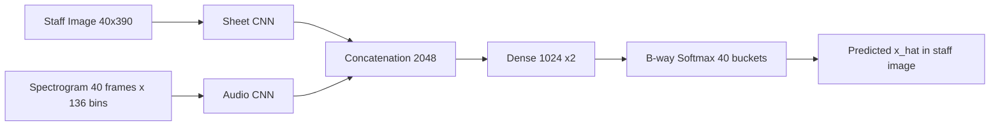

# Towards Score Following in Sheet Music Images — 분석 보고서

## 핵심 요약

이 논문은 짧은 음악 오디오 조각을 그것이 가리키는 악보 이미지 상의 픽셀 위치와 직접 연결하는 방법을 제안한다. 기존의 모든 score following 접근이 MusicXML, MIDI와 같은 기호적(symbolic) 악보 표현을 전제로 했던 것과 달리, Dorfer, Arzt, Widmer는 OMR(광학 악보 인식) 단계나 수작업 표기 변환을 거치지 않고도 악보 이미지와 스펙트로그램을 입력으로 받아 두 모달리티를 end-to-end 멀티모달 컨볼루셔널 신경망으로 정렬하는 첫 시도(proof of concept)를 제시한다(PDF p.1). Nottingham 데이터셋의 단일 스태프, 단성(monophonic) 피아노 음악 환경에서 약 1.2초 길이의 오디오 스니펫이 가리키는 위치를 버킷 분류 문제로 풀어, 테스트셋에서 top-1 버킷 정확도 54.64%, top-2 정확도 84.36%를 달성한다(PDF p.4). 이 논문은 score following 분야가 기호 악보 의존성을 벗어나 raw 이미지·오디오 학습 기반 정렬로 패러다임을 전환할 수 있음을 보여준 출발점이라는 점에서 후속 sheet-image 기반 alignment·retrieval 연구의 토대가 된다.

## 서지 정보와 접근 범위

저자는 Matthias Dorfer, Andreas Arzt, Gerhard Widmer 세 명으로, 모두 오스트리아 요하네스 케플러 대학교(Johannes Kepler University Linz, JKU)의 Department of Computational Perception 소속이다(PDF p.1). 발표 학회는 ISMIR(International Society for Music Information Retrieval) 2016, 즉 17th International Society for Music Information Retrieval Conference이며, 라이선스는 CC BY 4.0이다. arXiv 식별자는 1612.05050v1, 작성일은 2016년 12월 15일로 표기되어 있다. 본 분석 자료의 출처는 arXiv 추출 텍스트(`/tmp/pdftext/1612.05050v1.txt`)와 원본 PDF(`02_Dorfer2016_SheetImage/원본.pdf`)이며, 본문은 약 6쪽 분량의 짧은 conference paper로, 1. Introduction, 2. Methods (2.1 Data/Notation/Task, 2.2 Audio-Sheet Matching as Bucket Classification, 2.3 Sheet Location Prediction), 3. Experimental Evaluation (3.1 Experiment Description, 3.2 Data, 3.3 Evaluation Measures, 3.4 Model Architecture and Optimization, 3.5 Experimental Results), 4. Discussion and Real Music (4.1 Prediction Example and Discussion, 4.2 First Steps with Real Music), 5. Conclusion, 6. Acknowledgements, 7. References의 구성을 따른다(PDF p.1-6).

## 상세 요약

논문이 정조준하는 문제는 audio-to-score alignment, 그중에서도 온라인 정렬에 해당하는 score following이다(PDF p.1). 저자들은 콘서트 시각화 동기화, 자동 반주, 페이지 자동 넘김, MIR 학습 데이터 생성과 같은 응용을 동기로 제시하면서, 종래 모든 방법이 MusicXML이나 MIDI 같은 컴퓨터가 읽을 수 있는 기호적 악보 표현에 의존해 왔다는 점을 한계로 지적한다. 기호적 표현은 사람이 악보 표기 프로그램으로 다시 입력하거나 자동 OMR로 추출해야 하는데, OMR은 특히 오케스트라 악보 같은 복잡한 자료에서 여전히 신뢰성이 낮아 활용이 제한적이다(PDF p.1).

이 논문의 중심 아이디어는 오디오와 악보 이미지를 중간 표현 없이 직접 연결하는 학습기를 만드는 것이다. 모델은 악보를 "읽고", 음악을 "듣고", 두 모달리티 간의 대응을 동시에 학습한다. 학습은 end-to-end 신경망으로 진행되어, 사람이 설계한 특징(feature)이 아니라 데이터로부터 행동 전체를 직접 익힌다(PDF p.1). 입력은 두 갈래다. (1) 악보 이미지 측은 한 줄(staff)의 단일 스태프 이미지 Si로, 크기는 40 × 390 픽셀이다. (2) 오디오 측은 길이 1.2초의 스펙트로그램 발췌 Ei,j로, 40 프레임 × 136 주파수 빈을 가진다. 출력은 해당 오디오 스니펫이 악보 이미지의 어느 픽셀 x좌표에 대응하는지에 대한 예측 x̂j이다(PDF p.2).

핵심 기술적 선택은 위치 예측을 회귀(MSE)로 풀지 않고, 스태프 이미지를 가로로 B개의 비중첩 버킷으로 양자화한 뒤 어느 버킷에 속하는지를 분류하는 문제로 재정의한 점이다. 각 노트 j의 정답 벡터 tj는 진짜 픽셀 위치 xj와 가장 가까운 두 개의 버킷 중심 사이에서 픽셀 거리에 비례해 선형 보간한 "soft target"으로 만들어지며(PDF p.2), 모델 출력 pj는 B-way softmax 분포다. 학습은 categorical cross entropy로 진행되며, 저자들은 초기 실험에서 시도한 MSE 회귀가 학습이 어렵고 성능도 떨어졌다고 명시한다(PDF p.2 각주1). 테스트 시점의 위치는 두 가지 방식으로 산출하는데, (1) 최댓값 버킷 b*의 중심 cb*를 그대로 쓰는 방식과 (2) b*의 양 옆 버킷 b*-1, b*+1까지 포함해 확률 가중 선형 보간으로 더 정밀한 좌표를 얻는 방식이다(PDF p.2-3).

학습 데이터는 Nottingham 데이터셋의 MIDI 파일에서 가공한다. 첫 번째 트랙(오른손 피아노)을 Lilypond로 악보 렌더링하고, 모든 노트의 시트 좌표 xj를 자동 어노테이션하며, Fluidsynth와 Steinway 사운드폰트로 flac 오디오를 합성한 뒤 노트 온셋 타임스탬프를 추출한다. 마지막으로 22.05kHz 샘플레이트, FFT 윈도 2048 샘플, 31.25 fps의 로그 스펙트로그램을 계산하고, 80Hz–8kHz 범위에서 24-band 정규화 로그 필터뱅크로 차원을 줄여 136개 주파수 빈을 만든다. 1.2초(40 프레임) 발췌의 오른쪽 끝 온셋이 타깃 노트 j와 정렬되며, 스펙트로그램은 5 프레임 우측으로 시프트되어 현재 타깃 온셋과 음고 정보를 약간 포함한다. 이 비대칭 어노테이션은 미래 정보가 없어야 하는 온라인 score following 시나리오에 부합한다(PDF p.3).

평가는 노트 온셋 시점에서만 수행되며, top-k 버킷 hit rate(정답 버킷과의 ±k-1 허용 범위 내 일치 비율)와 정규화된 픽셀 거리(Normalized Pixel Distance, NPD)로 보고된다. NPD는 픽셀 오차를 이미지 가로폭으로 나눠 (-1, 1)에 두는 지표다. 4.2절에서는 야마하 AvantGrand N2 하이브리드 피아노로 사람이 직접 연주한 바흐 미뉴엣 G장조(BWV Anhang 114)를 마이크 단일 채널로 녹음하여, 학습 데이터에 없던 "real music"에 대한 연속 스트림 예측을 시연한다. 이때는 온셋 검출 없이 연속된 스펙트로그램 윈도에 대해 위치를 추정하므로, 사실상 sheet-image 기반 온라인 score following의 단순 버전에 해당한다(PDF p.5).

## 방법론과 데이터

네트워크는 두 갈래의 전용 컨볼루셔널 서브네트워크로 시작한다. Sheet 측은 5×5 conv(stride 1×2)로 시작해 3×3 conv 블록들과 2×2 max-pooling, dropout(0.15)을 쌓고, 채널 수는 64→64→128→128로 증가한다. Audio 측은 3×3 conv 블록들로 64→64→96→96 채널을 쌓는다. 각 갈래는 Dense-1024-BN-ReLu + Drop-out(0.3)로 끝나며, 두 갈래의 표현은 2048-차원 concatenation 레이어에서 합쳐진다. 그 뒤 Dense-1024-BN-ReLu + Dropout(0.3) 두 층을 더 통과한 뒤 B-way softmax로 출력된다. 활성화는 ReLU, 정규화는 모든 층에 batch normalization, 미니배치 100, Nesterov 모멘텀 0.9의 mini-batch SGD, 초기 학습률 0.1을 10 epoch마다 1/10로 감쇠, 가중치 감쇠 0.0001을 적용한다(PDF p.4 Table 1). 컨볼루션 구조는 작은 커널(3×3)과 max-pooling을 반복 적층하는 VGG 스타일에서 영감을 받았다고 명시한다(PDF p.4).

| 데이터셋 | 곡 수 | 특성 | 용도 |
|---------|-------|------|------|
| Nottingham (MIDI) | 명시되지 않음(train/valid/test 분할 사용) | MIDI 컬렉션, 첫 트랙(오른손 피아노)만 추출, 단성·반·4분·8분음표 중심, 점음표·붙임줄·임시표 허용 | 학습/검증/테스트 전 구간 |
| Nottingham 합성 오디오 | 위와 동일 | Fluidsynth + Steinway 사운드폰트로 합성, 22.05kHz flac, 로그 스펙트로그램 31.25 fps | 학습/검증/테스트의 오디오 입력 |
| Nottingham 렌더링 악보 | 위와 동일 | Lilypond로 단일 스태프 렌더링, 노트별 픽셀 좌표 어노테이션 | 학습/검증/테스트의 이미지 입력 |
| Bach Minuet in G (BWV Anhang 114) | 1곡 부분 | Yamaha AvantGrand N2에서 사람이 연주, 단일 마이크 녹음 | 실제 연주에 대한 정성적 평가(4.2절) |

평가지표는 두 가지다. 첫째, top-k bucket hit rate는 예측 버킷이 정답 버킷과 ±k-1 이내에서 맞으면 정답으로 본다. 둘째, normalized pixel distance(NPD)는 (x̂j − xj)/width(Si)로 정의되어 (-1, 1) 구간에 산다. 결과는 다음과 같다(PDF p.4 Table 2): Top-1 hit rate가 train 79.28% / valid 51.63% / test 54.64%, Top-2 hit rate가 train 94.52% / valid 82.55% / test 84.36%, |NPDmax|의 평균이 train 0.0316 / test 0.0647, 한 버킷 폭 wb 이내 예측 비율(|NPDint| < wb)은 test에서 81.18%다. 4.2절의 실제 피아노 연주에서는 한 버킷 폭 이내 정확도 71.72%, 평균 NPD 0.0402로 보고된다(PDF p.5). 재현성 측면에서는 madmom(Böck 외, 2016)과 Lasagne(Dieleman 외, 2015)를 사용한다고 밝히고, saliency 시각화는 Lasagne의 recipe(저자 Jan Schlüter)에서 차용한다고 각주에서 적시한다(PDF p.5). 다만 본 논문에는 별도의 코드 저장소 URL이 포함되어 있지 않으며, 데모 영상은 Dropbox 링크로 공개되어 있다.

## 비판적 평가

강점은 분명하다. 첫째, MIDI/MusicXML 같은 중간 기호 표현을 거치지 않고 raw sheet image와 spectrogram만으로 학습 가능한 음악 정렬 모델을 처음으로 보여, 기호 변환이 어려운 악보 자료(스캔본, 손으로 베낀 악보 등)로 score following을 확장할 가능성을 열었다. 둘째, 위치 예측을 직관적인 MSE 회귀가 아닌 soft-target bucket classification으로 재정의해 학습 안정성과 다중 봉우리 예측 능력을 동시에 확보했다. 4.1절의 사례에서 모델이 반복 구조를 가진 부분에서 두 개의 후보 위치에 동시에 큰 확률을 주는 모습은, 음악 특유의 반복성에 잘 맞는 출력 형태가 무엇이어야 하는가에 대한 합리적 답을 제시한다(PDF p.4). 셋째, saliency map 분석을 통해 네트워크가 실제로 음표의 머리(note head)에 주의를 기울이고, 4분음표·8분음표를 구분하기 위해 stem까지 본다는 해석을 제공해, 학습된 표현이 음악적으로 그럴듯함을 보여준다(PDF p.5).

약점도 명확하다. 첫째, 저자 스스로 강조하듯 본 모델은 단성, 단일 스태프, 피아노, 학습 시 설정한 템포에 가까운 연주에만 작동하는 매우 제한적인 proof-of-concept이다(PDF p.5). 다성 음악, 페이지 단위, 다양한 악기 편성, 큰 템포 변화는 모두 후속 과제로 남는다. 둘째, train과 test 사이의 성능 격차가 매우 크다(top-1 79.28% vs 54.64%). 이는 학습 데이터에 대한 과적합 또는 곡 단위 분할에서 오는 일반화 한계를 시사하지만, 본문에서 별도의 분석은 제공되지 않는다. 셋째, 평가는 주로 정렬 자체가 명확한 노트 온셋 시점에서만 이루어지며, 시간 연속 예측과 score following의 실시간 성능, 지연(latency), 이전 예측과의 시간적 일관성은 정량 지표로 평가되지 않는다. 4.2절의 실연주 평가는 정성적 영상 시연과 한 곡 부분에 대한 단일 수치(71.72%)에 그쳐 통계적 신뢰 구간을 알기 어렵다.

## 선행연구와 비교

| Citation | 연도 | 방법 | 핵심 발견 | 본 논문과의 차이 |
|---------|------|------|----------|----------------|
| Arzt, Widmer, Dixon [2] | 2008 | 실시간 머신 리스닝 기반 자동 페이지 넘김 | 실연주 음악으로부터 악보 위치를 추적해 페이지 넘김을 자동화 | 기호 악보 표현에 의존하는 전통적 score following이며, 본 논문은 이미지 자체를 직접 사용 |
| Cont [5] | 2009 | Coupled duration-focused HMM 아키텍처 | 실시간 audio-to-score 정렬을 확률 모델로 정식화 | HMM 기반 기호 정렬이며, 본 논문은 신경망 기반 이미지·오디오 직접 매칭 |
| Müller, Kurth, Clausen [15] | 2005 | Chroma 기반 통계 특징 audio matching | 음악 자료 사이의 매칭에서 chroma 특징의 유효성 입증 | 수작업 chroma 특징과 정렬 알고리즘에 의존, 본 논문은 특징을 학습으로 획득 |
| Niedermayer, Widmer [16] | 2010 | Multi-pass audio-to-score 정렬 | 다단계 패스로 정렬 정확도를 개선 | 기호 표현 기반, 본 논문은 sheet image 직접 입력 |
| Thomas, Fremerey, Müller, Clausen [20] | 2012 | Sheet music과 audio 연결의 도전 과제 정리 | OMR 신뢰성 한계 등 sheet–audio 링크의 어려움을 체계화 | 본 논문이 해결하려는 문제의 동기 자료로 인용 |
| İzmirli, Sharma [12] | 2012 | 인쇄 악보와 오디오를 mid-level score representation으로 정렬 | 중간 표현을 통해 두 모달리티 정렬 가능 | 중간 표현을 두는 접근, 본 논문은 중간 표현을 제거 |

## 실무적 함의와 응용

논문의 1절에서 명시된 응용 영역은 크게 네 갈래다. 첫째, 자동 페이지 넘김(automatic page turning)으로, 연주자가 악보를 직접 넘기지 않고도 오디오만으로 현재 위치를 추적할 수 있다(PDF p.1, [2] 인용). 둘째, 콘서트장에서의 시각화 동기화로, 라이브 음악 진행에 맞춰 자막·해설·시각 효과를 띄우는 응용(예: [1, 17])이 있다. 셋째, 자동 반주(automatic accompaniment)와 무대 위 인터랙션(예: [5, 18])이며, 컴퓨터가 사람 연주자와 합주할 수 있게 한다. 넷째, 비트 트래킹·코드 인식 같은 MIR 하위 과제의 학습 데이터 생성, 음악학자의 연주 분석(예: [6]), 그리고 [9, 13] 같은 새로운 음악 청취·탐색 인터페이스다. 본 논문의 차별적 함의는, 이런 모든 응용에 들어가는 기호 악보 준비 비용을 제거할 가능성을 시사한다는 점이다. 결론(5절)에서 저자들은 "어떤 종류의 클래식 악보든 데이터 준비 없이 곧바로 작동하는 score following 시스템"을 비전으로 제시한다(PDF p.5).

## 후속 연구와 핵심 참고문헌

핵심 참고문헌은 다음과 같다. (1) Arzt, Frostel, Gadermaier, Gasser, Grachten, Widmer (2015) "Artificial Intelligence in the Concertgebouw," IJCAI는 실연 환경에서 동작하는 score following의 현장 적용 사례를 제공한다. (2) Arzt, Widmer, Dixon (2008) "Automatic Page Turning for Musicians via Real-time Machine Listening," ECAI는 본 논문이 결합 대상으로 명시한 score following 모델의 대표 사례다. (3) Cont (2010) "A Coupled Duration-focused Architecture for Realtime Music to Score Alignment," IEEE TPAMI는 확률 기반 실시간 정렬의 정형화된 기준이다. (4) Boulanger-Lewandowski, Bengio, Vincent (2012) "Modeling Temporal Dependencies in High-Dimensional Sequences," ICML은 본 논문이 데이터 분할을 차용한 Nottingham 사용 선례다. (5) Springenberg, Dosovitskiy, Brox, Riedmiller (2014) "Striving for Simplicity: The All Convolutional Net"은 본 논문이 saliency 시각화에 사용한 기법의 출처다. (6) Thomas, Fremerey, Müller, Clausen (2012) "Linking Sheet Music and Audio – Challenges and New Approaches"는 본 연구의 문제 의식과 동기를 제공한다.

후속 연구 방향은 5절에서 직접 명시된다. 첫째, 단성→다성 음악으로 확장. 둘째, 단일 스태프→페이지 단위로 확장(연속된 스태프를 가로로 이어 붙여 "연속적 악보 스트림"을 만드는 방안이 4.2절 각주에 제안된다(PDF p.5)). 셋째, 다양한 악기 편성과 템포 변화에 대한 견고성 확보. 넷째, 본 모델의 확률 출력을 기존 score following 알고리즘(예: [2])과 결합해 시간적 제약을 부과하는 하이브리드 시스템 구축. 다섯째, 궁극적으로 데이터 준비 없이 임의의 클래식 악보에 적용 가능한 범용 sheet-image score following 시스템 구축이다(PDF p.5).
