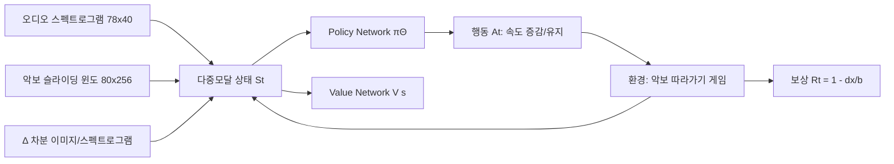

# Learning to Listen, Read, and Follow: Score Following as a Reinforcement Learning Game — 분석 보고서

## 핵심 요약

이 논문은 악보 따라가기(score following) 과제를 강화학습 게임으로 재정의한 최초의 시도이다. 저자들은 들어오는 오디오에 맞춰 악보 이미지 위 현재 위치를 추적하는 문제를, 에이전트가 읽는 속도를 스스로 조절해 가며 악보를 항해(navigate)하는 다중모달 마르코프 결정 과정(MDP)으로 정식화한다. 입력은 약 2초 분량의 스펙트로그램과 슬라이딩 윈도 형태의 악보 이미지이며, 행동은 픽셀 속도를 증감 또는 유지하는 세 가지로 구성된다. REINFORCE with Baseline과 Synchronous Advantage Actor-Critic(A2C)을 적용하여, 단성(monophonic) Nottingham 데이터셋과 다성(polyphonic) Mutopia 데이터셋 모두에서 기존의 위치예측(localization) 기반 베이스라인 [Dorfer 2016]을 큰 폭으로 능가한다는 결과를 보고한다. 핵심 기여는 "악보 따라가기를 비디오 게임처럼 다룰 수 있다"는 패러다임 전환과, 그것이 실제로 동작함을 보인 실험적 증거이다.

## 서지 정보와 접근 범위

본 분석은 Matthias Dorfer, Florian Henkel, Gerhard Widmer가 저술한 "Learning to Listen, Read, and Follow: Score Following as a Reinforcement Learning Game" (arXiv:1807.06391v1, 2018년 7월 17일)을 대상으로 한다. 저자들의 소속은 오스트리아 린츠 요하네스 케플러 대학교(JKU)의 Institute of Computational Perception이며, Widmer는 OFAI(Austrian Research Institute for Artificial Intelligence)에도 소속되어 있다. 논문은 19th International Society for Music Information Retrieval Conference (ISMIR 2018, Paris, France)에 게재되었다. 분석은 추출된 텍스트 파일(`/tmp/pdftext/1807.06391v1.txt`)을 출처로 하며, 본문 6개 섹션(서론, 데이터, MDP 정식화, 학습, 실험, 토의 및 결론), 표 2개, 그림 6개, 그리고 28개 참고문헌을 포함한다. 코드는 저자들이 https://github.com/CPJKU/score_following_game 에서 공개하였고, 시연 영상은 https://youtu.be/COPNciY510g 에 게시되어 있다.

## 상세 요약

논문은 먼저 score following이라는 과제를 정의하는 데서 출발한다. 악보 따라가기란 알려진 상징적 표현(악보)에 대해 실제 음악 연주(오디오)를 온라인으로 추적하는 작업이다. 자동 페이지 넘김, 자동 반주, 콘서트 시각화 동기화 등의 응용에서 핵심 구성요소이며, 전통적으로는 MusicXML이나 MIDI 같은 컴퓨터 판독 가능한 상징 표현에 기반해 왔다. 저자들의 선행 연구 [Dorfer 2016]는 이 의존성을 깨고 악보 이미지 자체에서 직접 따라가기를 시도했지만, 매 시점을 독립적인 위치 예측 문제로 다루기 때문에 반복적인 악구에서 위치가 튀는 문제가 있었다. 본 논문은 이 한계를 강화학습으로 돌파하려 한다.

핵심 아이디어는 score following을 다중모달 제어 문제로 재정의하는 것이다. 에이전트는 매 시점 두 가지 입력을 동시에 본다 — 현재 곡의 슬라이딩 윈도 악보 이미지(80×256, 다운스케일 후)와 가장 최근 약 2초간의 로그 주파수 스펙트로그램(78×40)이다. 마르코프 성질을 만족시키기 위해 두 모달 모두에 대해 직전 시점과의 1차 차분(Δ) 이미지/스펙트로그램을 함께 상태에 포함한다. 에이전트의 행동은 픽셀 속도 v_pxl 의 증감 또는 유지로, At ∈ {−Δv_pxl, 0, +Δv_pxl} 의 세 이산 행동 집합이다. 보상 신호는 에이전트의 추정 위치 x̂과 진짜 위치 x의 거리 dx에 대해 윈도 [x−b, x+b] 내에서 r = 1.0 − |dx|/b 로 선형 감쇠하며, 윈도를 벗어나면 에피소드를 곡의 처음으로 리셋한다.

학습 측면에서 저자들은 정책 경사(policy gradient) 계열, 그중에서도 액터-크리틱(actor-critic) 방법을 채택한다. 비교 대상은 두 가지이다 — Monte-Carlo 방식인 REINFORCE with Baseline (Williams 1992) 과, Mnih 등의 A3C를 동기화한 변형인 A2C이다. 두 알고리즘 모두 동일한 다중모달 합성곱 신경망 아키텍처를 사용한다. 좌측은 악보 이미지를 처리하고(8개의 합성곱 층, 5×5/3×3/1×1 커널, 적절한 stride와 dropout), 우측은 스펙트로그램을 처리하며(7개의 합성곱 층), Dense(512) 표현으로 합쳐 정책 출력 Dense(3)-Softmax와 가치 출력 Dense(1)-Linear로 분기한다. 정책망과 가치망은 하부층 파라미터를 공유한다. A2C는 16개 환경 인스턴스를 병렬로 돌리고 t_max=15 시점까지만 부트스트랩하여 학습 안정성을 확보한다. 옵티마이저는 Adam(초기 학습률 1e-4)이며, 검증 세트의 추적된 onset 수가 50 epoch 동안 개선되지 않으면 학습률을 1/10로 줄이는 방식을 세 번 반복한다.

지도학습 방식 베이스라인도 시도되었다. 시점별 최적 템포 변화를 회귀 목표로 두는 방법인데, 최적 템포 변화가 대부분 0에 가깝고 드물게 큰 스파이크가 나타나는 sparse한 신호이기 때문에, 학습 결과 네트워크가 모든 입력에 대해 0에 가까운 값을 출력하는 사소한(trivial) 해로 빠진다는 것을 보였다. 이 관찰은 RL을 사용하는 동기를 강화한다 — 행동 선택이 누적 보상을 통해 학습되므로, 드문 결정 시점이라도 환경과의 상호작용 속에서 자연스럽게 의미를 가진다.

실험 결과는 표 형태로 깔끔하게 정리되어 있으며, RL 접근의 장점을 분명히 보여준다. Nottingham(단성)에서 A2C는 96%의 곡을 끝까지 추적했고, MM-Loc 베이스라인은 43%에 불과했다. Mutopia(다성)에서는 A2C가 74%, MM-Loc은 61%였으며 평균 추적 오차는 A2C 19.25 픽셀(약 5mm) 대 MM-Loc 62.34 픽셀로 약 3배 차이가 난다. 표준편차 측면에서도 A2C가 압도적으로 안정적이다. REINFORCE_bl은 단성에서는 잘 동작했지만 다성에서는 5일 이상 학습해도 성능이 좋지 않아, A2C의 분산 감소 효과가 본질적임을 시사한다. 저자들은 또한 MDP 정식화가 위치 예측보다 우월한 이유를, 에이전트가 속도를 통해 점진적으로 진행하므로 큰 점프(반복 악구에서의 모드 점프)가 구조적으로 차단되기 때문이라고 해석한다.

## 방법론과 데이터

| 데이터셋 | 곡 수 | 특성 | 용도 |
|---------|-------|------|------|
| Nottingham | 296 (학습 187 / 검증 63 / 테스트 46) | 단성(monophonic) 민요 멜로디 | RL 에이전트 학습 및 평가 |
| Mutopia | 479 (학습 360 / 검증 19 / 테스트 100) | 다성(polyphonic) 클래식 (Beethoven, Mozart, Bach 등) | 더 어려운 다성 환경 평가 |

악보는 Lilypond로 조판되었고 오디오는 MIDI에 어쿠스틱 피아노 사운드폰트를 적용해 합성되었으므로, 픽셀 단위 음표머리(note head) 위치와 오디오 onset 사이의 정확한 정합이 자동으로 확보된다. 오디오 처리는 22.05kHz 샘플레이트에서 윈도 크기 2048로 FFT를 수행하고, 60Hz~6kHz 범위를 78개 주파수 빈으로 매핑한 로그 필터뱅크를 거친다. 프레임율은 20 FPS이며, 에이전트가 보는 스펙트로그램 컨텍스트는 40프레임(2초)이다. 슬라이딩 악보 윈도는 원본 160×512 픽셀이며 1/2로 다운스케일되어 입력된다.

학습 알고리즘은 REINFORCE with Baseline과 A2C 두 가지이다. REINFORCE with Baseline은 에피소드 단위 Monte-Carlo 갱신 Θ ← Θ + α(Gt − V(s))∇Θ ln πΘ(At|St,Θ) 을 사용하며, 분산을 줄이기 위해 추정 가치 V(s)를 차감한다. A2C는 부트스트랩과 16개 병렬 환경을 통해 변동성을 줄이고 온라인 학습을 가능하게 한다. 할인계수 γ = 0.9, t_max = 15 (n-step bootstrapping). 행동 단위 Δv_pxl은 Nottingham에서 0.5, Mutopia에서 1.0 픽셀이다. ELU 활성화 함수가 출력층을 제외한 모든 층에 사용되었다.

보상 함수는 r = 1.0 − |dx|/b 형태의 삼각형(triangular) 함수로, 에이전트가 트래킹 윈도 [−b, +b] 안에 있을 때만 양의 보상을 받고, 윈도를 벗어나면 에피소드가 리셋된다. 평가지표는 네 가지이다 — 평균 절대 추적 오차 |dx|, 그 표준편차 std(|dx|), 추적된 onset의 비율 R_on, 그리고 처음부터 끝까지 완주한 곡의 비율 R_tue. 평가는 합성된 신호의 보간 시점이 아니라 실제 onset이 존재하는 시점에서만 측정된다.

재현성 측면에서, 환경은 OpenAI Gym으로 구현되었고 코드와 영상이 공개되어 있다는 점이 강점이다. 단, 학습 시드와 정확한 하이퍼파라미터 스윕 결과는 본문에 명시적으로 포함되지 않았으며, 결과 표는 10회 평가의 평균만을 보고한다.

## 비판적 평가

강점으로는 첫째, 문제 정식화의 우아함이 두드러진다. score following을 시퀀스 결정 문제로 보는 관점은 음악 연주의 시간적 인과성과 자연스럽게 부합하며, 위치 예측 방식이 안고 있던 모드 점프 문제를 구조적으로 해결한다. 둘째, 다성 음악과 같은 어려운 환경에서 베이스라인 대비 평균 오차를 약 1/3로 줄인 정량적 성과가 분명하다. 셋째, 환경을 표준 RL 툴킷(Gym)에 맞춰 구축하여 후속 RL 연구의 진입 비용을 낮추었다는 점, 그리고 코드 공개를 통한 재현성 확보가 학계에 공헌한다. 넷째, 지도학습 베이스라인이 왜 실패하는지(타깃의 sparsity)를 직접 보임으로써 RL 채택의 정당성을 강화하였다.

약점도 분명하다. 첫째, 평가가 모두 합성 오디오에 한정되어 실제 연주(템포 변동, 표현, 마이크 잡음, 청중 소음)에 대한 일반화는 검증되지 않았다. 본 논문 자체가 토의 절에서 "신청서 비유로, 합성으로 학습한 모델을 실제 오디오에 마디 단위 보상으로 미세조정 가능"이라 언급할 뿐 실증은 미루어 두었다. 둘째, 행동 공간이 세 개의 이산 속도 변화로만 구성되어 곡 내 미세한 템포 변화를 완벽히 따라가지는 못한다 — 저자들도 연속 제어(continuous control)로의 확장을 미래 작업으로 명시한다. 셋째, REINFORCE_bl이 다성에서 사실상 실패한 결과는 알고리즘 의존성이 매우 높음을 시사한다 — 즉, 더 발전된 RL 알고리즘이 등장해야만 안정적인 향상이 가능하다는 외적 의존성이 존재한다. 넷째, 보상 함수 설계(윈도 폭 b)와 픽셀 속도 단위 같은 핵심 하이퍼파라미터의 민감도 분석이 결여되어 있어, 다른 데이터셋이나 조판 방식에 대한 이식성이 불확실하다. 다섯째, 다성 데이터셋에서 학습-검증-테스트 분할 비율(360/19/100)이 비대칭적이며, 검증 셋이 작아 조기 종료(early stopping) 안정성에 의문이 든다.

## 선행연구와 비교

| Citation | 연도 | 방법 | 핵심 발견 | 본 논문과의 차이 |
|---------|------|------|----------|----------------|
| Dorfer, Arzt, Widmer [7] | 2016 | 다중모달 CNN으로 악보 이미지에서 직접 위치 확률분포 회귀 (MM-Loc) | 상징적 표현 없이 sheet image만으로 score following이 가능함을 첫 입증 | 본 논문이 직접 베이스라인으로 채택. 매 시점 독립 예측이라 반복 악구에서 모드 점프 발생; 본 논문은 RL의 시간적 일관성으로 이를 해소 |
| Dorfer, Arzt, Widmer [8] | 2017 | 오디오-악보 조각 간 공통 임베딩 학습, DTW로 오프라인 정합 | 모달 간 코사인 거리로 유사도 측정 가능 | 오프라인 DTW 기반인 반면 본 논문은 온라인 의사결정. 동일 저자의 점진적 발전 라인 |
| Mnih et al. [19] | 2015 | DQN으로 Atari 게임에서 인간 수준 제어 달성 | 픽셀 입력에서 직접 정책 학습 가능 | 본 논문이 명시적으로 영감의 원천으로 인용. score following을 "게임"으로 보는 관점 자체가 이 작업의 직접 계보 |
| Mnih et al. [18] | 2016 | A3C/A2C 비동기/동기 액터-크리틱 알고리즘 | 다중 환경 병렬화로 분산 감소 및 학습 안정화 | 본 논문이 정확히 채택한 학습 알고리즘 |
| Nakamura et al. [21] | 2015 | Autoregressive HSMM으로 상징적 악보 기반 score following | MIDI 기반 환경에서 강력한 통계적 모델링 | 본 논문은 상징 표현 없이 raw image에서 직접 동작 — 입력 모달과 학습 패러다임이 모두 다름 |

특히 Dorfer 2016 (MM-Loc) 과의 관계는 단순한 비교 이상이다. 본 논문은 동일한 데이터, 동일한 입력 표현, 거의 동일한 CNN 백본을 그대로 가져온 채 출력 헤드와 학습 패러다임만 RL로 교체했다. 따라서 Nottingham에서 R_tue가 0.43 → 0.96으로, Mutopia에서 0.61 → 0.74로 향상된 것은 순수하게 학습 방식의 차이에서 비롯된 결과로 해석할 수 있다.

## 실무적 함의와 응용

가장 직접적인 응용은 자동 페이지 넘김(automatic page turning)이다 — Arzt et al. [2]가 다룬 문제에서 상징 악보 의존성을 제거할 수 있다면, 디지털 악보 뷰어가 연주자의 연주를 들으며 실시간으로 페이지를 넘겨주는 시스템이 사진/스캔 악보에 대해서도 동작 가능해진다. 두 번째 응용은 인터랙티브 음악 시스템과 자동 반주(Music Plus One [23], Cont [6] 라인의 후속) — 솔리스트의 연주를 따라가며 반주를 생성하거나 동기화된 시각효과를 제공하는 시스템에서 입력 채널을 악보 사진으로 받을 수 있다는 의미이다. 세 번째로 콘서트 시각화 시스템(Arzt et al. [1, 22]) — 라이브 공연 중 청중에게 악보 위치, 분석 정보, 작곡가 코멘트 등을 표시하기 위한 동기화 엔진으로 활용될 수 있다.

연구 방법론 차원에서는, 음악 정보 검색 분야에서 RL 환경을 표준 Gym 형태로 제공한 첫 사례 중 하나로 의미가 있다. 이는 후속 연구자들이 새로운 RL 알고리즘(PPO, SAC, DreamerV3 등)을 즉시 비교 평가할 수 있는 벤치마크 역할을 한다. 또한 sparse decision 신호 학습 문제(어디서 무엇이 결정인지 알기 어려움)를 가진 다른 신호처리 과제(예: 자동 자막 동기화, 댄스/제스처 따라가기)에 대한 메서드 이전 가능성을 시사한다.

다만 실제 배포를 위해서는 합성 오디오에서 실제 녹음으로의 도메인 갭, 노이즈 강건성, 인쇄 악보의 다양한 조판 스타일에 대한 일반화 등 추가 검증이 필수적이다.

## 후속 연구와 핵심 참고문헌

핵심 참고문헌과 그 의의는 다음과 같다. (1) Dorfer, Arzt, Widmer [7], ISMIR 2016 — 본 논문의 가장 직접적인 베이스라인이자 sheet image score following이라는 문제 설정을 만든 작업. (2) Dorfer, Arzt, Widmer [8], ISMIR 2017 — 동일 저자의 cross-modal embedding 라인으로, 본 논문과 상보적인 오프라인 정합 접근. (3) Mnih et al. [18], ICML 2016 — A3C/A2C 알고리즘의 원전이며 본 논문 학습기의 토대. (4) Mnih et al. [19], Nature 2015 — score following을 "게임"으로 다루는 관점의 사상적 기반. (5) Sutton and Barto [25], MIT Press 1998 — RL 표기와 개념 전반의 표준 교재. (6) Williams [27], Machine Learning 1992 — REINFORCE 알고리즘 원전.

저자들이 명시한 후속 방향은 세 갈래이다. 첫째, 합성 오디오로 학습된 모델을 실제 연주 오디오에 미세조정하는 것 — 마디 단위로만 라벨이 있는 약지도(weakly labeled) 환경에서 RL이 자연스럽게 동작할 수 있다는 점을 활용. 둘째, 이산 행동 공간을 연속 제어로 확장하여 완벽한 정합(alignment)을 달성하는 것. 셋째, RL 일반화를 위한 정규화 기법(dropout, weight decay, batch normalization)의 체계적 벤치마크 — RL에서는 이들 기법의 효과가 지도학습만큼 잘 정리되어 있지 않다는 관찰. 본 저자 그룹의 후속 작업으로는 Henkel et al. (2020 / 2021)에서 score following 환경을 더욱 완전한 형태와 바운딩 박스 표현으로 확장한 연구들이 이어진다.
