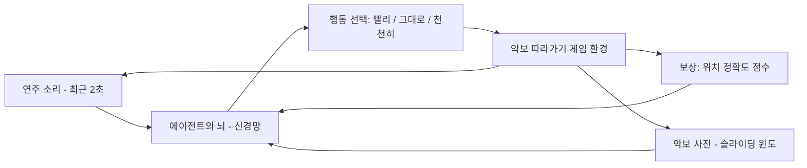

# Learning to Listen, Read, and Follow — 비전공자 해설

## 이 논문이 풀려는 문제는 무엇인가

피아노 연주회를 떠올려 보자. 무대 옆에 앉은 페이지 터너(악보를 넘겨주는 사람)는 연주자가 지금 악보의 어느 위치에 있는지를 끊임없이 눈으로 따라가야 한다. 연주가 빨라지면 시선도 빨라지고, 느려지면 시선도 느려진다. 갑자기 어떤 부분을 반복하면 시선도 그 자리로 돌아가야 한다. 사람에게는 자연스러운 이 행동을 컴퓨터에게 시키는 것이 바로 "악보 따라가기(score following)"이다.

악보 따라가기는 단순한 호기심 거리가 아니라 실용적인 응용이 많다. 태블릿이 알아서 악보를 넘겨주는 디지털 페이지 터너, 솔리스트의 호흡에 맞춰 자동으로 반주를 따라가는 시스템, 콘서트장에서 청중에게 "지금 이 부분을 연주 중입니다"를 실시간으로 보여주는 시각화 시스템 등이 모두 이 기술 위에 서 있다.

지금까지 컴퓨터가 이 일을 하려면 보통 두 가지 도움이 필요했다. 하나는 연주자가 만들어내는 소리(오디오), 그리고 다른 하나는 악보를 컴퓨터가 읽을 수 있는 형식으로 변환한 데이터 — 즉 MIDI나 MusicXML이다. 그런데 우리 주변에 있는 악보는 대부분 종이에 인쇄된 것이거나 사진으로 찍어 올린 이미지다. 이걸 일일이 MIDI로 바꾸는 일은 시간이 많이 걸리고, 자동 변환 프로그램(OMR, 광학 음악 인식)은 아직 신뢰할 만한 수준이 아니다. 특히 오케스트라처럼 복잡한 악보에서는 더욱 그렇다.

이 논문의 저자들은 한 발 더 나아가 묻는다. "MIDI 같은 중간 단계 없이, 악보 사진과 오디오만 가지고 컴퓨터가 직접 따라갈 수는 없을까?" 그리고 그 방법으로 강화학습(reinforcement learning, RL)을 들고 온다. 강화학습은 알파고가 바둑을 배운 방법이고, 컴퓨터가 옛날 아타리(Atari) 게임을 인간 수준으로 익힌 방법이다. 저자들은 악보 따라가기를 일종의 비디오 게임으로 다시 정의한다. 게임의 주인공(에이전트)은 악보 위를 일정한 속도로 미끄러져 나가며, 음악이 빨라지면 속도를 올리고 느려지면 속도를 줄이는 식으로 정확한 위치를 유지하려 애쓴다. 잘 따라가면 점수(보상)를 받고, 너무 멀어지면 게임 오버다.

## 핵심 아이디어를 한 그림으로

비유를 하나 들어 보자. 양궁 선수가 움직이는 표적을 따라 활시위를 당기는 모습을 상상해 보라. 표적이 오른쪽으로 빨리 움직이면 시위도 빠르게 같이 따라가야 하고, 멈추면 같이 멈춰야 한다. 한 번에 너무 큰 점프를 하면 표적을 놓치고, 너무 천천히 가면 뒤처진다. 이 논문의 에이전트도 비슷하다. 에이전트는 매 순간 "조금 더 빠르게 갈까, 그대로 갈까, 조금 천천히 갈까"의 세 가지 중 하나를 고른다. 그리고 그 결과로 악보 위에서 자기 위치가 진짜 연주 위치와 얼마나 가까운지에 따라 점수를 받는다. 점수를 많이 받기 위해 에이전트는 수천 번 게임을 플레이하면서 — 즉 수천 곡을 연주해 보면서 — 어떤 상황에서 어떤 속도 조절을 해야 하는지를 스스로 학습한다.

## 알아야 할 핵심 용어

| 용어 | 영문 | 직관적 설명 |
|------|------|----------|
| 악보 따라가기 | Score Following | 컴퓨터가 연주 음악을 들으며 악보 위 어느 위치를 연주 중인지 실시간으로 짚어내는 기술 |
| 강화학습 | Reinforcement Learning, RL | 시행착오로 점수를 최대화하는 행동을 배우는 기계학습 방법. 비디오 게임 학습이 대표 사례 |
| 에이전트 | Agent | 게임 속 주인공. 환경을 보고 판단하여 행동하는 학습 주체 |
| 환경 | Environment | 에이전트가 행동을 펼치는 무대. 여기서는 "악보 따라가기 게임" |
| 상태 | State | 에이전트가 매 순간 보는 정보. 이 논문에서는 최근 2초 오디오 스펙트로그램과 악보 슬라이딩 윈도 |
| 행동 | Action | 에이전트가 고를 수 있는 선택지. 여기서는 속도를 빠르게/그대로/느리게의 세 가지 |
| 보상 | Reward | 행동에 대해 받는 점수. 진짜 위치에 가까울수록 높고, 윈도 밖으로 벗어나면 게임 오버 |
| 정책 | Policy | 어떤 상태에서 어떤 행동을 고를지 결정하는 규칙. 신경망으로 표현됨 |
| 가치 함수 | Value Function | 지금 이 상태가 앞으로 점수를 얼마나 받을 수 있는 좋은 상태인지를 평가하는 함수 |
| A2C | Advantage Actor-Critic | 정책망(액터)과 가치망(크리틱)을 함께 학습시키는 강화학습 알고리즘. 이 논문의 주력 도구 |
| REINFORCE | REINFORCE | 가장 고전적인 정책 학습 알고리즘. 에피소드 한 곡을 끝까지 본 뒤 갱신 |
| 스펙트로그램 | Spectrogram | 시간에 따른 주파수 에너지를 보여주는 음향 이미지. 에이전트가 "듣는" 방법 |
| 슬라이딩 윈도 | Sliding Window | 긴 악보 이미지에서 현재 위치 주변만 잘라낸 작은 창. 에이전트가 "보는" 범위 |
| 마르코프 결정 과정 | Markov Decision Process, MDP | 상태/행동/보상으로 이루어진 의사결정 문제의 표준 수학적 틀 |

## 이 논문의 새로운 점

기존 방법들과 비교하면 이 논문의 신선함이 잘 드러난다. 가장 오래된 방법은 동적 시간 워핑(DTW, Dynamic Time Warping)이라는 알고리즘이다. DTW는 두 시간 시퀀스를 가장 잘 맞추는 정렬을 찾는 통계적 방법인데, 보통 연주가 끝난 뒤에 전체를 한꺼번에 정렬하는 오프라인 방식이다. 라이브 연주에서 실시간으로 위치를 알려주기는 어렵다.

같은 저자 그룹의 2016년 논문(MM-Loc이라 부른다)은 한 단계 진보였다. 매 순간 컴퓨터가 "지금 들리는 소리는 악보의 어디쯤일까"를 직접 예측하는 신경망을 만들었다. 그러나 이 방식에는 한 가지 문제가 있었다. 매 순간을 독립적으로 예측하다 보니, 같은 멜로디가 반복되는 부분에서는 신경망이 헷갈려 위치를 갑자기 다른 곳으로 점프시키곤 했다. 마치 비슷한 길이 두 곳에 있을 때 내비게이션이 두 길 사이를 왔다갔다 하는 것과 같다.

이 논문은 이 문제를 게임의 비유로 풀어버린다. 게임 속 캐릭터는 마음대로 순간이동을 할 수 없다. 한 발씩 걸어가야 한다. 마찬가지로 에이전트는 매 순간 속도를 조금씩 조절할 뿐 큰 점프를 할 수 없다. 비슷한 멜로디가 반복돼도 "방금까지 내가 여기쯤이었으니, 지금은 여기서 한 걸음 옆이 맞다"는 시간적 일관성을 자연스럽게 가진다. 영리한 트릭이라기보다, 문제를 보는 관점 자체를 바꾼 것이다.

또 하나 흥미로운 점은 저자들이 지도학습(supervised learning) 방식도 시도해 보고 실패담을 보고했다는 것이다. 지도학습이란 정답을 미리 알려주고 따라하게 하는 방법이다. "이 시점에서는 속도를 +2 만큼 늘려라"라는 정답을 매 순간마다 만들어 두고 신경망에 학습시켜 보았는데, 결과는 신경망이 거의 모든 시점에서 0(속도 변화 없음)을 출력하는 무성의한 답으로 빠지는 것이었다. 왜냐하면 진짜 속도 변화가 필요한 순간은 매우 드물어서, 그저 0을 출력해도 평균적으로 오차가 작기 때문이다. 강화학습은 이 함정을 피한다. 어차피 점수는 누적되어야 하므로, 드문 순간이라도 옳은 결정을 내리지 못하면 결국 게임에서 진다.

알고리즘 자체는 기계학습 분야에서 잘 알려진 두 가지를 가져왔다. REINFORCE는 1992년에 만들어진 고전 알고리즘으로, 한 곡을 끝까지 연주해 본 뒤 결과를 보고 정책을 갱신한다. A2C는 더 최근의 방법으로, 16개의 게임을 동시에 병렬로 플레이하면서 즉각즉각 학습한다. 결과적으로 A2C가 훨씬 안정적으로, 훨씬 빠르게 학습되었다. 단성 멜로디(Nottingham 데이터)는 6시간 만에 학습이 끝났고, 한층 어려운 다성 클래식 음악(Mutopia 데이터)에서도 평균 오차가 베이스라인의 약 1/3로 줄었다.

## 한계와 의의

좋은 결과 뒤에 솔직한 한계도 함께 적어야 공평하다. 첫째, 이 논문에서 사용한 음악은 모두 컴퓨터가 합성한 가짜 피아노 소리이다. 실제 사람이 연주한 녹음에서는 템포가 미묘하게 흔들리고, 강약이 달라지고, 마이크나 공간 잔향이 들어간다. 그런 진짜 연주에서도 잘 동작하는지는 이 논문만으로는 알 수 없다. 저자들도 이 점을 인정하고 있고, "합성으로 학습한 모델을 진짜 연주에 살짝 더 학습시키면 될 것"이라는 아이디어를 제시할 뿐이다.

둘째, 에이전트가 고를 수 있는 행동이 단 세 가지(빨라지기, 그대로, 느려지기)뿐이다. 픽셀 단위로 따지면 한 걸음 크기도 정해져 있다. 이 때문에 미세한 템포 변화에 완벽히 들어맞지는 않는다. 저자들은 미래 작업으로 연속적인 속도 조절(continuous control)을 언급한다.

셋째, 강화학습은 학습 시간이 길고 변동성이 크다. 본문 기준으로 더 단순한 REINFORCE는 다섯 일 넘게 학습해도 어려운 데이터셋에서 실패했다. A2C 덕분에 안정성이 확보됐지만, 더 어려운 음악(예를 들어 오케스트라 풀스코어)에서도 같은 알고리즘이 잘 동작할지는 별도의 검증이 필요하다.

이런 한계를 감안해도 이 논문이 의미하는 바는 적지 않다. 첫째, 악보 따라가기를 "게임"이라는 새로운 시각으로 볼 수 있다는 사고의 전환을 제공했다. 이 시각은 후속 연구에서 보상 함수 설계, 행동 공간 확장, 다양한 RL 알고리즘 비교 등 풍부한 연구 가능성을 열었다. 둘째, 인쇄된 악보 사진을 그대로 입력으로 받아 동작하는 종단 간(end-to-end) 시스템을 입증함으로써, 디지털 변환 작업이 어려운 수많은 악보(고악보, 손글씨, 출판되지 않은 사보 등)에도 같은 기술을 확장할 길을 열었다. 셋째, 코드와 환경을 공개해 후속 연구자들이 같은 벤치마크 위에서 새로운 알고리즘을 즉시 비교할 수 있게 했다 — 이는 학계 발전 속도를 빠르게 만드는 실질적 기여이다.

음악과 인공지능의 만남이라는 큰 그림에서 이 논문은 의미 있는 한 걸음이다. 컴퓨터가 음악을 "이해한다"는 말은 추상적이지만, 사람이 악보를 보며 연주를 따라가듯 컴퓨터도 악보 사진과 소리만으로 그 일을 해낼 수 있다는 사실은, 음악 시각화, 자동 반주, 악보 학습 보조 같은 일상적 응용으로 곧 연결될 수 있다. 이 논문의 진짜 가치는 결과의 숫자가 아니라, "이런 방식으로 풀 수 있다"는 가능성을 명확히 보인 데에 있다.
