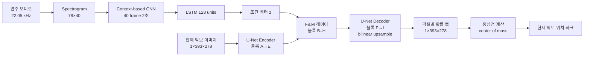

# Learning to Read and Follow Music in Complete Score Sheet Images — 분석 보고서

## 핵심 요약

이 논문은 OMR(광학 음악 인식)이나 사전 처리 없이 **전체 페이지 단위의 원본 악보 이미지**를 직접 입력받아 score following을 수행하는 최초의 종단간(end-to-end) 시스템을 제안한다(PDF p.1). 이전의 이미지 기반 추적기들이 한 줄(staff) 또는 작은 스니펫에 국한되어 있던 한계를 극복하기 위해, 저자들은 score following을 "지시 영상 분할(referring image segmentation)" 과제로 재정의하고, FiLM(Feature-wise Linear Modulation) 레이어로 오디오 조건화된 U-Net 구조를 설계한다(PDF p.1, p.3). MSMD 데이터셋의 다성 피아노 음악 125 페이지 테스트셋에서 기존 OMR·MM-Loc·RL 기반 방법보다 정렬 정밀도(precision)가 크게 향상되어 새로운 SOTA를 달성하지만, 실제 녹음 환경(룸 마이크)에서는 일반화 성능이 크게 떨어진다는 한계도 함께 보고한다(PDF p.5–6). 이 작업은 단편 기반 추적기에서 **전체 페이지 인식**으로 패러다임을 전환했다는 점에서 score following 연구의 중요한 분기점이다.

## 서지 정보와 접근 범위

- **저자**: Florian Henkel¹, Rainer Kelz², Gerhard Widmer¹
- **소속**:
  - ¹ Institute of Computational Perception, Johannes Kepler University Linz (JKU), Austria
  - ² Austrian Research Institute for Artificial Intelligence (OFAI), Vienna, Austria
- **학회**: Proceedings of the 21st International Society for Music Information Retrieval Conference (ISMIR 2020), Montréal, Canada
- **연도**: 2020 (arXiv:2007.10736v1, 21 Jul 2020)
- **분량**: 약 6 페이지 본문 + 참고문헌
- **섹션 구성**: 1. Introduction → 2. Related Work → 3. Score Following as a Referring Image Segmentation Task (3.1 FiLM, 3.2 Model Architecture) → 4. Experiments (4.1 Data, 4.2 Baselines and Evaluation Measures, 4.3 Experimental Setup, 4.4 Results) → 5. Real Performances → 6. Discussion and Conclusion
- **코드 공개**: https://github.com/CPJKU/audio_conditioned_unet (PDF p.2 footnote 1)

## 상세 요약

**문제 정의와 동기**. score following은 자동 반주, 자동 페이지 넘김, 라이브 공연 시각화 동기화 등 MIR(Music Information Retrieval)의 다양한 응용에 필수적인 기초 과제이다(PDF p.1). 기존 접근은 두 갈래로 나뉜다. 한쪽은 MusicXML/MIDI 같은 컴퓨터 가독 표현이 필요(DTW, HMM 계열)하고, 다른 한쪽은 OMR을 거치거나 작은 악보 스니펫만을 보는 제한된 행동 공간을 갖는다. 후자는 한번 추적이 어긋나면 audio와 sheet snippet의 대응이 깨져 회복이 불가능하다는 치명적 약점이 있다(PDF p.1). 저자들은 **전체 페이지를 항상 관측 가능한** 시스템을 제안하여 이 한계를 정면 돌파한다.

**핵심 기여 — Referring Image Segmentation으로의 재정식화**. 컴퓨터 비전의 referring image segmentation은 자연어 표현으로 이미지 내 특정 영역을 지시하는 과제인데, 저자들은 오디오를 "언어 표현"처럼 다루고 악보 이미지를 "추론 대상"으로 두어 동일한 프레임으로 score following을 정식화한다(PDF p.2). ground truth는 현재 위치 주변에 폭 10 픽셀, staff 높이에 따라 적응적인 높이를 갖는 binary segmentation mask로 정의된다.

**모델 구조 — Audio-Conditioned U-Net**. 모델은 [22]의 의료 영상용 U-Net을 base로 하여 9개 블록(A–I)으로 구성되며, 각 블록은 두 개의 convolutional layer + ELU + Layer Normalization으로 이루어진다(PDF p.3, Figure 3). 핵심은 **FiLM 레이어**(PDF p.3 식 (1))로, 오디오에서 추출한 조건 벡터 z로 feature map을 affine 변환(scale s(z), translate t(z))한다. 조건화는 블록 B–H에 적용하며, A와 I는 비조건화 상태로 둔다. transposed convolution 대신 bilinear upsampling + 1×1 convolution을 사용해 checkerboard artifact를 줄였고, batch norm 대신 layer norm을 채택했다(작은 batch size, RNN 존재 때문). 오디오 인코더는 두 종류로 비교된다: **CB(context-based)** — 40 프레임(2초) 스펙트로그램을 처리, **FB(frame-based)** — 단일 프레임만 처리. 두 인코더 출력은 모두 128 unit LSTM을 거쳐 hidden state가 FiLM의 z로 사용된다(PDF p.3–4).

**데이터와 학습**. MSMD(Multi-modal Sheet Music Dataset)의 정제판 — 353 train / 19 validation / 94 test 곡(945 / 28 / 125 페이지)을 사용하며, 자동 정렬의 오류를 수동으로 보정했다(PDF p.4). 악보는 1181×835에서 393×278로 다운스케일, 오디오는 22.05 kHz / 20 fps / 78개 log-frequency bin 스펙트로그램으로 처리된다. 손실은 imbalanced segmentation에 적합한 **Dice coefficient loss**, 옵티마이저는 Adam (lr=1e-4, weight decay=1e-5), batch size 4(LSTM 모델) / 64(NTC), 시퀀스 길이 16, x·y 축 이미지 시프트와 0.5–1.5배 7가지 tempo augmentation을 적용한다(PDF p.4–5).

**평가와 결과**. 두 종류의 평가 — 픽셀 단위(Precision/Recall/F1, alignment error in cm)와 음악적(노트 onset 시간 오차 누적 분포, 5개 임계값 0.05–5초)을 사용한다. CB 모델이 모든 baseline(NTC, FB)보다 우수했고(F1 0.843, mean alignment 1.25 cm, median 0.51 cm), 최종 비교에서 OMR[14]·MM-Loc[15,32]·RL[14,16] 대비 0.05–1초의 좁은 임계값에서 압도적 정밀도를 보였다(예: ≤0.05초 73.3% vs OMR 44.7%). 다만 ≤5초의 큰 임계값에서는 OMR이 더 robust(97.4% vs CB 93.7%)하다(PDF p.5 Table 3). 실제 피아노 녹음(16곡, 25 페이지) 평가에서는 합성 / 공연 MIDI / Direct Out 까지는 우수하지만 **room recording**에서 성능이 급격히 떨어진다(≤0.05초 9.4% vs OMR 22.6%, PDF p.6 Table 4) — 합성 오디오에 대한 overfitting을 시사한다.

**파이프라인 흐름**.

## 방법론과 데이터

**네트워크 입출력 차원**:

- 입력 sheet image: `1 × 393 × 278` (다운스케일된 grayscale 페이지)
- 입력 spectrogram: CB는 `78 × 40` (78 log-freq bin × 40 frame), FB는 `78 × 1`
- LSTM hidden state z: 128 차원
- 출력 probability map: `1 × 393 × 278` (각 픽셀의 [0,1] 확률, 0.5로 thresholding)
- U-Net 블록 필터 수: A=8 → E=128 → I=8 (대칭 증감)
- Encoder CNN 필터: 24→48→96→96, kernel 3×3, MP 2×2, 마지막 Dense 32

**데이터셋 표**:

| 데이터셋 | 곡 수 | 페이지 수 | 특성 | 용도 |
|---|---|---|---|---|
| MSMD train (정제) | 353 곡 | 945 페이지 | Lilypond 조판, Fluidsynth 합성, 다성 피아노 (Bach/Mozart/Beethoven 등) | 학습 |
| MSMD validation | 19 곡 | 28 페이지 | 동일 합성 조건 | 모델 선택 (lowest val loss) |
| MSMD test | 94 곡 | 125 페이지 | 동일 합성 조건 | 주 평가 (Table 2, 3) |
| MSMD real recordings | 16 곡 | 25 페이지 | Yamaha AvantGrand N2 hybrid piano로 실연 녹음, Direct Out + Room mic | 일반화 평가 (Table 4) |

**평가지표**:
1. **픽셀 단위**: Precision, Recall, F1 (threshold 0.5), 그리고 mean / median alignment error (cm). 변환 계수 0.0352 cm/pixel (72 dpi A4 가정).
2. **음악적**: 노트 onset별 절대 시간 오차 누적 비율을 5개 threshold (0.05, 0.10, 0.50, 1.00, 5.00초)에서 측정. 예측 segmentation의 center of mass를 가장 가까운 staff에 매핑한 뒤 unrolled score 좌표 보간으로 시간 차이 계산.
3. **OMR 비교 시**: ground truth alignment 부재로 — onset만 평가, perfect alignment를 diagonal로 가정한 채 추적 위치의 offset 측정.

**재현성**. 코드와 정제 데이터 공개 약속(https://github.com/CPJKU/audio_conditioned_unet), madmom 라이브러리 사용, 하이퍼파라미터·초기화·학습 종료 조건(val loss 5 epoch 정체 시 lr halve, 10 epoch 정체 시 stop, max 100 epoch) 모두 명시되어 있어 재현성은 양호하다(PDF p.4–5).

## 비판적 평가

**강점**. (1) **개념적 도약** — score following을 referring image segmentation으로 재정식화한 것은 독창적이며, 비전의 conditional segmentation 기법(FiLM)을 음악 영역에 자연스럽게 이식했다. (2) **전체 페이지 직접 처리** — staff detection·snippet 추출 같은 사전 처리를 모두 제거해 종단간 학습을 가능하게 했다. (3) **정확도** — synthetic 환경에서 ≤0.05초 정렬 비율이 OMR의 44.7%에서 73.3%로 큰 폭으로 개선되어, fine-grained 정확도에서 명백한 SOTA를 달성. (4) **장기 시간 맥락** — LSTM을 통해 반복 패턴 처리 가능성을 열었다. (5) **재현 가능성** — 데이터·코드 공개와 상세한 학습 세팅.

**약점**. (1) **일반화 한계** — 룸 마이크 녹음에서 성능이 ≤0.05초 9.4%로 OMR(22.6%)에 절반 이하로 뒤지는 것은 실용성에 큰 제약. 저자도 "synthesized audio에 overfit"으로 인정. (2) **반복 처리 미해결** — 악보 내 반복 마디(repeating patterns)나 da capo 같은 음악적 반복 구조를 다루는 명시적 메커니즘이 없으며, 저자도 future work로 미룬다(PDF p.6). (3) **큰 임계값에서의 robustness 부족** — ≤5초 threshold에서는 OMR/RL이 우세, 즉 평균은 OMR이 안정적임. (4) **단일 페이지 가정** — 페이지 전환은 "단순 hack"으로 처리한다고 언급(PDF p.4 footnote 5). (5) **MSMD 단일 도메인** — 합성된 Lilypond 조판, Fluidsynth 사운드폰트로 학습되어 스캔/필사 악보·다양한 악기 일반화는 검증되지 않음. (6) **좌표 직접 회귀 실패** — CoordConv 시도에도 직접 (x,y) 회귀가 어려웠다는 보고(PDF p.4)는 segmentation 우회 자체가 차선책일 수 있음을 시사.

## 선행연구와 비교

| Citation | 연도 | 방법 | 핵심 발견 | 본 논문과의 차이 |
|---|---|---|---|---|
| Dorfer et al. [15] (MM-Loc) | 2016 | sheet image snippet + audio excerpt → 위치 회귀하는 multi-modal CNN | 최초로 sheet image 기반 score following 제시 | 본 논문은 snippet 대신 **전체 페이지** 입력. 또한 단순 latent concat 대신 FiLM 조건화 사용 |
| Dorfer et al. [16] (RL) | 2018 | unrolled sheet image 위에서 RL agent가 reading speed 조절 | RL로 score following 정식화 | 본 논문은 RL이 아닌 **segmentation 회귀**, unrolled 대신 **원본 페이지**. 행동 공간 제약 없음 |
| Henkel, Balke, Dorfer, Widmer [14] | 2019 | RL 강화 + OMR baseline 비교, MSMD 평가 프로토콜 정립 | snippet 기반 RL의 SOTA 정립 및 OMR과 정량 비교 프레임워크 제공 | 평가 프로토콜과 baseline을 그대로 차용했으나, 모델은 sheet snippet → **full page**로 전환 |
| Henkel, Kelz, Widmer [17] | 2019 | full sheet image 기반 audio-conditioned U-Net (monophonic), WoRMS workshop | 전체 페이지 처리의 첫 시도, 단 시간 맥락 부재 | 본 논문은 [17]의 직속 후속작 — **LSTM 기반 장기 맥락**, batch norm → layer norm, transposed conv → bilinear upsample, **다성 피아노**로 확장 |
| Hajič jr., Dorfer, Widmer, Pecina [22] | 2018 | U-Net으로 악보 내 음악 기호 검출 | sheet image에 U-Net이 효과적 | 본 논문은 [22]의 U-Net 구조를 차용해 segmentation backbone으로 활용 |
| Perez et al. [7] (FiLM) | 2018 | feature-wise linear modulation으로 visual reasoning | 외부 조건으로 CNN feature 변조하는 일반 메커니즘 | 본 논문은 FiLM을 **오디오 → 악보 이미지** 조건화에 적용 |

## 실무적 함의와 응용

- **자동 페이지 넘김(automatic page turning)**: 정밀한 페이지 내 위치 추정으로 페이지 끝 도달 감지가 자연스럽게 구현 가능하다(PDF p.4 footnote 5).
- **자동 반주(automatic accompaniment)**: ≤0.05초 정밀도가 73.3%에 달해 합성 환경에서 가속 반주 시스템에 즉시 활용 가능. 단, 라이브 환경에서는 audio robustness 보강이 필요.
- **공연 시각화 동기화**: 라이브 공연을 악보 이미지 상의 시각 효과(예: 현재 위치 하이라이트)와 맞물리는 응용에 적합. 저자가 인용한 Concertgebouw [4], Orchestral Performance Companion [5] 같은 시스템에서 OMR을 우회하는 직접 경로 제공.
- **OMR 의존성 제거**: 손글씨 악보·역사 악보 등 OMR이 어려운 문서에서도 학습 데이터만 확보되면 적용 가능성을 시사.
- **실제 도입 전 과제**: room reverberation augmentation, 더 다양한 연주 합성 데이터, 반복 마디 처리, 여러 페이지 트랜지션 모듈 추가가 필요(PDF p.6 Discussion).

## 후속 연구와 핵심 참고문헌

**저자가 명시한 future work**(PDF p.6):
- reverberation을 포함한 audio data augmentation 또는 더 robust한 audio encoder
- 스캔/사진 촬영된 악보(real visual domain) 평가용 데이터셋 큐레이션
- 악보 내 반복 구조(repetitions)와 연주의 반복 처리 메커니즘
- LSTM의 audio history 인코딩 용량 분석

**핵심 참고문헌**:
- [7] Perez et al., FiLM (AAAI 2018) — 본 논문의 핵심 building block
- [8] Dorfer et al., MSMD (TISMIR 2018) — 데이터셋과 인코더 구조의 출처
- [14] Henkel et al., RL Score Following (TISMIR 2019) — 평가 프로토콜과 baseline의 출처
- [15] Dorfer et al., MM-Loc (ISMIR 2016) — 이미지 기반 score following의 선구작
- [16] Dorfer et al., RL Score Following (ISMIR 2018) — RL 기반 선구작
- [17] Henkel et al., Audio-Conditioned U-Net (WoRMS 2019) — 본 논문의 직접적 전신
- [22] Hajič jr. et al., U-Net OMR (ISMIR 2018) — backbone U-Net 구조의 출처
- [23] Ronneberger et al., U-Net (MICCAI 2015) — segmentation 백본의 원전
- [29] Milletari et al., V-Net Dice loss (3DV 2016) — 학습 손실 함수
