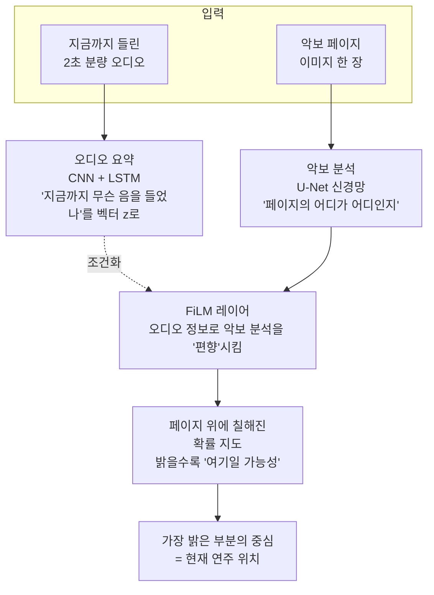

# Learning to Read and Follow Music in Complete Score Sheet Images — 비전공자 해설

## 이 논문이 풀려는 문제는 무엇인가

연주가 시작되면 컴퓨터가 악보를 보면서 "지금 연주자가 어디를 치고 있는지"를 실시간으로 짚어주는 기술을 **score following**(악보 추적)이라고 합니다. 이 기술이 잘 동작하면 자동 반주, 자동 페이지 넘김, 콘서트장에서 악보 위에 현재 위치를 비추는 시각 효과 같은 응용이 가능해집니다.

문제는 "악보를 어떻게 컴퓨터에게 보여주느냐"입니다. 그동안의 연구는 두 가지 방법을 썼습니다. 첫째는 악보를 미리 컴퓨터가 알아볼 수 있는 디지털 악보(MusicXML이나 MIDI)로 바꿔놓고 따라가는 방법입니다. 그러려면 사람이 일일이 입력하거나 OMR(Optical Music Recognition, 악보 광학 인식)이라는 별도 프로그램을 돌려야 하는데, OMR은 종종 음표를 잘못 읽어 추적이 망가지는 원인이 됩니다. 둘째는 악보를 한 줄씩 잘라서(snippet) 컴퓨터에게 한 조각씩 보여주는 방법입니다. 그런데 한 번이라도 추적이 어긋나면, 보고 있는 한 줄과 들리는 음악이 어긋나 다시는 회복하지 못합니다. 좁은 시야로 길을 찾는 것과 같습니다.

이 논문은 그래서 **악보 한 페이지 전체를 한꺼번에 컴퓨터에게 보여주자**고 제안합니다. 마치 사람이 악보 한 페이지를 한눈에 펼쳐놓고 들리는 음악과 비교하며 위치를 찾는 것처럼요. 페이지 전체를 보면 한 줄에서 길을 잃어도 다른 줄에서 다시 위치를 찾을 수 있고, 잘라내거나 OMR을 돌리는 전처리도 필요 없습니다. 이전까지 누구도 풀지 못했던 "전체 페이지 단위 score following"을 처음으로 종단간(end-to-end) 학습으로 해낸 것이 이 논문의 핵심 기여입니다.

## 핵심 아이디어를 한 그림으로

이걸 일상 비유로 바꾸면 이렇습니다. 누군가 책의 어느 페이지를 큰 소리로 읽어주는데, 당신은 같은 페이지를 보며 어디를 읽고 있는지 손가락으로 짚어야 한다고 생각해 봅시다. 사람은 (1) 들리는 단어들을 머리에 잠시 담아두고(2초 분량의 청각 기억), (2) 페이지를 훑어보며 그 단어들이 있을 만한 자리를 찾고, (3) "여기일 거다"라는 위치에 손가락을 둡니다. 이 논문의 신경망도 똑같이 합니다. 오디오 인코더가 청각 기억을, U-Net이 시각 인지를, FiLM 레이어가 "어떤 특징에 더 주의해야 하는지"의 가이드를, 마지막의 segmentation map이 "손가락 끝 위치"를 담당합니다.

## 알아야 할 핵심 용어

| 용어 | 영문 | 직관적 설명 |
|---|---|---|
| 악보 추적 | Score Following | 연주를 들으면서 악보 위에서 현재 위치를 실시간으로 짚어주는 기술. 자동 반주의 토대 |
| 광학 음악 인식 | OMR (Optical Music Recognition) | 악보 이미지를 읽어 디지털 악보(MIDI 등)로 변환하는 기술. 종종 오류가 생겨 추적의 약점이 됨 |
| 합성곱 신경망 | CNN (Convolutional Neural Network) | 이미지의 가까운 픽셀들을 함께 보면서 패턴(선·곡선·기호 등)을 점점 더 추상적인 특징으로 요약하는 신경망 |
| 인코더–디코더 | Encoder–Decoder | 인코더가 이미지를 작게 압축하며 의미를 뽑아내고, 디코더가 다시 원래 크기로 복원하면서 픽셀별 답을 만드는 구조 |
| U-Net | U-Net | 인코더와 디코더 사이를 "건너뛰기 연결(skip connection)"로 이어 위치 정보를 잃지 않게 한 segmentation 전용 신경망. 원래는 의료영상용 |
| 영상 분할 | Image Segmentation | 사진의 각 픽셀이 어떤 종류인지(예: 사람/배경) 분류하는 일. 이 논문에선 "현재 위치 ↔ 그 외"의 두 가지로 분할 |
| 지시 영상 분할 | Referring Image Segmentation | "빨간 모자를 쓴 사람" 같은 외부 단서로 사진 속 특정 부분을 골라내는 과제. 이 논문은 단서가 "들리는 음악" |
| 스펙트로그램 | Spectrogram | 소리를 시간×주파수의 그림으로 펼친 것. 오디오를 "이미지처럼" 다룰 때 쓰는 표준 표현 |
| 좌표 회귀 | Coordinate Regression | 그림 위 (x, y) 좌표를 신경망이 직접 숫자로 출력하는 방식. 저자들은 이 방식이 잘 안 됐다고 보고 |
| FiLM 조건화 | Feature-wise Linear Modulation | 한쪽 신경망(오디오)의 출력으로 다른 쪽 신경망(악보)의 내부 특징 지도를 늘리거나 줄이고 더해서 "주의를 돌리는" 트릭. 곱하기와 더하기 한 줄로 끝나지만 효과는 강력 |
| 다중 모달 임베딩 | Multi-modal Embedding | 서로 다른 종류의 데이터(여기선 소리와 그림)를 같은 의미 공간의 벡터로 만들어 비교 가능하게 하는 기법 |
| LSTM | Long Short-Term Memory | 시간 순서가 있는 데이터에서 "지금까지 무슨 일이 있었는지"를 기억하는 순환 신경망. 여기선 오디오의 장기 맥락 담당 |
| Dice 손실 | Dice Coefficient Loss | "전체 픽셀 중 진짜 정답 영역은 매우 작다"라는 불균형 상황에서 영역 일치 정도를 직접 측정하는 학습 목표 함수 |

## 이 논문의 새로운 점

가장 큰 차이는 **시야의 크기**입니다. 이전 시스템들은 악보 한 줄짜리 짧은 조각을 보고 "이 조각 안의 어디일까?"를 답했습니다. 이 논문은 **페이지 한 장 전체**를 보여주고 "이 페이지 어디든 좋으니 정답을 짚어라"라고 시킵니다. 시야가 넓어지면 모호함도 늘어납니다(같은 음표가 페이지 여러 곳에 등장할 수 있으니까요). 그래서 두 가지 장치를 새로 넣었습니다.

첫 번째는 **장기 청각 기억(LSTM)**입니다. 단순히 직전 2초만 듣고 답하면, 같은 음형이 반복될 때 똑같은 위치 후보가 여러 개 떠오릅니다. 사람이 "조금 전엔 첫 번째 마디, 지금은 그 다음 마디" 식으로 이전 흐름을 기억하듯, LSTM이 시간 순서를 누적해 모호함을 깎아냅니다.

두 번째는 **FiLM 조건화**입니다. 음악과 그림을 단순히 양옆에 붙여서 함께 처리하는 대신, 음악 정보로 악보를 보는 시신경의 "주의 가중치"를 직접 흔듭니다. 비유하면, "오른손 멜로디가 들리니까 페이지 중에서 음표 머리가 진하고 위쪽 staff 라인을 더 주의해서 봐"라고 옆에서 귓속말로 알려주는 셈입니다. 이 트릭 덕분에 신경망이 페이지 어디에 집중할지 자동으로 조절합니다.

세 번째 차이는 **사전 처리의 제거**입니다. 악보를 OMR로 풀거나, staff를 검출해 잘라내거나, 음표 좌표를 미리 뽑는 작업이 전혀 필요 없습니다. 픽셀 그대로의 페이지 + 마이크로 들어온 오디오만 있으면 학습부터 추론까지 한 번에 굴러갑니다. 이는 "OMR이 틀리면 추적도 무너진다"라는 약한 고리를 끊었다는 점에서 실용적 의미가 큽니다.

## 한계와 의의

논문 스스로도 한계를 명확히 짚습니다. 합성된 피아노 소리(컴퓨터로 만든 음원)에서는 매우 정밀하지만, 진짜 콘서트장 마이크로 녹음한 오디오로 시험하면 정확도가 절반 이하로 떨어집니다. 이는 학습 데이터가 단조로워서 시스템이 "특정한 합성 음색"에 과적합된 결과로 보입니다. 또 한 가지 미해결 과제는 **반복 구조**입니다. 악보에는 "처음으로 돌아가기"(da capo)나 같은 마디 두 번 연주 같은 반복이 자주 등장하는데, 현재 모델에는 이를 명시적으로 다루는 장치가 없습니다.

그럼에도 의의는 분명합니다. score following 연구의 흐름을 "조각 단위 추적"에서 "페이지 단위 추적"으로 끌어올린 분기점이고, 컴퓨터 비전의 referring segmentation·FiLM 같은 일반 도구를 음악 영역에 성공적으로 이식했다는 점에서 후속 연구의 출발점이 됩니다. 합성 환경에서의 0.05초 이내 정렬 비율이 약 73%에 도달했다는 사실은, 데이터 다양화와 잔향 augmentation 같은 실용적 보강만 따라준다면 콘서트홀 자동 반주·자동 페이지 넘김 같은 응용을 한 발 더 가깝게 만들었음을 시사합니다. 즉 이 논문은 "원리적으로는 가능함"을 증명한 단계이며, "현장에서 견고하게 동작함"은 다음 단계로 남겨진 과제입니다.

페이지 한 장을 한눈에 보면서 음악을 따라간다는 발상은 단순하지만, 신경망에게 그 능력을 익히게 하기까지 referring segmentation·FiLM·U-Net·LSTM·Dice loss 같은 도구들이 정교하게 맞물려야 합니다. 이 논문은 그 조립도를 처음으로 끝까지 완성해 보여주었고, 그 결과 score following 연구는 "어떻게 더 좁은 조각에서 정확하게 맞출까"에서 "어떻게 더 넓은 시야로 견고하게 따라갈까"라는 새로운 질문으로 옮겨가게 되었습니다.
