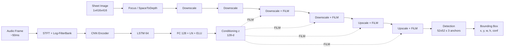

# Multi-modal Conditional Bounding Box Regression for Music Score Following — 분석 보고서

## 핵심 요약

이 논문은 sheet-image 기반 온라인 score following 문제를 객체 검출(object detection)의 시각으로 재정의한다. 기존 연구가 시트 이미지의 각 픽셀에 확률을 부여하는 분할(segmentation) 방식이거나 1차원 위치 분류 방식이었던 데 비해, 저자들은 YOLO 계열의 단일 단계 검출기를 조건부(conditional)로 변형하여 오디오 프레임마다 시트 이미지 위에서 매칭되는 위치를 직접 bounding box로 회귀(regression)한다. FiLM(Feature-wise Linear Modulation) 층을 통해 오디오 인코더의 conditioning vector를 시각 backbone에 주입하고, MSMD 합성 피아노 데이터셋에서 기존 SOTA였던 CUNet을 모든 오차 임계값에서 능가한다. 또한 Impulse Response(IR)를 활용한 오디오 데이터 증강만으로도 실제 피아노 녹음에 대한 일반화 성능을 큰 폭으로 끌어올려, 합성-실제 도메인 갭을 완화하는 단순하지만 효과적인 방법론을 제시한다.

## 서지 정보와 접근 범위

- **제목**: Multi-modal Conditional Bounding Box Regression for Music Score Following
- **저자**: Florian Henkel, Gerhard Widmer
- **소속**: Johannes Kepler University Linz, Austria — Institute of Computational Perception 및 LIT Artificial Intelligence Lab
- **출판 정보**: arXiv preprint 2105.04309v1 (2021년 5월 10일 제출). 본 논문은 EUSIPCO 2021 채택본의 사전인쇄 버전으로 알려져 있다.
- **펀딩**: European Research Council (ERC), Horizon 2020, grant 670035 "Con Espressione".
- **코드/데이터**: 저자가 GitHub `CPJKU/cyolo_score_following` 저장소를 통해 공개할 예정이라고 본문 각주에서 명시한다.
- **본 분석의 출처**: `/tmp/pdftext/2105.04309v1.txt`로 추출된 전문 텍스트(Abstract, I 서론, II 관련 연구, III 방법, IV 실험 설정, V 결과, VI 결론, 참고문헌 [1]–[34]).

## 상세 요약

이 논문이 풀려는 문제는 sheet-image-based on-line score following이다. 오프라인 정렬과 달리 온라인 정렬은 연주가 진행되는 동안 약 50ms 단위로 들어오는 오디오 프레임에 대해 즉시 시트 이미지 상의 대응 위치를 출력해야 한다. 기존의 referring image segmentation 방식(CUNet, [15])은 모든 픽셀에 확률을 부여한다는 점에서 두 가지 문제를 갖는다. 첫째, 한 픽셀이 음악적으로 어떤 노트에 대응하는지에 대한 명확한 의미가 없어 직관적이지 않다. 둘째, 이런 분할 마스크는 멀티모달(다중 후보) 응답을 명확히 구별하지 못한다.

저자들은 이 문제를 객체 검출 패러다임으로 재정의한다. 시트 이미지를 입력으로, 오디오를 조건(query)으로 받아 "지금 시점까지의 연주에 대응되는 시트 영역"을 둘러싸는 bounding box 한 개를 회귀한다. 박스의 폭은 학습 어노테이션에서 30 픽셀로 임의 고정되고, 높이는 해당 staff 높이에 의존한다. 박스의 중심 좌표 `(x, y)`, 폭, 높이 네 값을 직접 예측하며, 각 박스에는 IoU를 근사하는 objectness/confidence score가 함께 출력된다. 추론 시 이 신뢰도 점수가 가장 높은 후보를 선택해 시트 위에서 가장 가능성 높은 위치로 사용한다.

방법론의 골격은 conditional YOLO이다. Focus(SpaceToDepth) 층으로 입력 시트 이미지(1×416×416)를 4×208×208로 변환한 뒤, Downscale 4단(104² → 52² → 26² → 13²) → Upscale 2단(26², 52²)을 거쳐 52×52 그리드의 검출층에서 각 위치·각 anchor마다 5개 출력(x offset, y offset, w offset, h offset, objectness)을 산출한다. anchor는 3개 `(11, 26), (11, 34), (11, 45)`로 학습 박스를 k-평균 군집화해 정한 값이며 폭 11은 모든 anchor에 공통이다. 핵심 변형은 Downscale 블록 4·5와 Upscale 블록 6·7에 FiLM 층을 삽입해 외부 조건 벡터 `z`로 feature map을 채널별 affine 변환(스케일·이동)하는 것이다. 오디오는 22.05 kHz STFT(Hann 2048, hop 1102, 약 20 fps), 60 Hz–6 kHz 로그 필터뱅크 78 bin → CNN(40프레임 → 32d) → LSTM 64 hidden로 인코딩되며, LSTM hidden과 현재 CNN 출력의 concat을 fully connected(128) + LayerNorm + ELU를 통과시켜 128차원 z를 만든다.

학습 손실은 두 항으로 구성된다. 박스 좌표·크기에 대한 mean squared error와 objectness에 대한 logistic regression loss이다. 후자는 예측 박스와 ground truth 사이의 IoU를 회귀하도록 설계되어 있다(YOLO9000 [25]의 관행을 차용). 데이터 증강 측면에서는 시트 이미지에 대해 x, y 무작위 시프트를, 오디오에 대해 0.5–2배 랜덤 템포 변환을 적용한다. 추가로 본 논문이 강조하는 IR augmentation은 OpenAIRLib와 MicIRP에서 모은 500여 개의 Impulse Response를 학습 중 매 epoch마다 오디오에 컨볼루션해 마이크/방 음향 특성을 다양화함으로써, 합성 음원에 과적합되지 않고 실제 녹음으로의 일반화를 돕는다.

실험은 MSMD(Multi-modal Sheet Music Dataset, [17])에서 진행되며 945/28/125(train/valid/test) 페이지 분할은 [15]와 동일하다. 평가지표는 [15]를 따라 예측 박스를 ground truth 어노테이션을 통해 시간축으로 역사상한 뒤, 노트 onset과의 절대 오차가 0.05/0.10/0.50/1.00/5.00초 이하인 비율로 보고한다. 비교 대상은 MM-Loc[12], RL agent[14], CUNet[15]의 sheet-image 기반 세 방법과 OMR + ODTW 베이스라인이다. 합성 풀세트, 합성 서브세트(25페이지), 그리고 같은 25페이지에 대한 (a) 연주 MIDI 합성, (b) Yamaha AvantGrand N2 다이렉트 출력, (c) 사무실 룸 마이크 녹음의 세 실세계 시나리오에서 비교가 이루어진다. CYOLO는 모든 합성 평가에서 SOTA를 갱신하고, IR을 추가한 CYOLO-IR은 룸 녹음에서도 0.05초 임계값 기준 0.563을 기록해 0.094에 그친 CUNet 대비 큰 격차로 앞선다.

## 방법론과 데이터

네트워크 구조 요약(Table I 기준):

- Layer 1: Focus, 16채널, 208×208
- Layer 2: Downscale, 32채널, 104×104
- Layer 3: Downscale, 64채널, 52×52
- Layer 4: Downscale + FiLM, 128채널, 26×26
- Layer 5: Downscale + FiLM, 128채널, 13×13
- Layer 6: Upscale(skip from 4) + FiLM, 128채널, 26×26
- Layer 7: Upscale(skip from 3) + FiLM, 128채널, 52×52
- Layer 8: Detection, 15채널(=3 anchor × 5 출력), 52×52

손실 함수: bounding box `(x, y, w, h)`에 대한 MSE와 objectness/IoU에 대한 logistic regression loss의 합. 신뢰도는 예측 박스와 ground truth의 IoU를 0–1 범위로 회귀하도록 학습되어 추론 시 후보 선택의 기준이 된다.

학습 설정:

- 옵티마이저: Adam with decoupled weight decay (AdamW, [29]), weight decay 5e-4(컨볼루션·순환·선형층의 가중치 한정, normalization·bias는 제외)
- 학습률: 코사인 어닐링 50 epoch, 5e-4 → 5e-6
- 초기화: 직교 초기화([31]), bias=0, LSTM forget gate bias=1
- 그래디언트 클리핑: 오디오 인코더 RNN 파라미터 max-norm 0.1
- 입력 정규화: 데이터 증강과 호환되도록 spectrogram 앞에 batch normalization 층([26], [27])

| 데이터셋 | 곡 수 | 특성 | 용도 |
|---|---|---|---|
| MSMD train (전체 데이터셋, [17]) | 945 페이지 | 합성 피아노(MIDI→sound-font Fluidsynth), notehead-위치 정렬 | 학습 |
| MSMD validation | 28 페이지 | 합성 | 모델 선택 |
| MSMD test (full) | 125 페이지 | 합성 | 표 II.I 평가 |
| MSMD test subset | 25 페이지 | 같은 곡에 대해 실제 피아노 녹음이 추가로 제공 | 표 II.II–III 평가 |
| Performance MIDI synthesized | 25 페이지 분량 | 사람이 친 연주 MIDI를 학습 sound-font로 합성 | 표 III(a) |
| Direct out (Yamaha AvantGrand N2) | 25 페이지 분량 | 하이브리드 그랜드의 다이렉트 라인 아웃 | 표 III(b) |
| Room recording | 25 페이지 분량 | 사무실 환경의 마이크 녹음(잔향·잡음 포함) | 표 III(c) |
| OpenAIRLib + MicIRP IR pool | 500+ impulse response | 마이크·룸 특성 모델링 | 학습 시 오디오에 on-the-fly 컨볼루션 증강 |

평가지표: 5개 시간 임계값(0.05, 0.10, 0.50, 1.00, 5.00초) 각각에서 추적된 onset의 비율. CYOLO-IR이 합성 풀세트 0.05초 임계값에서 0.830으로 CUNet의 0.733을 8.7%p 앞섰고, 룸 녹음에서는 0.563 vs 0.094로 격차가 가장 두드러진다.

재현성: 코드와 데이터가 `https://github.com/CPJKU/cyolo_score_following`에서 공개될 예정임을 본문이 명시한다. MSMD([17]), Fluidsynth, OpenAIRLib, MicIRP는 모두 공개 자원이며, 학습 하이퍼파라미터(학습률 스케줄, weight decay, anchor 군집화)도 본문에서 구체적으로 기술된다.

## 비판적 평가

이 논문의 가장 큰 강점은 task formulation의 명료성이다. 픽셀 단위 segmentation을 단일 박스 회귀로 치환함으로써, 출력이 "현재까지 연주된 가장 최근 노트(또는 화음)"에 자연스럽게 대응되도록 설계 의도가 분명해진다. 또한 박스의 confidence score를 IoU의 회귀로 학습함으로써, 시트 위 다중 후보가 존재할 때 이를 명시적으로 점수화할 수 있는 길을 연다(저자들은 본 논문에서는 Top-1만 평가하지만 다중 후보 활용 가능성을 시사한다).

두 번째 강점은 IR augmentation의 단순함과 효과다. 추가 실제 데이터 없이 학습 시점의 오디오에 IR 컨볼루션만 추가했음에도 룸 녹음에서 0.05초 정확도가 약 0.306 → 0.563으로 거의 두 배가 된다. 이는 score following 분야가 오랫동안 안고 있던 합성–실제 도메인 갭 문제에 대해 저비용·고효과 해법을 제시한다. 다만 저자들도 인정하듯 추가적인 격차 축소를 위해서는 실제 데이터의 직접적 활용이 필요하다.

한계로는 첫째, 평가가 MSMD 단일 데이터셋이며 모두 피아노 음악(대부분 polyphonic이지만 단일 악기)에 한정된다. 다중 악기, 보컬, 챔버/오케스트라로의 일반화는 검증되지 않았다. 둘째, 박스 너비 30픽셀은 학습 어노테이션 단계에서 임의로 결정된 상수이므로 박스 폭의 의미론은 약하고, 본 논문이 채택한 평가지표(onset 시간 정확도)도 박스의 시각적 적합성보다는 시간축 매핑의 정확성을 측정한다. 셋째, FiLM 기반 conditioning은 [15]에서 이미 도입된 기제이며, 본 논문의 새로움은 주로 출력 형태(분할 → 박스)와 IR augmentation에 집중되어 있다. 따라서 표현력 측면의 진정한 기여는 출력 표상의 변경에서 온다고 평가하는 편이 정확하다. 넷째, 룸 녹음 결과를 보면 CUNet보다 큰 폭의 향상이 있지만 OMR 베이스라인(0.226 @0.05s, 0.974 @5.00s)과 비교하면 임계값에 따라 우열이 갈린다. 즉 5초 임계값에서는 OMR이 여전히 경쟁력이 있어 IR로도 closing되지 않은 영역이 남아 있다.

## 선행연구와 비교

| Citation | 연도 | 방법 | 핵심 발견 | 본 논문과의 차이 |
|---|---|---|---|---|
| Dorfer et al. [12] (MM-Loc) | 2016 | 시트 이미지 발췌를 k bin으로 이산화한 1D localization | 시트 이미지로부터 직접 위치 분류 가능 | unrolled excerpt와 이산화에 의존, 본 논문은 전체 페이지에서 연속 좌표를 직접 회귀 |
| Dorfer, Henkel, Widmer [13] (RL ISMIR 2018) | 2018 | unrolled score를 RL agent가 읽는 속도를 조절하며 따라감 | RL로 reading speed를 학습 가능 | 본 논문은 매 프레임 독립적으로 박스 회귀, RL agent의 시간적 의존성 학습과 다름 |
| Henkel, Balke, Dorfer, Widmer [14] (RL TISMIR 2019) | 2019 | 다중모달 RL로 score following | 합성 데이터에서 강한 성능, 실제 음원 일반화 한계 지적 | 본 논문은 RL 대신 지도학습 박스 회귀, 동일한 실세계 갭 문제를 IR로 완화 |
| Henkel, Kelz, Widmer [15] (CUNet ISMIR 2020) | 2020 | 전체 페이지에 대한 conditional U-Net + FiLM segmentation | 전처리 없이 full-page 추적 가능, polyphonic 확장 | 동일한 FiLM/오디오 인코딩 채택하되 출력만 segmentation → bbox로 변경, 모든 임계값에서 우위 |
| Redmon et al. [16], Redmon & Farhadi [25] (YOLO/YOLO9000) | 2016/2017 | 단일 단계 객체 검출, anchor 기반 박스 회귀 | 빠른 추론, 실시간 탐지 | 본 논문은 클래스 라벨 대신 오디오 query로 conditioning, anchor·objectness loss는 차용 |

## 실무적 함의와 응용

자동 페이지 넘김([6]), 콘서트홀의 동기화 정보 표시([7]), 반주 시스템 등이 직접적인 응용 영역이다. 박스 출력은 시트 페이지 위에 시각적 하이라이트를 그리기 쉬워 사용자 인터페이스 측면에서 분할 마스크보다 자연스럽다. 또 추론 속도가 빠른 YOLO 계열을 채택했기에 약 20 fps의 오디오 입력에 대응하는 실시간 처리가 가능하다.

엔지니어링 관점에서 IR augmentation은 별도의 라벨링 비용 없이 오픈 자원만으로 즉시 적용할 수 있는 모범적 경량 도메인 어댑테이션 기법이다. 마이크/룸 환경 차이가 큰 라이브 무대, 강의실, 가정 환경 등 다양한 배포 시나리오에서 모델을 한 번만 학습한 뒤 재사용하는 데 유용하다.

후속 확장으로 저자들이 직접 언급한 두 방향이 있다. 첫째, note 단위 위치 외에 마디(bar)와 단(system) 단위 박스를 동시에 예측하는 다중 스케일 hierarchical bbox. 이는 fine-grained 정렬 라벨이 없는 스캔본·사진본까지 활용 가능하게 한다. 둘째, 실제 데이터의 직접적 활용을 통한 합성–실제 갭의 추가 축소. 두 방향 모두 일반화 향상과 데이터 효율 측면에서 실무적 가치가 크다.

## 후속 연구와 핵심 참고문헌

본 논문은 CUNet([15])과 RL([13], [14])이라는 동일 연구진의 이전 라인을 직접 잇는 작품이며, 후속 연구의 출발점으로도 자주 인용된다. 후속 연구는 (1) 실제 녹음 데이터를 직접 학습에 활용하는 방향, (2) bar/system 단위로 출력을 계층화하는 방향, (3) 다중 후보를 명시적으로 다루는 multi-hypothesis tracking 방향으로 전개될 것으로 본문에서 시사된다.

핵심 참고문헌:

- [15] Henkel, Kelz, Widmer, "Learning to Read and Follow Music in Complete Score Sheet Images," ISMIR 2020 — 본 논문이 직접 비교하고 구조를 부분적으로 계승하는 baseline.
- [12] Dorfer, Arzt, Widmer, "Towards Score Following in Sheet Music Images," ISMIR 2016 — sheet-image 기반 localization의 시초.
- [13] Dorfer, Henkel, Widmer, "Learning to Listen, Read, and Follow," ISMIR 2018 — RL 패러다임의 score following.
- [14] Henkel, Balke, Dorfer, Widmer, TISMIR 2019 — multi-modal RL의 baseline 및 실세계 갭 분석.
- [16] Redmon, Divvala, Girshick, Farhadi, "You Only Look Once," CVPR 2016 — YOLO 검출 패러다임의 출발점.
- [25] Redmon, Farhadi, "YOLO9000," CVPR 2017 — anchor 기반 박스 회귀와 objectness 학습 기법의 차용원.
- [19] Perez 외, "FiLM," AAAI 2018 — 본 논문의 conditioning 메커니즘.
- [17] Dorfer, Hajič jr., Arzt, Frostel, Widmer, "Learning Audio–Sheet Music Correspondences," TISMIR 2018 — MSMD 데이터셋.
- [21] Hu, Rohrbach, Darrell, "Segmentation from natural language expressions," ECCV 2016 — referring image segmentation 영감원.
- [29] Loshchilov, Hutter, "Decoupled Weight Decay Regularization," ICLR 2019 — AdamW 최적화.
