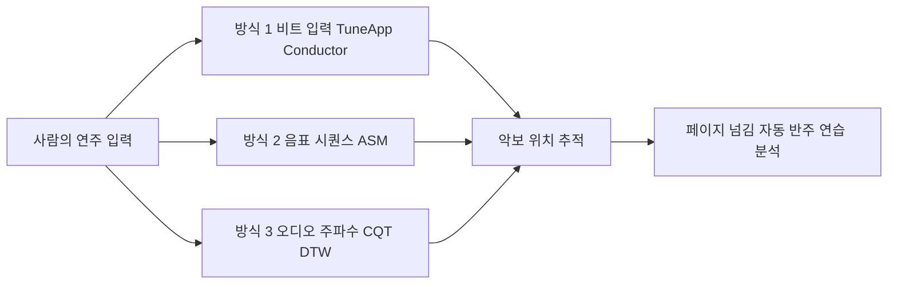

# Musical Score Following and Audio Alignment — 비전공자 해설

## 이 논문이 풀려는 문제는 무엇인가

피아노를 배우는 사람을 떠올려 보자. 양손이 건반을 누르고 있는 동안 페이지를 넘기려면 누군가 옆에서 대신 넘겨 주거나, 발로 페달을 눌러 태블릿 화면을 스크롤해야 한다. 무대 위 오케스트라가 컴퓨터로 만든 효과음과 함께 연주하는 경우에는 더 까다롭다 — 사람의 호흡과 템포에 맞춰 컴퓨터가 정확한 순간에 음을 내야 하기 때문이다. 이렇게 "지금 사람이 악보 어디를 연주하고 있는지를 컴퓨터가 실시간으로 따라 잡는 일"을 score following(악보 추종)이라 부른다(p.15).

이 논문(Lin Hao Lee, Imperial College London EEE 학과의 학부 졸업 프로젝트, 2022)은 이 분야의 한 가지 주제만 깊게 파고드는 일반 학술 논문과는 성격이 다르다. 저자가 1년 동안 직접 score following 분야 전체를 한 권의 보고서에 정리하고, 평가용 도구를 만들고, 서로 다른 세 가지 기법으로 동작하는 시스템까지 모두 구현해 본 "종합 작품집"에 가깝다(p.16). 보고서는 크게 세 부분이다. (1) 1984년 이후 약 40년의 score following 연구사를 비전공자도 따라갈 수 있도록 정리한 리뷰, (2) 다른 연구자가 자기 시스템을 공정하게 평가할 수 있게 해 주는 두 가지 오픈소스 평가 도구(testbench)와 데이터셋(QualScofo), (3) 세 종류의 score follower를 직접 만들어 본 실험.

저자가 처음에 진단한 핵심 문제는 "이 분야는 평가가 통일되어 있지 않다"는 것이다(p.16, 47). 2006년부터 MIREX라는 표준 대회가 시도되었지만 2018년 이후로는 참가 팀이 거의 없어졌고, 각 연구 그룹은 자기 시스템에 유리한 데이터만 사용해 결과를 발표하는 일이 잦았다. 본 프로젝트는 이런 문제를 해결할 도구를 직접 만들어 GitHub에 공개하는 것을 큰 목표로 삼는다(p.51-65).

## 핵심 아이디어를 한 그림으로

음악을 따라가는 데에는 여러 길이 있다. 사람이 손바닥으로 박만 쳐 줘도 되고(가장 단순한 방식), 음표 하나하나를 글자처럼 비교해도 되며(전통적인 문자열 정렬 알고리즘), 소리의 주파수 그림을 그려 두 줄을 곡선으로 늘리고 줄여 가며 맞춰 갈 수도 있다(DTW). 본 프로젝트는 이 세 갈래를 모두 한 번씩 직접 만들어 보여 준다.

비유하자면 이렇다. **TuneApp Conductor**는 사용자가 휴대폰을 박자에 맞춰 흔들면 그 박자에 맞춰 음악이 나오는 "디지털 지휘자"다(p.67-72). 마치 게임 Wii의 박자 게임처럼, 사용자가 곧 악보의 위치를 직접 가리켜 주는 셈이라 컴퓨터의 부담이 가장 적다. **ASM(Approximate String Matching) 방식**은 단어 두 개의 철자가 얼마나 닮았는지 비교하는 자동 맞춤법 검사기와 같다 — 악보의 음표 줄과 연주의 음표 줄을 글자열처럼 늘어놓고 가장 닮은 짝짓기를 찾는다(p.76-86). **CQT-DTW 방식**은 두 음악의 "주파수 사진"을 찍어 두 개의 시간 축을 고무줄처럼 잡아당겨 가며 가장 비슷한 모양으로 포개는 방식이다(p.94-113). 세 방식은 각각 빠름·정확·강건함의 균형이 다르고, 본 프로젝트는 이 셋을 한 자리에서 비교한다는 데 의미가 있다.

## 알아야 할 핵심 용어

| 용어 | 영문 | 직관적 설명 |
|---|---|---|
| 악보 추종 | Score following | 사람의 연주가 악보의 어느 위치를 지나가는지를 컴퓨터가 실시간으로 알아내는 일(p.15). |
| 자동 페이지 넘김 | APT (Automatic Page Turning) | 손이 바쁜 연주자를 위해 태블릿이 알아서 페이지를 넘기는 기능. 본 분야의 가장 친숙한 응용(p.19-20). |
| 컴퓨터 반주 | Computer-aided accompaniment | 사람이 솔로를 치면 컴퓨터가 반주를 따라 쳐 주는 시스템. 1984년 이 분야의 출발점이었다(p.20-21, 35). |
| MIDI | Musical Instrument Digital Interface | 음표를 "어떤 음을 언제 누르고 떼었는지"의 숫자로 표현하는 형식. 오디오가 아니라 악보에 가까운 데이터(p.27). |
| MusicXML | MusicXML | 악보를 XML 텍스트로 표기한 형식. 화면에 그릴 수 있는 "디지털 악보"의 표준 중 하나(p.28). |
| FFT/STFT | (Short-Time) Fast Fourier Transform | 소리를 시간 구간별로 잘라 "어떤 주파수가 얼마만큼 들어 있는가"를 보여 주는 사진을 만드는 기법. 일반 스펙트로그램이 그 결과(p.95). |
| CQT | Constant-Q Transform | 사람이 음을 옥타브 단위(로그 척도)로 듣는다는 점을 반영하기 위해, 낮은 음에는 더 큰 창을, 높은 음에는 더 작은 창을 쓰는 특수한 주파수 분석 기법(p.95-101). 같은 비율로 "균등하게" 음을 본다. |
| sliCQ / NSGT-CQT | sliced Constant-Q / Non-stationary Gabor Transform | 일반 CQT를 실시간으로 돌릴 수 있도록 작은 조각으로 잘라 처리하게 만든 알고리즘(p.96-101). 본 프로젝트의 핵심 부품. |
| DTW | Dynamic Time Warping | 두 시퀀스를 시간축에서 늘리고 줄여 가며 가장 닮은 모양으로 맞추는 알고리즘. 1970년대 음성 인식에서 출발(p.41, 102-106). |
| OLTW | Online Time Warping | DTW를 실시간으로 돌리기 위한 온라인 변형. 미래 데이터를 보지 않고도 한 프레임씩 들어오는 입력에 맞춰 정렬을 갱신한다(p.106-110). 2005년 Dixon이 제안. |
| ASM | Approximate String Matching | 두 문자열의 "거의 비슷한 매칭"을 찾는 알고리즘. Needleman-Wunsch 같은 편집 거리 계열이 대표적(p.76-83). |
| Beat tracking | Beat tracking | 음악에서 박이 어디 있는지를 찾는 일. TuneApp Conductor에서는 사용자가 직접 박을 알려 준다(p.69). |
| Testbench | Testbench (벤치마크 도구) | 평가 도구. 다른 연구자가 자기 시스템을 끼워 넣기만 하면 같은 기준으로 점수를 매겨 주는 표준화된 환경(p.51-58). |
| QualScofo | QualScofo dataset | 본 프로젝트가 만들어 공개한 정성 평가용 음악 데이터셋. 첼로 솔로부터 로맨틱 오케스트라까지 16곡(p.62-65). |
| Bach10 | Bach10 dataset | 4성부 합창곡 10곡으로 구성된, 정량 평가의 사실상 표준 데이터셋(p.88-89). |
| MIREX | Music Information Retrieval Evaluation eXchange | 음악 정보 검색 분야의 공식 평가 대회. 2018년 이후 score following 분야 참가가 사실상 끊겼다(p.16, 47). |
| Misalignment threshold (`θe`) | θe | "정답에서 몇 ms까지 벗어나도 맞다고 칠 것인가"의 기준선. 표준은 300 ms(p.115). |
| Total precision rate (`rpt`) | rpt | 임계 `θe` 안에서 맞춘 음표의 비율. 본 분야에서 가장 많이 쓰는 단일 점수(p.115). |
| Polyphonic music | 다성 음악 | 여러 성부·여러 음이 동시에 울리는 음악(p.33). 단순 모노 매칭으로는 못 따라간다. |

## 이 논문의 새로운 점

학술 논문은 보통 "새 알고리즘"을 자랑하지만, 본 프로젝트가 자랑하는 것은 새로운 알고리즘이 아니라 **누구나 쓸 수 있는 평가 도구와 데이터의 공개**다. 이는 학부 졸업 프로젝트로서는 드물게 가치 있는 기여다. 구체적으로 세 가지를 들 수 있다.

첫째, 정량 testbench와 정성 testbench를 모두 GitHub에 공개해 다른 연구자가 자기 시스템을 표준 입출력 형식만 맞추면 즉시 같은 점수를 받아 볼 수 있게 했다(p.51-65). 이는 그동안 각 연구실이 자기 데이터로만 점수를 발표해 비교가 어려웠던 문제를 해결할 후보다.

둘째, **공정한 비교 실험**을 했다. 정렬 단계(OLTW)는 그대로 두고 특징 추출만 sliCQ-CQT vs 일반 FFT-pseudo-CQT로 바꾸어 비교한 결과, sliCQ 쪽이 Bach10에서 약 10%p, BWV846에서 약 13%p 더 정확했다(p.117, Table 11.2-11.3). 즉 같은 정렬 알고리즘을 쓸 때 어떤 주파수 분석을 먹이느냐가 매우 중요하다는 점을 처음으로 명확히 정량화했다.

셋째, **ASM 정렬기로 평가용 정답을 자동 생성하는 파이프라인**을 제안했다(p.92). 보통 "이 연주는 악보의 어느 음을 어느 시각에 친 것인가"라는 정답 데이터는 사람이 손으로 만들어야 해서 공급이 부족하다. 본 프로젝트는 ASM이 Bach10에서 완벽한 정답을 만들 수 있다는 것을 검증한 뒤, 같은 ASM으로 MAESTRO 데이터셋의 BWV 846 Prelude/Fugue에 대해 자동으로 정답을 만들어 평가에 사용한다(p.89-92).

오픈 testbench의 의의는 이 분야가 "각 그룹의 비밀 데이터"에 갇혀 있던 폐쇄성에서 빠져나오게 한다는 데 있다. 이는 컴퓨터 비전 분야가 ImageNet으로, 자연어 처리 분야가 GLUE/SuperGLUE로 큰 진보를 이룬 것과 같은 메커니즘이다. 단지 한 학부생이 만든 도구가 그 정도 표준이 될지는 후속 연구자들의 채택에 달려 있다.

## 한계와 의의

이 보고서는 학부 졸업 프로젝트라는 특성상 분명한 한계가 있다. 가장 큰 것은 본 시스템(NSGT-CQT Online)의 절대 정확도가 표준 임계 300 ms에서 약 74% (Bach10) / 80% (BWV846)에 머문다는 점이다(p.117). 페이지 넘김이나 연주 분석에는 충분하지만, 컴퓨터 반주처럼 사람의 호흡과 함께 호흡해야 하는 까다로운 응용에는 더 정밀한 후처리가 필요하다(p.118). 또 MIREX 데이터셋에서 직접 비교하지 못해 "최고 성능"이라는 주장은 간접 추론에 가깝다(p.115). 코로나 시기에 진행된 탓에 실제 연주자들과의 라이브 테스트도 이뤄지지 못했다(p.126). 그리고 핵심 부품(sliCQ, OLTW, ASM)은 모두 기존 알고리즘이라, 알고리즘적 새로움이라는 면에서는 박사 학위 논문 수준의 깊이를 기대하기 어렵다(p.94, 106).

그러나 의의 또한 분명하다. 첫째, 약 10,145줄의 동작하는 코드(p.131)와 일반 사용자에게 배포된 TuneApp Conductor(p.72-73), 그리고 누구나 다운로드 가능한 testbench와 QualScofo 데이터셋이 모두 GPLv3로 공개되어 있어, 후속 연구자들이 즉시 활용할 수 있는 "준비된 출발점"이 된다. 둘째, 40년 연구사를 한 권에 정리한 Part I은 score following을 처음 배우는 사람에게 한국어든 영어든 비교할 만한 입문서가 거의 없다는 점을 감안하면 상당한 교육적 자산이다(p.127). 셋째, 같은 OLTW 위에서 특징 추출 방식만 바꾸는 ablation 비교는 후속 시스템 설계자에게 "어디에 자원을 더 투자해야 하는가"라는 명확한 지침을 준다 — sliCQ 같은 더 좋은 특징 추출이, 정렬 알고리즘을 더 정교하게 만드는 것 못지않게 중요하다(p.117).

요약하면 이 보고서는 score following이라는 분야가 "누구나 검증할 수 있는 오픈 인프라"로 한 걸음 다가가도록 만든 작은 디딤돌이며, 동시에 학부 1년의 시간 안에 한 사람이 어디까지 종합 시스템을 만들 수 있는지를 보여 주는 좋은 사례다. 본 시리즈의 다른 논문들 — Arzt 박사논문(2016), Henkel 등의 sheet 이미지 딥러닝(2020) — 이 깊이 있는 한 가지 주제를 파고든 작업이라면, 이 보고서는 그 사이를 잇는 "지도와 도구상자"의 역할을 한다.
