# Robust and Accurate Audio Synchronization Using Raw Features from Transcription Models — 분석 보고서

## 핵심 요약

이 논문은 음악 정보 검색(MIR) 분야에서 오디오–오디오 및 오디오–악보 동기화의 정확도와 강건성을 동시에 끌어올리는 새로운 파이프라인을 제안한다. 기존의 동기화 시스템이 chroma 또는 onset feature를 사용하거나, AMT(Automatic Music Transcription) 모델의 최종 심볼릭(이산화) 출력에 의존했던 것과 달리, 저자들은 transcription 신경망의 중간 산출물인 raw onset/frame 확률(연속값 [0,1])을 그대로 DTW에 입력으로 사용한다. ASAP과 BPSD(Beethoven Piano Sonata Dataset) 두 데이터셋에서 RAW 특성이 SYM(이산화) 특성 대비 outlier를 크게 줄이고 95% 신뢰구간을 좁힌다는 점을 실험적으로 보인다. 또한 도메인 시프트가 큰 역사적 녹음(예: Gulda 1958, Bilson 1997 fortepiano)에 대해서는 transcription 모델을 target 데이터로 fine-tuning(T3)하면 정렬 강건성이 극적으로 향상되어 beat-tracking 수준의 정밀도(95% conf. interval 약 62 ms)에 도달함을 보여준다.

## 서지 정보와 접근 범위

- 저자: Johannes Zeitler, Ben Maman, Meinard Müller
- 소속: International Audio Laboratories Erlangen (FAU와 Fraunhofer IIS의 공동 기관), Germany
- 학회: 25th International Society for Music Information Retrieval Conference (ISMIR 2024), San Francisco, United States
- 연도: 2024
- 라이선스: CC BY 4.0
- 섹션 구성: (1) Introduction and Related Work, (2) Synchronization Pipeline, (3) Datasets, (4) Quantifying Synchronization Accuracy, (5) Evaluation, (6) Conclusion and Outlook
- 자금 지원: DFG 보조금 521420645(MU 2686/17-1), 500643750(MU 2686/15-1)
- 출처: 본 보고서의 모든 인용 및 수치는 `/tmp/pdftext/2024_ZeitlerEtAl_Synchronization_ISMIR.txt`에 추출된 본문에서 확인된 내용에 근거한다.

## 상세 요약

**문제 설정.** 동기화(synchronization)는 같은 곡의 서로 다른 버전(다른 연주자, 다른 녹음, 또는 악보와 오디오)을 동일한 시간축에 정렬하는 작업이다. 전통적으로 DTW 기반 파이프라인은 chroma 혹은 onset feature를 사용한다. chroma는 multirate filterbank나 constant-Q transform 같은 신호처리 기법으로 추출되며, onset은 별도 추정기로 얻는다. 그러나 hand-crafted feature는 다양한 음향 조건(저품질 역사적 녹음, fortepiano, 튜닝 편차 등)에서 false positive가 많거나 onset을 놓치는 등 구조적 한계가 있다. 한편 최근의 AMT 모델(Onsets and Frames 류)은 음표 onset/frame을 정확히 추정할 수 있게 되었지만, 동기화 파이프라인에 결합할 때 보통 후처리를 거친 이산 SYM 출력만을 활용해 왔다.

**핵심 아이디어.** 저자들은 transcription 모델의 중간 출력—frame 활성 확률 P_raw^frame과 onset 확률 P_raw^onset (각각 [0,1] 사이의 연속값, 88 pitch × N frame)—을 그대로 raw feature로 사용한다. 이 raw 표현은 임계값을 적용한 SYM과 달리 음표 경계 근처의 모호성을 부드럽게 보존한다. 본문 Figure 2 분석에서, T1_RAW는 DK(Disklavier 참조) 대비 매우 안정적이며 onset이 정확히 일치하지만, T1_SYM은 thresholding 때문에 음표 길이가 들쭉날쭉해 정렬 불안정을 유발한다는 점이 시각적으로 드러난다.

**파이프라인.** 두 가지 DTW 변형이 비교된다. (1) O: onset feature만 12차원 pitch class로 변환하고 표준 DTW(스텝 가중치 1.5, 1.5, 2)를 사용. (2) OF: frame과 onset을 결합한 high-resolution 접근으로, frame은 cosine 거리, onset은 Euclidean 거리로 비용 행렬을 만든 뒤 합산하여 multi-resolution multi-scale DTW(MrMsDTW, [14])로 풀이한다. Onset에는 DLNCO(Decaying Locally Normalized Chroma Onset) 가공이 적용된다. 평가를 위해 두 가지 무지도(annotation-free) 휴리스틱이 사용된다: BPSD에서는 measure transfer(Wilhelm Kempff 1964 수동 주석을 다른 버전으로 전이), ASAP에서는 note onset transfer(score→A1, A1→A2 두 경로의 시간 차이).

**주요 결과.** ASAP에서는 RAW_OF가 SYM 대비 mean 및 95% confidence interval을 모두 줄였고, T2_RAW_OF는 DK_SYM_OF조차 능가하는 mean 21 ms / 95% 99 ms를 기록했다. BPSD에서는 RAW_OF가 SYM_O 대비 outlier를 크게 줄였으며(T1: 234 → 121 ms, T2: 466 → 207 ms), T1이 음향적으로 다양한 MusicNet으로 학습되어 MAESTRO만 학습한 T2보다 BPSD에서 강건했다. Gulda 1958(FG58, 95% conf. 788 ms), Bilson 1997(MB97, fortepiano)이 문제 버전으로 식별되었고, T1을 BPSD로 fine-tuning한 T3가 FG58을 80 ms, MB97을 103 ms로 끌어내려 평균 95% conf. 62 ms를 달성했다.

```mermaid
flowchart TD
    A[Audio Recording] --> B[Transcription Model T1/T2]
    B --> C1["Raw Frame Probabilities P_raw^frame"]
    B --> C2["Raw Onset Probabilities P_raw^onset"]
    B --> D["Postprocessing &#40;threshold/quantize&#41;"]
    D --> E["SYM features &#40;binary pianoroll&#41;"]
    C1 --> F[Pitch class projection]
    C2 --> F
    F --> G["DLNCO + cost matrices &#40;cosine/Euclidean&#41;"]
    G --> H["MrMsDTW alignment"]
    H --> I[Score-Audio / Audio-Audio Alignment]
    E -.SYM 경로.-> H
    style C1 fill:#cfe8ff
    style C2 fill:#cfe8ff
    style I fill:#d4edda
```

**결론.** raw feature는 transcription을 수행할 때 어차피 계산되는 부산물이므로 추가 비용이 없다는 점에서, 저자들은 동기화 파이프라인에서 raw feature를 기본 옵션으로 채택할 것을 제안한다. 동시에 도메인 시프트가 큰 데이터셋에서는 unaligned audio–score 페어로 transcription 모델을 fine-tune하는 것이 강건성을 크게 개선한다는 실용적 권고를 제시한다.

## 방법론과 데이터

**Transcription 모델 후보.**
- **FB (Filterbank)**: Sync Toolbox [14]의 multirate filterbank 기반 베이스라인.
- **T1**: Maman & Bermano [4]의 Onsets and Frames 변형, MusicNet [16]에 재정렬된 라벨로 학습. 음향적으로 다양한 데이터에 강함.
- **T2**: Kong et al. [27]의 high-resolution piano transcription with pedals, MAESTRO [25]로 학습.
- **DK (Disklavier)**: Disklavier 심볼릭 트랙으로부터 직접 추출된 feature, MPE 추출기의 상한선(upper bound) 역할.
- **T3**: T1을 BPSD target audio에 fine-tune한 모델.

**Feature 추출 위치.** transcription 네트워크의 onset/frame prediction head 직전(또는 직후) sigmoid 출력—즉 후처리 전 연속 확률값을 그대로 추출. 88 pitch × N frame 형태의 pianoroll-like 표현으로 저장. T2는 추가로 velocity와 offset 확률을 예측하지만 본 동기화 실험에서는 frame과 onset만 사용.

**동기화 알고리즘.**
- **O**: onset 확률을 12-d pitch class로 압축 → Euclidean cost → standard DTW (1.5, 1.5, 2 step weights).
- **OF**: frame은 cosine, onset은 DLNCO 적용 후 Euclidean. 두 cost matrix를 합산해 MrMsDTW [14, 33]로 multi-resolution 정렬. Chroma만 단독 사용은 onset이 명확한 피아노에 대해 [11]에서 alignment error 100% 증가가 보고되어 제외.

**데이터셋.**

| 데이터셋 | 곡 수 | 특성 | 용도 |
|---|---|---|---|
| BPSD (Beethoven Piano Sonata Dataset) [35] | 32 sonata 1악장 × 11 버전 = 352 트랙, 약 41시간 7분 | 라이브, 역사적 vinyl(노이즈/피치 드리프트), fortepiano(MB97), 모던 스튜디오 등 다양한 음향 조건. 11개 버전이 동일한 musical timeline 공유(반복부 차이 제거). WK64에 수동 measure 주석 | 메인 평가, measure transfer 휴리스틱, fine-tuning(T3) |
| ASAP (subset) [31] | Beethoven 1악장 13개 Disklavier 녹음, 약 103분 | Disklavier 기반이라 정확한 reference note 정보 보유. ASAP 전체에서 BPSD 구조와 일치하는 1악장만 선별 | note onset transfer 휴리스틱, DK upper bound 비교 |

**평가 지표.** Ground-truth 정렬이 없는 실세계 데이터를 다루기 때문에 두 가지 transitive consistency 휴리스틱을 사용:
- BPSD measure transfer: ε = |M_S→A1(t_S) − M_A2→A1(t_A2)|
- ASAP note onset transfer: ε = |M_S→A2(t_S) − M_A1→A2(M_S→A1(t_S))|

각 페어에 대해 절대 오차의 mean, median, 90·95 percentile을 계산해 ms 단위로 보고. [37]의 triple-based analysis 관점.

**재현성.** 본문에 코드 공개 명시는 없으나, 사용 모델([4], [27]), 데이터셋(ASAP, BPSD), 알고리즘(Sync Toolbox [14])이 모두 외부에서 이용 가능하므로 파이프라인 재구성은 가능. T3 fine-tuning은 [4]의 unaligned audio–score 학습 절차를 따른다고 명시.

## 비판적 평가

**강점.**
- 현대 DL 기반 transcription과 고전 DTW를 자연스럽게 결합한 실용적 설계. 추가 학습 없이 기존 transcription 모델의 부산물(raw 확률)을 재활용하므로 계산 오버헤드가 사실상 0.
- 정확도(median)뿐 아니라 강건성(95% confidence interval)을 핵심 지표로 강조하여, 실무에서 정말 중요한 outlier 거동을 정량화.
- 음향적으로 매우 도전적인 BPSD(역사적 녹음, fortepiano)에서의 평가는 학계 벤치마크의 sterile한 한계를 보완.
- Fine-tuning을 unaligned 페어로 수행해 reference 정렬에 overfit하지 않는 점이 학술적으로 깔끔.

**약점 및 한계.**
- Transcription 모델 의존성: pitched onset이 명확한 피아노 음악에 한정된 평가. 보컬, 관현악, 타악 위주 음악에서의 일반화는 미검증(저자도 future work로 명시).
- DK reference도 perfect ground truth가 아닌 점, 그리고 evaluation이 transitive consistency에만 의존하는 점은 필요조건이지 충분조건이 아님(저자도 [37]을 인용하며 인정).
- T2가 ASAP에서 좋은 성적을 낸 이유 중에는 ASAP이 MAESTRO 기반이라 train/test 분리 보장이 어렵다는 caveat가 본문에 명시되어 있어, T2 결과 일부는 낙관적일 수 있음.
- Fine-tuning(T3) 결과는 단일 데이터셋(BPSD)에 한정. 다른 도메인 시프트(예: 비-피아노)에 대한 일반 절차로 확장 가능한지는 입증되지 않음.
- raw feature가 SYM 대비 항상 우월한 것은 아니며(BPSD에서 FB_RAW_OF가 T2보다 강건한 사례 존재), 모델 선택과 학습 데이터 다양성이 결과를 좌우.

## 선행연구와 비교

| Citation | 연도 | 방법 | 핵심 발견 | 본 논문과의 차이 |
|---|---|---|---|---|
| Ewert, Müller, Grosche [11] | 2009 | Chroma + DLNCO onset feature, high-resolution DTW | Frame+onset 결합이 chroma 단독보다 alignment error 절반으로 감소 | 동일 OF 알고리즘을 사용하되 입력 feature를 hand-crafted에서 transcription의 raw 확률로 대체 |
| Müller [12] (Fundamentals 교과서) | 2015 | DTW step weights, chroma 기반 동기화 표준 | DTW + chroma 표준 레퍼런스 | 표준 DTW 절차를 채택하되 feature를 학습 기반으로 대체 |
| Müller, Özer, Krause, Prätzlich, Driedger [14] (Sync Toolbox) | 2021 | Multirate filterbank + MrMsDTW Python 패키지 | 효율적·강건한 동기화의 오픈소스 구현 | FB를 베이스라인으로, MrMsDTW를 alignment backbone으로 그대로 채택 |
| Hawthorne et al. [26] (Onsets and Frames) | 2018 | Dual-objective piano transcription (CNN+RNN) | onset/frame head 분리로 transcription 정확도 향상 | 이 모델의 SYM 출력 대신 RAW 중간 확률을 직접 활용 |
| Maman & Bermano [4] | 2022 | Unaligned 페어 기반 transcription 학습(T1) | MusicNet에서 generalization 개선 | 본 논문의 T1·T3가 이 모델 기반; 동일 unaligned 학습을 fine-tuning에 활용 |
| Kong et al. [27] | 2021 | Onset/offset regression + pedal modeling(T2) | high-resolution piano transcription | T2로 채택; SYM 결과만 쓰지 않고 raw 출력을 동기화에 투입 |
| Özer, Istvanek, Arifi-Müller, Müller [24] | 2022 | Activation function 사용한 measure-level 동기화 | onset 활성화가 정밀 정렬에 기여 | 비슷한 동기로 raw 활성화 직접 사용을 더 일반화 |
| Prätzlich, Müller [37] | 2016 | Triple-based analysis (no ground-truth) | 무주석 동기화 정확도 평가 프레임워크 | 본 논문의 BPSD/ASAP 평가 휴리스틱 근간 |

## 실무적 함의와 응용

- **악보 추종(score following)·자동 페이지 넘김**: 96% 신뢰구간 60~120 ms 수준의 정렬 정밀도는 실시간 추종의 부트스트랩 또는 오프라인 backbone에 충분.
- **Score-informed source separation**: [3]과 같은 음원 분리에서 timing-critical한 score-audio 정렬을 raw feature로 즉시 강화 가능.
- **데이터셋 자동 라벨링**: AMT 학습 데이터를 만들 때 reference alignment를 RAW_OF로 부트스트랩 → fine-tune 사이클 가능. 본문에서 "beat-tracking tolerance(70 ms) 수준"이라 명시한 정밀도가 이를 뒷받침.
- **역사적/저품질 녹음 디지털화**: 음악학자들이 다루는 vinyl, fortepiano 등 도메인 시프트 큰 자료에 fine-tuning 절차를 그대로 적용 가능.
- **Cross-version 분석·콘서트 트랙 스위칭**: [5, 6]과 같이 같은 곡의 다른 버전 간 알람·전환 UI에서 outlier 감소가 사용자 경험에 직접 기여.
- **자동 반주(automatic accompaniment)**: 라이브 입력에 대한 사전 정렬 정확도 향상으로 [7, 8] 같은 시스템의 견고성에 기여.

## 후속 연구와 핵심 참고문헌

- **Future work**: 저자들이 명시한 다음 단계는 (1) 비피아노 장르(보컬, 오케스트라)에 대한 일반화, (2) 더 다양한 transcription 모델과의 결합, (3) MT3 [28, 30]처럼 token sequence를 출력해 raw 확률에 접근하기 어려운 모델로의 확장.
- **핵심 참고문헌**:
  - [4] Maman & Bermano, ICML 2022 — T1 transcription의 기반.
  - [11] Ewert, Müller, Grosche, ICASSP 2009 — high-resolution DLNCO + DTW.
  - [12] Müller, *Fundamentals of Music Processing*, Springer 2015 — DTW 표준.
  - [14] Müller et al., JOSS 2021 — Sync Toolbox(MrMsDTW + FB).
  - [25] Hawthorne et al., MAESTRO ICLR 2019 — T2 학습 데이터.
  - [26] Hawthorne et al., Onsets and Frames ISMIR 2018 — 아키텍처 원형.
  - [27] Kong et al., IEEE/ACM TASLP 2021 — T2 모델.
  - [31] Foscarin et al., ASAP ISMIR 2020 — 평가 데이터셋.
  - [35] Zeitler et al., BPSD TISMIR 2024(submitted) — 메인 평가 데이터셋.
  - [37] Prätzlich & Müller, ICASSP 2016 — annotation-free 평가 휴리스틱.
