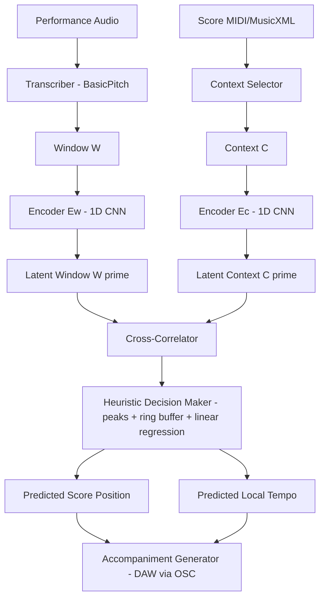

# A Neural Score Follower for Computer Accompaniment of Polyphonic Musical Instruments — 분석 보고서 (Pillay 2024, CMU MS Thesis)

## 핵심 요약

본 논문은 카네기멜런 대학교(CMU)의 석사학위 논문으로, 폴리포닉(다성) 악기 동반 시스템을 위한 **딥러닝 기반 스코어 팔로워(score follower)**인 **HeurMiT**를 제안한다. HeurMiT는 (1) 컴팩트한 1D-CNN 인코더 **Tyke/MiniTyke**가 학습한 압축 잠재 표현 위에서 **교차상관(cross-correlation)** 기반 템플릿 매칭을 수행하고, (2) **MIDIOgre**라는 자체 개발 MIDI 데이터 증강 라이브러리로 연주자의 imperfection(불완전성)에 강건한 표현을 학습하며, (3) 그 위에 **휴리스틱 규칙**을 결합한 하이브리드 구조를 갖는다. 저자는 이 시스템을 OLTW 기반 베이스라인 **Flippy**(Lee 2022)와 동일한 (n)ASAP 데이터셋에서 비교한 결과, **이상적인 조건에서는 비슷하거나 약간 더 정밀한 정렬오차**를 보이지만 **템포 불일치·반복 패턴·하이퍼파라미터 의존성** 때문에 실용에는 부족하다고 솔직히 보고한다. 즉 본 논문은 "아직 동작하는 신경 스코어 팔로워"를 제시하기보다는, **DL 기반 스코어 팔로잉의 본격적 탐색을 시작하는 출발점**이자 후속 연구의 방향을 제시하는 작업이다.

## 서지 정보와 접근 범위

- 저자: Ashwin Pillay
- 소속: Carnegie Mellon University, School of Music (Master of Science in Music and Technology)
- 지도교수: Dr. Richard M. Stern (Professor of ECE, Thesis Supervisor), Dr. Roger B. Dannenberg (Emeritus Professor of CS, Art and Music, Thesis Supervisor)
- 유형: MS 학위논문(Thesis), 2024년 5월 16일 제출
- 공개: arXiv:2503.06348v1 [cs.SD], 2025년 3월 8일 업로드
- 분량: 본문 7개 챕터 + 부록 2개 + 참고문헌, 총 약 50쪽 분량
- 본 보고서는 arXiv 공개판의 본문(Abstract, Chapter 1 Introduction, Chapter 2 Literature Review, Chapter 3 The Neural Score Following System, Chapter 4 Evaluation, Chapter 5 Results, Chapter 6 Future Directions, Chapter 7 Conclusions)을 직접 인용 범위 내에서 읽고 정리한 결과이며, 부록의 시각화 자료는 본문 설명 범위 내에서만 참조하였다.

## 상세 요약

**문제 정의.** Dannenberg(1984)와 Vercoe(1984) 이래 **컴퓨터 동반(computer accompaniment)** 문제는 세 가지 하위 과제로 분해되어 왔다. (1) 연주자가 무엇을 연주하는지 식별하기, (2) 악보 안에서 연주자의 현재 위치를 찾기(이것이 좁은 의미의 score following), (3) 적절한 시점에 반주 파트를 연주하기. Pillay는 두 번째 과제가 1980년대의 동적 계획법, 1990년대 이후의 HMM, 2000년대 후반의 OLTW로 이어져 왔지만, 다른 모든 분야를 휩쓴 **딥러닝**이 이 과제에서는 거의 활용되지 않았다고 지적하며 그 공백을 메우고자 한다. 다만 그가 다루는 시나리오는 사람이 주도하고 컴퓨터가 따라가는 형태(human-led)이며, 단성이 아닌 **폴리포닉 악기**(피아노 등)를 1차 대상으로 한다.

**HeurMiT의 핵심.** HeurMiT는 두 부분으로 구성된다. 첫째, **Tyke**는 1D-CNN 기반 인코더 두 개($E_w$와 $E_c$)로 이루어진 컴팩트 신경망으로, 윈도우 $W \in \mathbb{R}^{128 \times w}$(최근 연주의 피아노 롤)와 컨텍스트 $C \in \mathbb{R}^{128 \times c}$(현재 위치 부근의 악보 피아노 롤 일부)를 각각 잠재 공간 $W' \in \mathbb{R}^{e \times w}$, $C' \in \mathbb{R}^{e \times c}$로 압축한다. 그 후 두 잠재 표현 사이에서 **시간 축을 따라 교차상관**을 수행해 출력 벡터 $P' \in \mathbb{R}^{1 \times (c+w-1)}$를 얻고, $\mathrm{argmax}(P')$로 윈도우의 가장 가능성 높은 위치를 결정한다. 학습은 cross-entropy 손실로 이루어져 결과적으로 분류 문제처럼 다뤄진다. 둘째, **휴리스틱 결정 모듈**은 출력 벡터에 SciPy `find_peaks`로 보조 봉우리들을 검출하고, 과거 예측을 저장하는 링 버퍼와 선형 회귀를 이용해 모델 예측이 (a) 단조 증가, (b) 버퍼 예측 근방, (c) 버퍼 추세와 비슷한 변화율 조건을 만족하는지 검증한다. 검증 실패 시 모델/버퍼 예측의 평균이나 버퍼 예측을 사용하되, 연속해서 버퍼 예측만 쓰는 횟수에 상한을 둔다.

**입력/출력 구조와 학습 데이터.** 시스템은 외부적으로는 솔로 오디오 → 반주 오디오로 동작하지만, 내부적으로는 **피아노 롤** 표현을 사용한다. 오디오→MIDI 변환은 Spotify의 BasicPitch(저자가 제안하는 통합 형태)에 위임되며, 출력은 OSC over UDP를 통해 DAW로 전달되는 형태로 설계된다. Tyke의 학습 데이터셋은 **MAESTRO V3.0.0**의 피아노 MIDI에서 파생된 자체 데이터셋 **MSF-S**(MAESTRO for Score Following – Static)이며, 알고리즘 1에 따라 임의의 컨텍스트 시작점·윈도우 시작점·내·외 컨텍스트 플래그를 샘플링해 만든다. 그 위에 자체 라이브러리 **MIDIOgre**의 다섯 가지 증강(PitchShift, OnsetTimeShift, DurationShift, NoteAdd, NoteDelete)을 확률 0.1로 적용해 연주자의 임의 변형을 시뮬레이션한다.

**평가.** (n)ASAP 데이터셋의 MAESTRO test split 소속 연주 중 44곡(주로 Bach, Beethoven, Chopin, Debussy, Liszt, Rachmaninoff)을 사용했고, Lee(2022)의 Flippy를 NSGT-CQT online 모드로 베이스라인으로 삼아 **Misalign Rate $r_e$, Alignment Error $e_i$, Latency $l_i$**를 비교했다. 또한 MIDIOgre 증강의 효과를 따로 떼어보는 ablation, $f_e$(추론 빈도) 변화에 따른 거동, 그리고 정성적 듣기 평가를 수행했다. 결과는 다음과 같다. 첫째, 악보 템포를 연주의 실측 템포에 맞게 재조정한 이상적 조건에서 HeurMiT는 작은 임계값에서 약간 더 작은 정렬오차를 보이지만 더 자주 추적을 놓친다. 둘째, 템포가 ±5 BPM만 어긋나도 misalign rate가 50%를 넘는다. 셋째, MIDIOgre ablation은 통계적으로 유의미한 차이를 만들지 못한다. 넷째, 듣기 평가에서 HeurMiT는 일부 곡(P7/P11/P21/P38/P43)을 끝까지 따라가지만 빠른 패시지에서 지각 가능한 지연을 동반하고, 일부 곡(P25/P39/P41)에서는 안정화 단계를 지나기 전에 추적을 잃는다.

## 방법론과 데이터

**Tyke / MiniTyke 구조.** 최종 채택된 MiniTyke는 다음과 같이 매우 작다.

- $E_c$: Conv1d(in=128, out=64, kernel=3, stride=1, padding=1) → ReLU
- $E_w$: Conv1d(in=128, out=64, kernel=3, stride=1, padding=1) → ReLU
- 잠재 차원 $e=64$, 컨텍스트 길이 $c=512$, 윈도우 길이 $w=256$
- 피아노 롤 해상도 1/96 s ⇒ $c \approx 5.33$s, $w \approx 2.67$s
- 총 파라미터 49,280개, 곱셈-덧셈 약 605.55M, 단일 RTX 3060 Mobile GPU에서 67분 학습

학습은 AdamW(weight decay 1e-2, lr 5e-4), cosine annealing(min lr 1e-6, 1/4 cycle 10 epoch), 배치 크기 64, 50 epoch(epoch당 학습 500/검증 50 샘플)로 진행됐다. 합격 기준은 (1) val_acc/train_acc ≥ 0.75, (2) val_acc ≥ 0.9, (3) val_acc > val_bacc(piano-roll cross-correlation baseline)이며, 최종 MiniTyke는 train_loss 1.341, val_loss 1.458, train_acc 86%, val_acc 94%, val_bacc 88%로 세 조건을 모두 만족한다.

**폴리포닉 입력 처리.** 모든 처리는 128행 피아노 롤 위에서 일어나며, 폴리포니는 자연스럽게 한 시각 열에 여러 활성 셀로 표현된다. 인코더는 시간 축으로만 합성곱하고 노트 차원은 압축하므로(시간-등변) 임의 길이의 컨텍스트·윈도우를 처리할 수 있고, 학습 시와 다른 $c$를 추론에서 사용할 수 있다. 추론 시 best 설정은 $f_e = 10$Hz, $w = 500$ ($\sim 5.21$s), $c = 1250$ ($\sim 13.02$s), 이동평균 윈도우 5, 링 버퍼 20(초기 5 stabilization), 유효 예측 범위 -48 ~ +96 샘플, 변화율 0.5 ~ 1.5, 연속 버퍼 예측 상한 5이다.

| 데이터셋 | 곡 수 | 특성 | 용도 |
|---|---|---|---|
| MAESTRO V3.0.0 | ~200시간 피아노 연주 (수백 곡, MIDI/오디오 정렬 ~3 ms) | 학습용 (MSF-S로 가공) | Tyke/MiniTyke 지도학습 + MIDIOgre 증강 |
| MSF-S (자체) | MAESTRO 기반 무한 샘플링 (epoch당 500 train + 50 val) | (C, W, Y) 튜플로 정적 샘플링 | Tyke 학습/검증 |
| (n)ASAP (Peter et al.) | 44곡 평가 사용 (Bach, Beethoven, Chopin, Debussy, Liszt, Rachmaninoff) | 노트 단위 정렬, 큰 템포 변동, 다양한 숙련도 | 추론 평가 (HeurMiT vs Flippy) |
| ASAP (원본) | (n)ASAP의 모체, MAESTRO 기반 | 참고 | 평가용 ground truth 생성 보조 |

**평가 지표.** Misalign Rate $r_e$($\theta_e \in \{25, 50, 75, 100, 125, 300, 500, 750, 1000\}$ ms 임계값에서 정렬 오차가 임계 이상인 이벤트 비율), Alignment Error $e_i$ (mean ± SD), Latency $l_i$ (mean ± SD)이다. HeurMiT의 ground truth는 piano-roll 사이의 오프라인 unconstrained DTW(dtaidistance)로, Flippy의 ground truth는 저자 제공 string-matching 도구로 생성한다. 주요 결과(이상적 템포 매칭 조건, 표 5.4)는 $\theta_e = 100$ ms에서 Flippy $r_e = 54.05\%$, $e_i = 43.69 \pm 42.23$ ms, $l = 1678.77 \pm 729.09$ ms; HeurMiT $r_e = 77.24\%$, $e_i = 40.91 \pm 26.74$ ms, $l = 1.1 \pm 0.19$ ms (CUDA) 또는 $6.07 \pm 1.70$ ms (CPU)이다. 즉 정렬오차의 평균은 비슷하거나 약간 더 작지만, 추적을 놓치는 비율은 더 높고 지연은 약 1000배 작다.

**재현성.** MIDIOgre는 GitHub에 MIT 라이선스로 공개되어 있고(`https://github.com/a-pillay/MIDIOgre`), Flippy는 동일 저자(Lee)의 공개 저장소를 그대로 사용한다. MAESTRO와 (n)ASAP는 공개 데이터셋이며 학습/추론 하이퍼파라미터가 본문에 모두 명시되어 있어 재현 가능성은 높다. 단 학습은 단일 노트북 GPU에서 67분이지만 (n)ASAP 평가에서 26곡은 Flippy 측 GT 생성기의 재귀 한계, 4곡은 DTW 계산 시간 한계로 제외되어 있어 완전히 동일한 조건의 재현은 추가 작업이 필요하다.

## 비판적 평가

**강점.** 첫째, 본 연구는 Dannenberg가 1984년에 제기한 score-following 프레임 안에서 본격적으로 deep learning을 시도한 비교적 드문 사례다. 둘째, 추론에서 $O(1)$ 비용을 갖는 가벼운 1D-CNN과 교차상관 조합으로, OLTW 기반 Flippy 대비 지연을 약 세 자릿수 줄였다. 셋째, MIDIOgre는 그 자체로 폴리포닉 MIDI 학습에서 부족했던 도메인 특화 증강(PitchShift, OnsetTimeShift, DurationShift, NoteAdd, NoteDelete)을 공개 라이브러리로 제공해 후속 연구가 그대로 활용할 수 있다. 넷째, 평가 프로토콜이 정직하다. 저자는 자기 시스템이 베이스라인보다 잘 안 되는 영역까지 표 5.4·5.5와 그림 5.1·5.2로 명시적으로 보여주며, 듣기 평가에서 어떤 곡이 추적에 실패했는지(P25, P39, P41 등) 구체적으로 적는다. 다섯째, 6장에서 한계의 원인을 분석하고 (cross-correlation의 비-스케일 불변성, 작은 커널, out-of-context 처리 부재 등) 다음 단계(multi-scale 교차상관, 글로벌 검색, LSTM/Transformer로의 전환, MIDIOgre 강화) 로드맵을 구체적으로 제시한다.

**약점.** 첫째, 시스템 자체의 실용성은 저자도 인정하듯 한정적이다. 이상적 조건에서조차 $\theta_e = 100$ ms에서 misalign rate 77%로, 동일 조건의 Flippy 54%보다 못하다. 템포가 ±5 BPM만 어긋나도 무너지는 것은 심각한 결함이다. 둘째, MIDIOgre ablation에서 모든 증강을 모두 끄나 모두 켜나 $r_e$, $e_i$가 거의 차이가 없어 핵심 기여 중 하나의 효과가 검증되지 않는다. 저자는 "기본 시스템이 약해서 그렇다"고 해명하지만 이는 ablation의 한계를 드러낸다. 셋째, 휴리스틱이 사실상 곡별 튜닝(stabilization 길이, 변화율 범위, 버퍼 크기 등)을 요구해 "general-purpose heuristics"라는 목표를 충족하지 못한다. 넷째, 학습이 MAESTRO 피아노에 국한되어 있어 폴리포닉 악기 일반화 주장에 비해 경험적 근거가 좁다. 다섯째, 지연 비교(약 1.1 ms vs 1500+ ms)는 두 시스템이 본질적으로 다른 입력(piano roll vs spectrum)과 다른 알고리즘(O(1) cross-corr vs O(max(p,s)) OLTW)을 쓰므로 직접 비교가 부당하며, 저자도 이를 명시하지만 표 5.4의 임팩트는 그만큼 약화된다. 여섯째, BasicPitch로의 오디오→MIDI 변환은 본 논문에서 실제로 평가되지 않았으므로 end-to-end 시스템의 실측 성능은 미지수다.

## 선행연구와 비교

| Citation | 연도 | 방법 | 핵심 발견 | 본 논문과의 차이 |
|---|---|---|---|---|
| Dannenberg [1] / Vercoe [5] | 1984 | 동적 계획법으로 string sequence 정합 | Score-following 문제를 정식화하고 trumpet 등 단성악기 동반 가능 | HeurMiT는 동일 문제를 deep learning으로 풀고, 폴리포닉 입력을 piano roll로 일반화 |
| Bloch & Dannenberg [6] | 1985 | 그룹화로 polyphonic 확장 | 단성 DP를 다성으로 일반화 | HeurMiT는 그룹화 대신 piano roll 표현으로 본질적 다성 처리 |
| Raphael [14] / 후속 [15]–[26] | 1999~2023 | HMM 기반 audio 직접 정합 | spectral 특징 위에서 확률적 정합, 폴리포닉/스킵/리피트 대응 | HeurMiT는 확률모델 대신 latent-space cross-corr + 휴리스틱; 데이터 기반 |
| Dixon [27] / Arzt 등 [29], [30] | 2005~ | OLTW (DTW의 온라인 변형) | 선형 시공간으로 실시간 정합, MIREX의 대표 baseline | HeurMiT는 OLTW 대신 고정창 cross-corr + DL; Flippy(Lee, OLTW+CQT)와 직접 비교 |
| Lee [33] (Flippy) | 2022 | NSGT-CQT + OLTW 온라인 | (n)ASAP 평가 프레임워크 + MIREX 비판 | HeurMiT는 동일 평가 위에서 Flippy를 베이스라인으로 사용; 평균 정렬오차는 비슷하나 misalign rate는 더 높음 |
| Peter [53] | 2023 | Offline DRL + attention + tempo extractor | 신경망 기반 따라가기 + 휴리스틱 | HeurMiT도 DL+휴리스틱 하이브리드지만 RL 대신 template-matching 채택 |

## 실무적 함의와 응용

본 시스템은 현재 형태로는 실연(콘서트) 환경에서 곧바로 쓰기는 어렵다. 그러나 몇 가지 명확한 실무적 함의가 있다. 첫째, **컴퓨터 동반/연습 도구**: $O(1)$ 추론과 ms 단위 지연은 메트로놈을 대체하는 지능형 연습 동반자(템포 추정 + 자동 페이지 넘김 + 자동 반주 큐) 같은 연습용 응용에서 매력적이다. 단, 템포 변동이 작은 곡과 안정 단계 이후의 시나리오에 한정해야 한다. 둘째, **음악 교육**: 학생이 악보에서 크게 이탈하지 않는 일반적 학습 상황에서는 자동 페이지 넘김, 실수 위치 강조, 자동 메트로놈 보정 등에 적용 가능하다. 셋째, **퍼포먼스 시스템 개발자**: MIDIOgre는 폴리포닉 MIDI 도메인의 데이터 증강 도구로, 자동 채보·온셋 검출·연주 생성 등 인접 과제 학습에 그대로 재활용할 수 있다. 넷째, **연구 인프라**: (n)ASAP 위에서 HeurMiT 결과는 향후 신경 스코어 팔로워들이 비교할 명시적 베이스라인이 된다. Pillay가 강조하듯 본 작업의 1차 가치는 "DL 기반 score follower의 출발선과 평가 프레임워크 제공"에 있다.

## 후속 연구와 핵심 참고문헌

저자가 6장에서 명시적으로 제시한 후속 연구 방향은 다음과 같다.

1. **노트 온셋 전용 교차상관**: 지속 시간을 0/1로 단순화해 cross-corr의 템포 민감도 완화.
2. **멀티스케일 교차상관**: Viola-Jones 식으로 여러 해상도의 악보 piano roll을 병렬로 매칭하고 confidence로 선택.
3. **Out-of-Context Global Search**: $P'$를 입력으로 받는 binary classifier가 윈도우가 컨텍스트 밖에 있다고 판단하면 악보 전체에서 글로벌 검색 수행.
4. **동적 휴리스틱**: 정적 규칙 대신, Xia et al.[66] 류의 연주자 간 상호작용 모델로 템포·표현을 학습.
5. **대안 DL 패러다임**: LSTM/Transformer로 시퀀스 정합을 직접 학습. (n)ASAP는 이 학습에 적합한 노트 단위 정렬을 제공.
6. **MIDIOgre 강화**: 확률 0.1을 정량적으로 재탐색, RandomNoteSplit/RandomTrill 추가.
7. **다양한 악기·보컬 데이터로의 확장**.

핵심 참고문헌은 Dannenberg [1] (1984, score following 정의), Vercoe [5] (1984, 동시 제안), Raphael [14] (1999, HMM 도입), Dixon [27] (2005, OLTW), Cont [55] (2007, MIREX 평가지표), Lee [33] (2022, Flippy/NSGT-CQT, (n)ASAP 평가 프레임워크), Peter [62] (2023, (n)ASAP 데이터셋 + DRL score follower), Hawthorne et al. [57] (2018, MAESTRO), Cwitkowitz et al. [48] (MDTK, MIDI Degradation Toolkit), Bittner et al. [59] (BasicPitch)이다.
