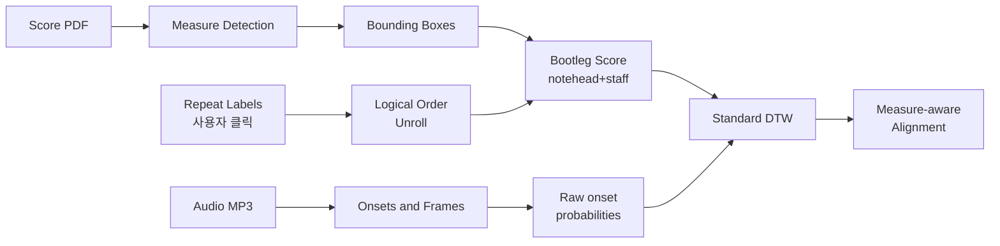

# Just Label the Repeats for In-the-Wild Audio-to-Score Alignment — 분석 보고서

## 핵심 요약

이 논문은 "실제 연주 오디오"와 "스캔된 악보 이미지(PDF)"를 오프라인으로 정렬하는 audio-to-score alignment 문제를 다루며, 반복 기호로 인한 jump 처리에서 기존 자동 알고리즘이 흔히 실패한다는 관찰에서 출발한다. 저자들은 "완전 자동" 대신 사용자가 악보 위 반복 기호 한 쌍에 클릭만 하면 되는 인간-기계 협업(human-in-the-loop) 워크플로우를 제안한다. 더불어 score 측에는 bootleg score에 measure detection을 결합하여 마디 단위로 잘라낸 후 notehead/staff line을 검출하고, audio 측에는 transcription model의 raw onset prediction probability를 그대로 특징으로 사용하는 두 가지 표현 개선을 도입한다. measure-level distance 기반의 새 평가 프로토콜에서 MAcc 33% → 82%(상대 150% 향상)를 보고하며, 페이지당 6초 미만의 클릭 노동만으로 정확도가 크게 향상됨을 보인다.

## 서지 정보와 접근 범위

- 저자: Irmak Bukey, Michael Feffer, Chris Donahue (모두 Carnegie Mellon University)
- 출처: Proceedings of the 25th International Society for Music Information Retrieval Conference (ISMIR 2024), San Francisco, United States
- 라이선스: CC BY 4.0
- 코드 및 비디오 예시: https://github.com/irmakbky/jltr-alignment, https://bit.ly/jltr-ismir2024
- 본 분석은 PDF 추출 본문(`/tmp/pdftext/JLTR.txt`, 564행) 직접 정독에 기반하며, 외부 보충 자료는 사용하지 않았다. 페이지 인용은 PDF 추출 텍스트 기준으로 표기한다.

## 상세 요약

문제 설정은 다음과 같다. 입력은 P 페이지짜리 악보 이미지와 길이 T 초의 연주 오디오이며, 출력은 시점 t ∈ [0, T)에서 해당 악보 playhead (p, y, h, x) ∈ S로 가는 매핑이다. 저자들은 이 task를 "in-the-wild" 환경 — 즉 IMSLP에서 가져온 스캔 악보와 실제(synthesized가 아닌) 연주 녹음 — 으로 한정하며, 기존 연구가 흔히 가정하던 (i) digital score(MIDI/MusicXML) 가용성, (ii) MIDI/synthesized audio 사용, (iii) 피아노 단일 악기 한정, (iv) 시간이 많이 드는 인간 라벨링 의존을 모두 피하는 것을 목표로 한다(PDF p.1-2).

핵심 도전은 반복 기호(repeat sign), Dal segno, D.S. al coda 같은 기호로 발생하는 inter-measure jump의 처리다. 가장 가까운 선행 연구인 Shan et al.(참고문헌 [16, 17])은 이를 자동으로 처리하기 위해 hierarchical DTW를 확장했으나, 본 논문 측정에 따르면 자동 모드에서 MAcc가 MeSA-13에서 0.33, SMR에서 0.36에 그친다(Table 1). 저자들은 "완벽한 자동화는 아직 어려우니, 인간이 몇 초 클릭으로 jump를 라벨링하자"는 실용적 절충을 제안한다.

제안 시스템은 score와 audio 양쪽에서 새로운 특징 표현을 사용한다. **Score 측**은 Yang et al.(참고 [1])의 bootleg score를 확장한다. 먼저 [21]의 measure detection 모델로 페이지 이미지를 마디 bounding box로 분할하고, 각 마디 이미지를 (height/width 중 작은 쪽 기준 900px로) 리사이즈한 뒤 notehead와 staff line을 검출한다. 이는 전체 페이지에서 검출하는 기존 방식보다 절대 픽셀 크기 변동에 덜 민감하다. notehead의 staff position을 MIDI pitch로 매핑할 때 key signature와 clef를 OMR로 안정적으로 얻기 어렵다는 한계를 우회하기 위해, 두 staff가 검출되면 treble+bass, 그 외에는 treble으로 가정하고 C major key를 가정한다. 이 단순 가정이 DTW의 전역 최적성과 결합되어 의외로 잘 동작한다(PDF p.3-4). 사용자가 입력한 jump 라벨은 마디 bounding box 리스트를 unrolled 논리 순서로 재배열하는 데 사용된다.

**Audio 측**은 Onsets and Frames piano transcription model[3]에 오디오를 통과시킨 뒤, MIDI로 후처리하지 않고 raw onset prediction probability 행렬(차원 [0, 1]^{T·31 × 88})을 그대로 사용한다. 이는 Maman & Bermano[2]에서 영감을 받은 선택이다. 정렬은 librosa의 표준 DTW(전이 (1,1), (0,1), (1,0), Euclidean cost)로 수행된다. 즉, 자동 jump 처리를 갖는 hierarchical DTW가 아니라 ordinary DTW만 사용한다는 점이 특징이다.

평가는 새로 제안한 measure-aware 메트릭으로 한다. ground truth measure list M*과 추정 measure list M' 간 Reindex 후 측정한 차이 MDiff를 기반으로, MAcc(half-measure radius 내 비율), MErr(평균 절대 오차), MDev(표준편차)를 100T 샘플 단위로 계산한다(PDF p.2-3). 데이터셋은 (1) MeSA-13[18] — 13곡의 sheet music + 실제 연주 오디오, 일부에 repeat과 비-피아노 악기 포함 — 과 (2) SMR[1] 100곡 중 measure detection이 일치하는 60곡 부분집합이다. SMR은 synthesized audio이지만 jump가 없다.

결과(Table 1)는 MeSA-13 전체에서 자동 설정으로도 MAcc 0.72(베이스라인 0.33 대비), repeat 라벨이 주어지면 0.82, M+R이면 0.86, M+R+S(staff metadata)이면 0.88로 향상됨을 보인다. 특히 repeat이 있는 부분집합 M13_R에서는 0.20 → 0.83으로 극적 향상되며, 이것이 논문 제목의 "150% 상대 향상"의 핵심 근거다. 저자들은 R†(repeat만 라벨링)을 권장 설정으로 제시한다 — measure bounding box나 staff metadata는 추가 라벨링 비용 대비 이득이 작기 때문이다(PDF p.5).

## 방법론과 데이터

- **Bootleg score 확장**: measure detection 전처리 → 마디 단위 리사이즈 → notehead/staff line 검출. 결과는 binary matrix S ∈ {0, 1}^{48M × 88}로, 각 마디는 48행을 차지하여 다양한 리듬 분해를 표현.
- **Audio feature**: Onsets and Frames[3]의 raw onset probability(thresholding 이전). 비교군으로 onset prediction(thresholded), frame probability/prediction, MIDI piano roll 평가됨(Table 2). raw onset이 가장 우수.
- **Alignment**: librosa[22]의 ordinary DTW. 자동 jump 처리 메커니즘이 없어 jump는 사용자 라벨로만 주입.
- **Labeling interface**(Section 5): 웹 기반 UI. measure detection을 backend에서 수행한 뒤 hover 시 마디 박스를 시각화, 사용자는 jump의 시작/끝 마디를 두 번 클릭. 결과는 logical-order JSON으로 다운로드. 평균 페이지당 6초 미만 소요.

| 데이터셋 | 작품 수 | 특성 | 용도 |
|---------|-------|------|------|
| MeSA-13 [18] | 13 | 실제 연주 오디오 + 스캔 악보, 일부 비-피아노, 2곡 repeat 포함, ground truth measure bounding box + measure timestamp | 메인 평가 (M13, M13_R, M13_NR 부분집합으로 분할) |
| Sheet MIDI Retrieval (SMR) [1] | 60 (원본 100 중 measure detection이 annotation과 일치하는 부분집합) | IMSLP 스캔 + MIDI synth 오디오, 피아노 단일 악기, jump 없음 | 보조 평가 |

평가 지표: **MAcc**(half-measure 반경 내 비율, 주 지표), **MErr**(평균 절대 오차, 단위: ground-truth measure), **MDev**(시간축 표준편차). 모두 100T 시점에서 산출.

재현성: 코드는 GitHub(`irmakbky/jltr-alignment`)에 공개. MeSA-13[18]과 SMR[1]는 외부 공개 데이터셋. 비디오 예시 별도 제공.

## 비판적 평가

**강점**
- 실용적 인간-기계 협업 설계: 페이지당 ~6초의 클릭으로 정확도가 0.33→0.82(상대 150%)로 도약하므로, 비용-효용비가 우수.
- 코드/인터페이스/비디오/평가 프로토콜 모두 공개되어 재현성 높음.
- "in-the-wild" 가정(스캔 악보 + 실제 연주, multi-instrument 일부)이 실제 적용 가능성을 높임. MIDI/synthesized 의존성을 제거한 흔치 않은 사례.
- measure-level metric의 명확한 수학적 정의(MDiff/MAcc/MErr/MDev)로 후속 연구 비교가 쉬움.
- 단순 가정(treble+bass, C major)이 DTW의 전역 최적성과 결합해 의외로 잘 동작한다는 발견은 후속 연구에 시사하는 바가 큼.

**약점/한계**
- 완전 자동이 아니다: 인간 라벨링이 필수로, 대규모 자동 데이터 수집의 마지막 한 발자국이 남아 있음.
- 오프라인(offline) 한정: 실시간 score following과는 별개 task. 본 프로젝트의 다른 8편(real-time)과 직접 비교 불가.
- 평가 데이터 규모가 작음: MeSA-13 13곡(repeat 포함은 단 2곡), SMR 60곡. 통계적 신뢰 구간이 좁지 않음.
- repeat 기호가 시각적으로 명확하고 measure detection이 잘 동작하는 악보를 가정. 손글씨 악보, 비-Western 표기, 복잡한 voltas/segnos에 대한 검증은 제한적.
- staff position → pitch 매핑의 단순 가정은 조성이 멀거나 변조가 잦은 작품에서 실패 가능성이 있으나, 이에 대한 ablation은 제한적.
- multi-instrument 케이스는 MeSA-13에 단 2곡으로, "non-piano"에서의 성능 주장은 약한 근거에 의존.

## 선행연구와 비교

| Citation | 연도 | 방법 | 핵심 발견 | 본 논문과의 차이 |
|---------|------|------|----------|----------------|
| Shan & Tsai [16, 17] | 2020-2021 | Hierarchical DTW + bootleg score, segment-level alignment, jump 자동 처리 | 피아노 in-the-wild 환경에서 자동 alignment 파이프라인 제시 | 자동 jump 처리를 포기하고 사용자 라벨링으로 대체. measure-level 평가 도입. raw onset 확률 사용. multi-instrument 일부 포함 |
| Yang et al. [1] | 2019 | Bootleg score 표현 (notehead+staff line의 binary matrix) | 휴대폰 사진 악보로 MIDI passage retrieval | 본 논문은 bootleg에 measure detection 전처리를 추가하고, alignment task로 확장 |
| Hawthorne et al. (Onsets and Frames) [3] | 2018 | 듀얼 목적 피아노 transcription network | onset/frame 동시 예측으로 transcription 정확도 향상 | 본 논문은 MIDI 결과 대신 raw onset 확률을 그대로 alignment feature로 사용 |
| Maman & Bermano [2] | ICML 2022 | Unaligned supervision 기반 in-the-wild transcription | raw prediction probability를 학습 신호로 활용 | 이로부터 영감을 받아 alignment에도 raw onset 확률을 채택 |
| Waloschek et al. [21] | ISMIR 2019 | sheet music 이미지 내 measure 식별/cross-document alignment | measure bounding box detection 모델 제공 | 본 논문은 이 모델을 score feature 전처리와 인터페이스 backend에서 활용 |
| Thickstun et al. [20] | 2020 | audio-to-score alignment 평가 방법론 재고 | granularity-aware metric 필요성 주장 | 본 논문은 이를 measure-level metric으로 구체화 |

## 실무적 함의와 응용

- **대규모 multimodal MIR 데이터셋 구축**: IMSLP 같은 public domain 악보 + 공개 녹음을 measure-level로 정렬하면, sheet-music-aware transcription/generation 모델의 학습 데이터로 사용 가능. 저작권 의존을 줄이는 부수 효과도 있음.
- **음악인 연습 동반**: 스캔된 악보로 연주 녹음과 같은 시간선상에서 따라가게 해, 학습용 반주/리허설 도구로 활용.
- **page turning, accompaniment 시스템의 데이터 부트스트래핑**: 본 논문은 offline이지만, 그렇게 모은 alignment 데이터가 real-time score following 학습 자원으로 환원될 수 있음.
- **데이터 큐레이션 워크플로우**: MeSA-13 인터페이스[18]는 곡당 수십 분 이상이 들었으나, 본 논문 인터페이스는 페이지당 ~6초로 시간 비용을 1-2 자릿수 단축.

## 후속 연구와 핵심 참고문헌

핵심 참고문헌
1. **Shan & Tsai (2020, 2021)** — 직접 비교 대상, hierarchical DTW + bootleg score.
2. **Yang et al. (2019)** — bootleg score 원논문.
3. **Hawthorne et al. (Onsets and Frames, 2018)** — 본 논문의 audio backbone.
4. **Maman & Bermano (ICML 2022)** — raw onset probability 활용의 영감원.
5. **Waloschek et al. (2019)** — measure detection 모델.
6. **Feffer et al. (2022, MeSA-13 LBD)** — 평가 데이터셋과 비교 대상 인터페이스.

후속 방향(저자 + 분석자 종합)
- **자동 repeat detection**: OMR이 jump 기호를 안정적으로 인식하면 인간 라벨링도 제거 가능 — "fully automated"로의 마지막 한 단계.
- **alignment audit & adjust 인터페이스**: 클릭으로 라벨링한 뒤, 추정된 alignment를 사용자가 빠르게 검증/수정해 데이터 정제와 학습 신호를 동시에 얻는 워크플로우.
- **real-time 확장**: 현재는 offline DTW. 라벨링한 jump 정보를 실시간 score follower(HMM/Particle Filter/RL 기반)에 주입해 hybrid 시스템 구성 가능.
- **multi-modal MIR 데이터셋 구축**: 본 논문에서 명시한 장기 목표. 대규모 sheet image + audio 정렬 데이터셋이 multimodal generative model의 학습 자원이 됨.
- **non-Western/비-피아노 일반화**: 윤리 섹션에서 명시한 한계로, 다른 음악 전통에 맞는 표기법/평가가 필요.
