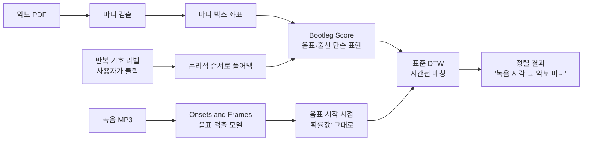

# Just Label the Repeats for In-the-Wild Audio-to-Score Alignment — 비전공자 해설

## 이 논문이 풀려는 문제는 무엇인가

상상해 보자. 친구가 피아노로 연주한 30분짜리 녹음 파일이 있고, 그 곡의 악보 PDF가 따로 있다. 이제 누군가 다음과 같은 도구를 만들고 싶다. 녹음의 어느 시점에서 일시정지를 누르면, 화면이 자동으로 악보 PDF의 그 정확한 마디를 가리키는 도구. 사람이 보기에는 "당연히 가능할 것 같은" 작업이지만, 컴퓨터에게는 의외로 까다롭다. 왜냐하면 (1) 악보는 종이를 스캔한 이미지일 뿐 음표 위치 정보가 디지털로 들어 있지 않고, (2) 녹음은 실제 사람의 연주라 빠르거나 느린 부분이 들쭉날쭉하며, (3) 무엇보다 악보에는 "다시 한 번 처음으로 돌아가서 연주하시오"를 뜻하는 **반복 기호**가 곳곳에 있다는 점 때문이다.

이 논문 "Just Label the Repeats for In-the-Wild Audio-to-Score Alignment"는 바로 이 작업, 즉 "녹음과 악보 이미지를 같은 시간선 위에 정렬하기(audio-to-score alignment)"를 다룬다. 그런데 이 프로젝트의 다른 8편 논문(score following)이 "지금 이 순간 연주 중인 부분을 실시간으로 따라잡기"를 목표로 하는 것과 달리, 본 논문은 **오프라인** 정렬이다. 즉, 연주가 끝난 뒤 녹음 파일과 악보를 모두 가지고 있는 상태에서 가장 정확한 정렬 결과를 만들어 내는 것이 목표다. 실시간이 아니어도 되니 더 쉬워 보일 수 있지만, 반복 기호 문제는 동일하게 남는다 — 같은 마디 그림이 한 곡에서 두 번 또는 세 번 연주된다면, 시스템은 녹음의 어느 부분이 첫 번째 연주이고 어느 부분이 두 번째 연주인지 가려야 한다.

기존의 가장 유력한 접근(Shan et al.)은 이 jump 문제를 자동으로 풀려고 했다. DTW(동적 시간 워핑)이라는 정렬 알고리즘을 확장해서 "여기서 점프할 수도, 안 할 수도 있다"는 모든 경우의 수를 계산하게 한 것이다. 그러나 본 논문 저자들이 측정해 보니, 이 자동 방식의 정확도는 33%에 그쳤다. 절반에도 못 미친다.

## 한 줄 비유로 본 이 논문의 아이디어

저자들의 발상은 이렇다. **"완벽한 자동화에 매달리는 대신, 사람이 30초만 클릭하면 정확도를 2.5배로 끌어올릴 수 있다."**

비유하자면, 로봇 청소기에게 모든 가구의 위치를 스스로 학습시키느라 한 달을 쓰는 대신, 사용자가 처음에 5분만 "여기는 의자, 여기는 화분"이라고 알려 주면 그 뒤로는 완벽하게 청소하는 식이다. 음악으로 돌아오면, 페이지당 6초 미만 — 즉 "여기서 처음으로 돌아가서, 여기서 끝낸다"는 두 번의 클릭 — 으로 시스템에 반복 구조를 알려 주면, 그 뒤로는 알고리즘이 알아서 정확하게 정렬한다.

이 접근에는 깊은 의미가 있다. 컴퓨터 비전이나 음악정보검색 분야에서 "완전 자동"은 종종 신성한 목표로 여겨지지만, 실제 데이터 수집 현장에서는 "전부 사람이 하기"와 "전부 자동" 사이에 광활한 중간 지대가 있다. 이 중간 지대에서 인간의 5분 노동이 자동 시스템의 1년 연구보다 더 큰 정확도 향상을 가져올 수 있다는 것 — 이것이 human-in-the-loop의 핵심 통찰이다.

## 핵심 아이디어를 한 그림으로

비유하자면, 악보 쪽에서는 "그림으로만 있는 음표"를 컴퓨터가 읽을 수 있게 단순화된 격자(bootleg score)로 만드는 작업을, 녹음 쪽에서는 "소리의 파형"을 "언제 어떤 음이 시작됐을 가능성"으로 변환하는 작업을 따로 하고, 두 결과를 동일한 좌표계 위에서 매칭한다. 마치 두 개의 다른 언어로 쓰인 같은 이야기를 한 줄 한 줄 대응시키는 번역가와 같은 일이다.

## 알아야 할 핵심 용어

| 용어 | 영문 | 직관적 설명 |
|------|------|----------|
| 오디오-악보 정렬 | Audio-to-score alignment | 녹음의 시간 t 초가 악보의 어느 위치(페이지·마디·박)에 해당하는지를 매핑하는 것 |
| 오프라인 vs 실시간 | Offline vs real-time | 오프라인은 녹음이 끝난 뒤 전체를 보고 가장 정확하게 정렬, 실시간은 연주가 진행 중일 때 즉시 따라가는 것. 본 논문은 오프라인 |
| 자연 환경 | In-the-wild | 인공적으로 만든 깨끗한 데이터(MIDI, synthesized audio)가 아니라, 실제 콘서트 녹음 + 사람이 스캔한 종이 악보처럼 잡음과 변형이 있는 실제 데이터 |
| 반복 기호 / 점프 | Repeat sign / jump | 악보에서 "이 부분을 다시 한 번", "처음으로 돌아가서" 등을 뜻하는 기호. 같은 마디가 시간선상 여러 번 등장하게 만든다 |
| Bootleg score | Bootleg score | 악보 이미지에서 "음표 머리(notehead)와 오선(staff line)"만 추려서 만든 단순 흑백 격자 표현. OMR 전체보다 가볍고 강건함 |
| 마디 검출 | Measure detection | 악보 이미지 안에서 마디(bar)의 사각형 경계를 찾아 주는 모델. 본 논문은 [21]의 모델을 사용 |
| 음표 시작 확률 | Raw onset probability | 음표가 시작되는 시점을 신경망이 예측한 0~1 사이 확률값. "이 시점에 도(C)가 시작될 확률 0.83"처럼. 본 논문은 이 확률을 0/1로 자르지 않고 그대로 사용 |
| 피아노롤 | Piano roll | "어느 시점에 어떤 음이 울리는가"를 격자에 0과 1로 표시한 행렬. 음표 시작 확률은 이보다 부드럽고 정보가 풍부함 |
| DTW | Dynamic Time Warping | 빠르거나 느리게 흘러가는 두 시퀀스를 비교하기 위해 시간축을 늘리고 줄이며 가장 잘 맞는 정렬을 찾는 고전 알고리즘 |
| 인간 개입 학습 | Human-in-the-loop | 알고리즘이 어려워하는 부분만 사람이 짧게 라벨링해 주는 협업 방식. 비용 대비 효용이 크다 |
| 마디 경계 박스 | Bounding box | 마디를 둘러싼 사각형의 좌표(상하좌우). 클릭한 마디를 시스템에 알려 주는 데 쓰임 |
| 음표 검출 모델 | Transcription model | 오디오를 입력받아 어떤 음표가 언제 울렸는지 예측하는 신경망. 본 논문은 Onsets and Frames[3]를 사용 |

## 이 논문의 새로운 점

크게 세 가지를 들 수 있다.

**첫째, 인간 라벨링 + 표준 DTW의 절충.** 기존 Shan et al.은 "DTW를 더 똑똑하게 만들어 jump를 자동 처리"하는 방향을 택했지만, 본 논문은 정반대로 간다. DTW는 가장 단순한 형태(librosa의 기본값)로 두고, 대신 사람이 jump 정보를 명시적으로 주입한다. 이 단순화가 가능한 이유는, 라벨로 받은 jump 정보로 악보의 마디 순서를 미리 "풀어냈기(unrolled)" 때문이다. 즉, 4마디 악보에 반복이 있으면 8마디 시퀀스로 펼친 뒤 그 위에서 일직선의 DTW를 돌리는 것. 결과적으로 연구 코드도 단순해지고 디버깅도 쉬워진다.

**둘째, 마디 단위 bootleg score.** 기존 bootleg score는 페이지 전체에서 음표 머리와 오선을 검출했다. 그런데 페이지마다 인쇄 크기가 다르면 음표 머리의 절대 픽셀 크기도 달라져 검출이 흔들렸다. 본 논문은 먼저 마디를 잘라낸 뒤 각 마디 이미지를 동일 크기(900px)로 리사이즈한 다음 그 위에서 검출한다. 작은 변경이지만 검출 일관성을 크게 높였다. 또한 staff position을 MIDI pitch로 바꿀 때 OMR로 키와 클레프를 정확히 알기 어렵다는 현실을 인정하고, 단순히 "두 줄이면 treble+bass, 키는 C major"로 가정한다. 이 어처구니없이 단순한 가정이 DTW의 전역 최적성과 만나 의외의 견고함을 보인다.

**셋째, raw onset 확률 그대로 사용.** 보통의 audio-to-score 시스템은 transcription model의 출력을 임계값으로 잘라 0/1 piano roll로 만든 뒤 정렬한다. 본 논문은 이 단계를 건너뛰고 신경망이 출력한 부드러운 확률값을 그대로 정렬 입력으로 쓴다. 정보 손실이 적기 때문에 정렬 정확도가 올라간다. Table 2에 따르면 raw onset 확률이 MAcc 0.88, MIDI 변환 후 piano roll은 0.46으로 큰 차이가 난다. 이 모델은 피아노 전용으로 학습되었지만, 기타나 다른 악기 녹음에서도 "유용한 onset 확률"을 출력해 multi-instrument 정렬에도 의외로 잘 동작한다고 보고한다.

이 세 가지가 합쳐져 MAcc 33% → 82%(상대 150%) 개선을 만들어 낸다. 특히 반복이 있는 곡들로만 보면 20% → 83%로 4배 이상 향상된다.

## 한계와 의의

**한계.** 첫째, 사람의 손이 필요하다. 페이지당 6초라고는 해도, 진정한 "대규모 자동 데이터 수집"의 마지막 한 발자국이 남아 있다. 둘째, 오프라인 한정이다. 실시간 연주를 따라가는 score following에는 그대로 쓸 수 없다. 셋째, 평가 데이터(MeSA-13 13곡, 그중 반복 포함은 단 2곡)가 작다. 이 작은 표본에서의 화려한 수치 향상이 더 큰 모음(corpus)에서도 유지되는지는 후속 검증 과제다. 넷째, 시스템은 반복 기호를 사람이 정확히 식별할 수 있다는 — 즉 악보가 깨끗하고 인쇄가 좋다는 — 가정을 한다. 손글씨 악보, 비-Western 표기법, 복잡한 segno/coda 구조에서는 사용자 학습 비용이 더 클 것이다.

**의의.** 본 논문이 시사하는 가장 큰 가치는 학술적 완벽주의에 대한 실용적 반론이다. "완전 자동"이 아닌, 사람의 짧은 개입을 받아들이는 시스템이 단기적으로 훨씬 큰 가치를 만들 수 있다는 것. 그렇게 모인 정렬 데이터는 다시 multimodal MIR 모델 — 악보를 입력으로 받는 transcription, 악보를 출력으로 내는 generation, 사람과 같이 따라 부르는 accompaniment — 의 학습 자원이 되어, 장기적으로는 본 논문이 우회한 "완전 자동" 문제를 푸는 데 기여할 가능성이 있다. 또한 본 프로젝트의 다른 score following 연구들과는 결이 다르지만 상보적이다 — 실시간 score follower의 학습/평가 데이터를 본 논문 같은 오프라인 도구로 만들 수 있기 때문이다. 인간과 알고리즘이 각자 잘하는 일을 분담하는 설계가, 음악정보검색이 다음 10년을 향해 나아가는 한 가지 길임을 보여 준다.
