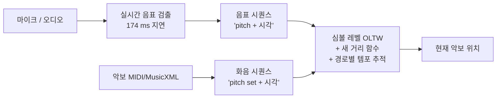

# Pairing Real-Time Piano Transcription with Symbol-level Tracking — 비전공자 해설

## 이 논문이 풀려는 문제는 무엇인가

본 프로젝트의 다른 논문들 — Arzt 2016, Lee 2022, Zeitler 2024 — 을 떠올려 보자. 이들은 모두 **오디오 도메인에서 끝까지 정렬**하는 전통을 따른다. 즉 마이크로 들어오는 소리를 직접 chroma·CQT 같은 음향 특징으로 변환한 뒤, 미리 합성해 둔 악보 오디오의 같은 특징과 시간선을 맞춘다. 2005년 Dixon의 OLTW 이래로 20년간 이 노선은 표준이었다.

문제는 이 접근의 정확도가 지난 10년 동안 멈췄다는 것이다. 본 논문 저자들은 이를 단순히 직감으로 주장하지 않고, 자기 데이터에서 직접 측정해 보인다. NS·NC·LNSO·LNCO라는 네 가지 audio 특징을 같은 OLTW 알고리즘에 넣어 비교했더니, 어떤 특징을 써도 "robustness 90%·정확도 ≤100 ms 분위 75%" 부근에서 정체했다. 알고리즘에 휴리스틱을 더 넣고 특징을 바꿔도 천장이 비슷했다.

저자들의 가설은 이렇다. "audio 도메인에 머무르는 한 손으로 만든 특징의 표현력이 천장이다. 차라리 audio를 한번 음표(MIDI 같은 심볼)로 변환한 뒤, 심볼 도메인에서 정렬하면 변환 오류를 감수하더라도 더 정확할 것이다." 이 가설을 transcribe-then-track(전사 후 추적)이라 부르고, 직접 시스템을 만들어 검증했다.

## 한 줄 비유로 본 이 논문의 아이디어

**"정렬을 audio 끼리 하지 말고, audio를 한 번 글자(음표)로 옮긴 다음 글자끼리 맞춰라."**

비유하자면, 두 사람이 같은 책을 한국어와 일본어 음성으로 각각 읽고 있을 때 두 음성을 직접 맞추는 것보다, 먼저 두 음성을 모두 한국어 텍스트로 변환한 뒤 텍스트끼리 매치하는 편이 더 정확한 것과 같다. 음성 인식기에 약간의 오류가 있어도, 텍스트 매치는 단어 단위 비교라 고차원 음향 매칭보다 본질적으로 강하다.

이 비유의 한계도 있다. 음성→텍스트 변환에 시간이 걸리듯, audio→MIDI 변환(transcription)에도 시간이 걸린다. 본 논문이 채택한 transcription 모델의 지연은 174 ms — 약 1/6 초. 자동 반주처럼 즉시 반응이 필요한 응용에는 이 지연을 미래 예측으로 보완해야 하지만, 페이지 터너나 자막처럼 약간 늦어도 되는 응용에는 그대로 충분하다.

## 핵심 아이디어를 한 그림으로

마이크 입력을 transcription 모델이 음표 시퀀스로 바꾸고, 악보 측에서는 동시에 울리는 음표를 한 묶음(pitch set)으로 만든 시퀀스를 준비한다. 두 시퀀스를 새 OLTW로 정렬하는데, 이 OLTW에는 두 가지 새 장치가 있다. (1) **새 거리 함수**는 pitch가 일치하는지(이산 거리)와 onset 시각이 예상값에서 얼마나 벗어났는지(연속 거리)를 가중합으로 결합한다. (2) **경로별 tempo 행렬**은 외부 tempo 모델 없이 OLTW의 각 셀에 그 셀로 도달하기까지의 추정 tempo를 저장해, 여러 후보 경로가 각자의 tempo를 동시에 추적할 수 있게 만든다.

## 알아야 할 핵심 용어

| 용어 | 영문 | 직관적 설명 |
|------|------|----------|
| 실시간 음표 검출 | Real-time AMT (Automatic Music Transcription) | 마이크로 들어오는 오디오를 매 순간 "지금 어떤 음이 시작/지속/끝나고 있는가"의 음표 시퀀스로 변환 |
| 심볼 레벨 정렬 | Symbol-level alignment | 두 음표 시퀀스(연주 vs 악보)를 시간선상으로 맞추는 작업. audio-level 정렬보다 입력 표현이 단순하고 강함 |
| transcribe-then-track | 전사 후 추적 | 본 논문의 핵심 사상. 오디오를 한번 심볼로 바꾼 뒤 그 위에서 정렬 |
| OLTW | Online Time Warping | 두 시퀀스를 한쪽이 실시간 입력일 때 정렬하는 고전 알고리즘. Dixon 2005 |
| pitch set | Pitch set | 동시 onset에 속한 음표들을 한 묶음으로 본 것. C-major 화음이면 {C, E, G} |
| onset | Onset | 음표가 시작되는 시각 |
| pairwise distance | Pairwise distance | 정렬할 때 두 칸을 비교하는 거리 함수. 본 논문은 pitch error + 시간 error의 가중합 |
| path-wise tempo | Path-wise tempo | 정렬 경로 각각이 자기만의 tempo 추정값을 들고 다닌다는 개념. 외부 tempo 모델 없이 OLTW 내부에서 자동 추적 |
| robustness | Robustness | 추적이 끝까지 살아남은 연주의 비율. 한 번이라도 절대 오차 10 초를 넘으면 lost로 간주 |
| precision (분위) | Precision quantile | 절대 오차가 25/50/100/250/500 ms 안에 들어온 비트의 비율. 작을수록 정밀 |
| 174 ms 지연 | Latency | transcription 모델이 입력 음을 검출해 출력하는 데 걸리는 고정 시간. 페이지 터너에는 충분히 작음 |
| extrapolation | Extrapolation | 174 ms 미래의 음표 onset을 예측해 지연을 보완하는 기법. 자동 반주에 필요 |
| Batik-plays-Mozart | Dataset | 한 명의 피아니스트가 모차르트 30곡을 친 정밀 note-aligned 코퍼스(JKU, Hu-Widmer 2023) |
| upper bound | 상한 | 본 논문에서 "완벽한 transcription을 가정한 상한값"을 recorded MIDI로 측정. 알고리즘 자체의 한계를 본다 |
| Kwon-Jeong-Nam 모델 | AMT model | 본 논문이 transcription 모듈로 채택한 외부 모델(ISMIR 2020) |

## 이 논문의 새로운 점

크게 세 가지를 들 수 있다.

**첫째, 분야의 정체를 정량으로 보였다.** 본 논문이 가장 중요하게 기여하는 것은 "audio OLTW가 plateau에 도달했다"는 분야 진단 그 자체다. 4종 audio 특징(NS·NC·LNSO·LNCO)을 같은 알고리즘에 끼워 비교한 ablation은 분야가 더 이상 audio 도메인에서 큰 도약을 기대할 수 없음을 직접 보여 준다. 이것이 단순한 의견이 아닌 데이터 기반 진단이라는 점이 강하다.

**둘째, 새 OLTW 알고리즘 — 새 거리 함수 + 경로별 tempo.** 심볼 정렬에서 음표는 화음(pitch set)이라는 묶음으로 나타난다. 본 논문의 거리 함수는 두 항으로 나뉜다 — 들어온 음 b의 pitch가 화음 a 안에 있으면 0, 아니면 1이라는 이진 pitch error와, 직전 매치점에서 추정한 tempo로 b의 예상 시각을 계산해 실제 시각과 비교한 시간 error다. 두 항을 timing weight c로 합친다. 더 우아한 설계는 tempo를 OLTW의 별도 행렬 T에 셀별로 저장한 것 — 외부 tempo 모델 없이 OLTW 내부의 multiple paths가 각자 자기 tempo를 추적한다. Arzt 2010의 simple tempo model이 가져온 효익을, 알고리즘 외부 모듈이 아니라 알고리즘 내부에서 흡수한 셈이다.

**셋째, 정확도 plateau의 돌파.** 결과는 분명하다. transcribed MIDI 입력에서 robustness 91.67%·≤100 ms 분위 88%로, 같은 코퍼스의 audio-only 베이스라인(NC, robustness 88.89%·≤100 ms 73%)을 정확도에서 명확히 앞선다. 더 인상적인 것은 recorded MIDI(완벽한 transcription을 가정한 상한)에서의 ≤25 ms quantile이 94%라는 점이다 — 이것은 "현재의 정확도 한계가 알고리즘이 아니라 transcription 정확도와 hop size에 있다"는 사실을 명시한다. 즉 이 논문이 제시한 알고리즘은 미래의 더 좋은 transcription이 등장할 때 자동으로 정확도가 갱신되는 구조다.

## 한계와 의의

**한계.** 첫째, 평가가 모차르트 솔로 피아노 30곡으로 한정된다. Matchmaker(184 연주)나 (n)ASAP(59 연주) 대비 작아 통계적 신뢰 구간이 좁지 않을 수 있다. 본 프로젝트의 페이지 터너(피아노/바이올린/첼로/기타) 관점에서 비-피아노 검증이 추가로 필요하다 — 다만 본 논문의 transcribe-then-track 사상은 악기 무관하므로, AMT 모듈만 해당 악기용으로 갈아끼우면 재사용 가능하다는 점에서 사상 자체는 일반화 가능성이 높다. 둘째, 174 ms 지연은 페이지 터너·자막에는 충분히 작지만 자동 반주에는 미래 예측이 필요하다. 셋째, audio OLTW와 본 시스템의 비교가 같은 OLTW 골격 위에서 이뤄지지만, 학습된 audio 특징(예: Joder 2013, Pillay 2024 류) 같은 더 강한 audio baseline은 비교에서 빠져 있다.

**의의.** 학술적으로 이 논문은 분야의 패러다임 전환점이다. 2005년 Dixon-OLTW 이후 20년간 흐름은 "audio 특징을 더 잘 만들고 OLTW를 더 잘 튜닝한다"였는데, 본 논문은 그 흐름을 끊고 "audio→symbolic 변환을 한 번 거치고 symbolic 정렬을 한다"는 새 프레임을 정량적으로 정당화한다. 같은 그룹(JKU)의 ISMIR 2025 동시 발표 논문(Hu-Peter-Schlüter-Widmer, 본 프로젝트의 분석 12번)이 30 ms 이하 지연의 AMT를 제시한 것과 합쳐 보면, 본 논문은 그 저지연 AMT를 받기 위해 미리 만들어진 정렬 알고리즘이라는 의미가 된다. 본 프로젝트의 페이지 터너 관점에서는 — Matchmaker(분석 10번)가 백엔드 라이브러리이고, 본 논문의 transcribe-then-track이 그 라이브러리에 끼워 넣을 가장 정확한 정렬 모듈이며, 분석 12번이 그 정확도를 더 정밀하게 만드는 저지연 AMT 모듈이라는 식으로 세 편이 한 응용 스택을 이룬다.
