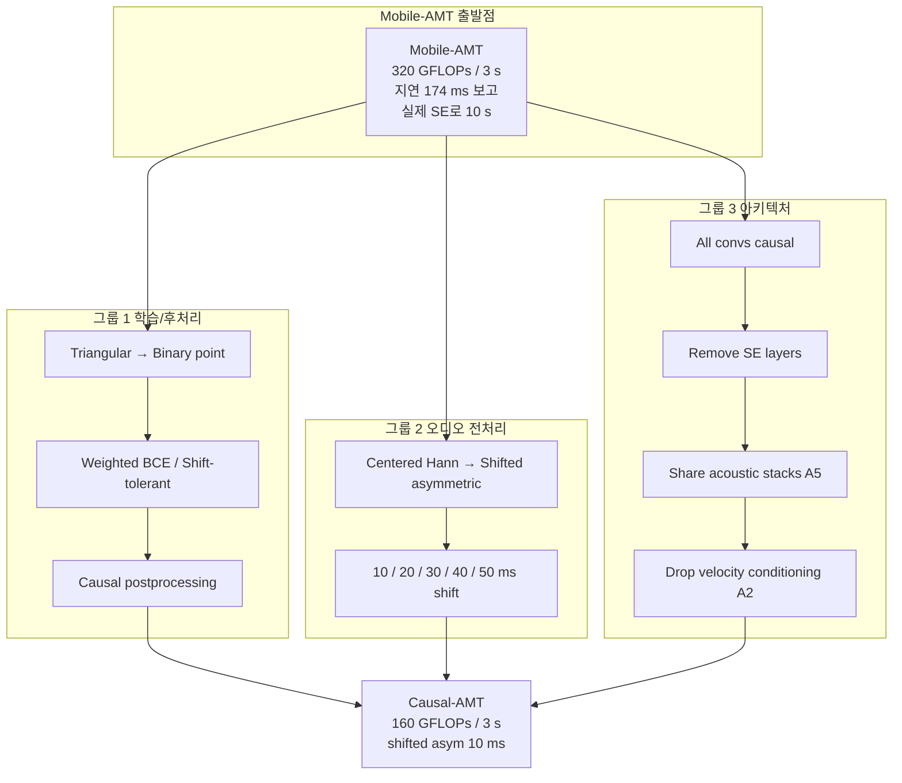

# Exploring System Adaptations for Minimum Latency Real-Time Piano Transcription — 분석 보고서

## 핵심 요약

본 논문은 자동 피아노 전사(automatic piano transcription, AMT) 분야의 실시간 성능을 다룬다. 출발점은 솔직한 지적이다 — **현재 SOTA "online" AMT의 지연이 128-320 ms인데, 실제 음악적 인터랙션이 요구하는 지연은 30 ms 이하**이다. 즉 "online"이 곧 "real-time"은 아니며, 자동 반주·디지털 악기 같은 응용에는 한 자릿수에서 30 ms대 지연이 필요하다. 저자들은 이 격차를 좁히기 위해 현재 SOTA online AMT인 Mobile-AMT(Kusaka-Maezawa, EUSIPCO 2024)를 출발점으로 삼아, 세 갈래로 시스템을 적응한다 — (1) **학습/후처리** 측에서 triangular regression target을 binary point target으로 바꾸고 weighted BCE/shift-tolerant loss를 시험, (2) **오디오 전처리** 측에서 STFT 윈도우를 시간축으로 shift하고 비대칭 윈도우 함수로 최근 샘플의 정보 손실을 줄임, (3) **모델 아키텍처** 측에서 모든 컨볼루션을 strict causal로 만들고 Squeeze-Excitation 층을 제거하며 convolutional stack을 target 간 공유. 평가는 MAESTRO v3에서 수행되며, 핵심 결과는 정직하다 — 10 ms 지연을 강제하면 정확도가 크게 떨어지지만, **30 ms 지연에서는 비-causal 베이스라인과 비슷한 정확도가 가능**하다. 저자들은 이를 baseline으로 오픈 소스화하여 분야의 후속 연구를 유도하는 것을 명시적 목표로 삼는다.

## 서지 정보와 접근 범위

- 저자: Patricia Hu¹, Silvan David Peter¹, Jan Schlüter¹, Gerhard Widmer¹·² (¹ JKU Institute of Computational Perception, ² LIT AI Lab Linz Institute of Technology)
- 출처: Proceedings of the 26th International Society for Music Information Retrieval Conference (ISMIR 2025), Daejeon, South Korea. arXiv:2509.07586v1, 2025년 9월 9일
- 라이선스: CC BY 4.0
- 펀딩: ERC Horizon 2020 grant agreement No. 101019375 "Whither Music?", LIT AI Lab(상부 오스트리아 주 지원)
- 본 분석은 PDF 추출 본문(532행) 직접 정독에 기반한다. 코드 공개는 본문에 명시되어 있으며 후속 연구를 위한 baseline 제공이 명시적 기여.
- 같은 그룹(JKU)의 자매 논문 — Peter-Hu-Widmer SMC 2025(분석 11번, transcribe-then-track) — 와 모듈 단위로 결합 가능한 관계. 본 논문의 저자 첫 두 명(Hu, Peter)이 그쪽 논문의 1·2저자.

## 상세 요약

저자들의 핵심 진단은 두 가지 시간 척도를 명확히 구분하는 것이다. **Online AMT**는 input을 청크 단위로 받아 점진적으로 출력하는 시스템으로, 지연이 100-300 ms 수준이어도 "online"이라 부른다. **Real-time AMT**는 음악적 인터랙션이 끊김 없이 흘러갈 수 있는 지연(상한 30 ms, 가급적 10 ms 이하)을 요구한다. 이 격차의 출처는 알고리즘이 아니라 시스템 전체에 걸친 여러 지연 — audio buffering, preprocessing, model inference, postprocessing — 의 누적이며, real-time을 위해서는 모든 단계에서 strict causality(미래 정보 미사용)를 보장해야 한다.

저자들은 출발점을 Mobile-AMT[5]로 잡는다. Mobile-AMT는 Kong et al.[2]의 offline SOTA 모델을 MobileNet 블록과 depthwise-separable convolution으로 가볍게 만들고, 온라인 SOTA F1을 174 ms 지연에서 달성했다고 보고한 모델이다. 그러나 저자들은 그 안에 두 가지 causality 위반이 숨어 있음을 지적한다. 첫째, MobileNet의 Squeeze-Excitation(SE) 층은 spatial dimension 전체에 대한 global average pooling을 하므로 10 초 청크 내 미래 프레임을 본다 — 즉 실제 지연은 174 ms가 아니라 약 10 초다. 둘째, postprocessing이 triangular target의 max를 찾기 위해 lookahead를 요구한다. 본 논문은 이 두 가지를 정조준한다.

세 갈래 적응은 다음과 같다.

**그룹 1 — 학습 target과 후처리(섹션 4.1)**. Mobile-AMT의 regression target은 onset 시각 주변에 삼각형으로 펼쳐져 있어 sub-frame 해상도를 얻는 대가로 lookahead가 필수다. 저자들은 이를 binary point target(annotation에 가장 가까운 한 프레임만 1)으로 바꾸고, 클래스 불균형에 대응해 양성 라벨에 가중치 10을 곱한 weighted BCE(TP3)와 ±1 프레임 shift-tolerant BCE(TP4·TP5)를 시험한다. 후처리도 strict causal로 다시 짠다 — 현재 프레임 활성화가 임계값을 넘고 직전 프레임은 못 넘었을 때만 onset을 기록한다. Table 1 결과 정리: 10 ms tolerance에서 binary classification(TP2, threshold 0.45)이 25.21·triangular regression(TP1) 대비 25.40으로 비슷하거나 더 높음. shift-tolerant loss(TP4)는 27.24로 가장 강하지만 strict causal 모델에서는 systematic delay를 일으킬 수 있어 본 논문 최종 모델에서 채택하지 않는다.

**그룹 2 — 오디오 전처리(섹션 4.2)**. Mobile-AMT는 2048 샘플(128 ms) Hann 윈도우를 예측 시점에 중앙 정렬한다. 즉 강한 causal 모델이라 해도 STFT 자체가 64 ms의 lookahead를 요구한다. 저자들은 윈도우를 reference point에서 n_s 샘플만 미래로 두는 비대칭 형태로 옮기고(예: n_s=160 = 10 ms 지연), Hann이 경계 정보를 강하게 감쇠시키는 점을 보완하기 위해 양쪽이 다른 길이로 tapering되는 비대칭 윈도우 함수를 도입한다. Table 2 결과: 10 ms shift Hann(H2)은 거의 0 점에 무너지지만, 비대칭 윈도우 30 ms shift(T3)에서 27.61로 비-causal 베이스라인과 비슷한 수준 회복. 결론은 명료하다 — **strict 10 ms 지연은 가능하지만 정확도 손실이 크고, 30 ms 지연에서는 비-causal 베이스라인 수준 회복 가능**.

**그룹 3 — 모델 아키텍처(섹션 4.3)**. 모든 컨볼루션을 causal로 변경(receptive field 9 프레임이 과거 8 + 현재 1로 비대칭), MobileNet V3 블록의 SE 층 제거, Mobile-AMT의 세 acoustic stack(onset/frame/velocity)을 어디까지 공유할 수 있는지 시험(A3-A5). Table 3 결과: 별도 offset stack 추가는 도움 안 됨(A1), velocity conditioning을 onset 예측에서 제거하면 오히려 정확도 향상(A2: 25.77), convolutional stack을 모든 target에 걸쳐 공유해도 성능 유지(A5).

최종 비교(Table 4)는 Mobile-AMT(non-causal)와 본 논문 Causal-AMT를 같은 데이터에서 직접 비교한다. 10 ms tolerance에서 Causal-AMT는 onset F1 31.55로 Mobile-AMT(18.26) 대비 우위, 30 ms tolerance에서는 Mobile-AMT가 66.80로 Causal-AMT(37.38)를 크게 앞섬. 즉 Causal-AMT는 **stricter timing tolerance에서 더 정밀**하지만 일반 metric에서는 lookahead를 가진 Mobile-AMT에 미치지 못함. 저자들은 이 trade-off를 솔직하게 보고하고, 본 baseline을 출발점 삼아 후속 연구를 유도하는 것이 본 논문의 핵심 기여라고 명시한다(섹션 5).

## 방법론과 데이터

- **Reference 모델**: Mobile-AMT[5] — depthwise-separable conv + MobileNet V3 + SE + 3 acoustic stacks(onset/frame/velocity).
- **본 논문 Causal-AMT 최종 구성**: shifted asymmetric STFT window(160 샘플 = 10 ms 지연, T1 in 4.2), velocity conditioning 제거(A2), 모든 conv layer를 모든 target에 걸쳐 공유(A5), causal postprocessing.
- **학습 데이터**: MAESTRO v3.0[1]. 16 kHz mono. 3 s segments. Hann window 2048 / hop 160. 229-bin mel spectrogram.
- **Loss**: BCE for onset/offset/frame, MSE for velocity. weighted (factor 10 for positive labels) 또는 shift-tolerant 시험.
- **학습 시간**: 대부분 실험 500 epochs(약 30k updates). 최종 비교는 2000 epochs.
- **평가 메트릭**: note onset F1, note onset+offset F1, mir_eval. tolerance 10/20/30 ms(real-time 적합성을 위해 통상 50 ms 대신 strict).
- **하드웨어**: 본문에 inference time 측정 환경은 명시되지 않음. 논문의 초점은 알고리즘적 지연이며 wall-clock 처리 시간 분석은 future work로 남김(섹션 5).

| 실험 | tol 10 ms | tol 20 ms | tol 30 ms | 비고 |
|---|---|---|---|---|
| TP1 (triangular regression, threshold 0.45) | 9.58 | 25.80 | 47.44 | 비-causal 출발점 |
| TP2 (binary point, threshold 0.45) | 29.84 | 47.64 | 50.28 | binary 전환의 효과 |
| TP4 (shift-tolerant ±10 ms, threshold 0.45) | 27.24 | 55.49 | 64.95 | causal 모델에 부적합 |
| H1 (centered Hann + causal model) | 17.43 | 34.65 | 39.86 | 그룹 2 출발점 |
| T3 (asym 30 ms shift) | 27.61 | 37.91 | 39.43 | shift 30 ms 회복 |
| T1 (asym 10 ms shift) | 22.25 | 25.21 | 25.84 | strict 10 ms 비용 |
| A2 (velocity conditioning 제거) | 25.77 | 30.66 | 31.79 | 그룹 3 핵심 |
| A5 (모든 conv 공유) | 19.44 | 22.39 | 23.12 | 모델 크기 절반 |
| **Causal-AMT 최종** | 31.55 | 36.70 | 37.38 | precision 위주 |
| **Mobile-AMT (Reference)** | 18.26 | 48.52 | 66.80 | 비-causal lookahead 활용 |

(*Table 1-4 발췌. Table 4의 final 결과는 onset F1만 보고.*)

## 비판적 평가

**강점**

- **격차의 명확한 측정**: "online ≠ real-time"이라는 분야 통념의 무비판적 사용을 정조준한다. 30 ms는 networked ensemble의 표준이자 percussive 디지털 악기에서 perception threshold이며, 10 ms는 imperceptible의 목표라는 다층적 근거를 인용해 30 ms 기준의 정당성을 보강.
- **Mobile-AMT의 숨은 SE 지연 폭로**: Mobile-AMT가 보고한 174 ms 지연이 사실 SE 층의 10 초 lookahead로 인해 더 큰 실제 지연을 가짐을 지적. 이 류의 "보고된 지연 ≠ 실제 지연" 진단은 AMT 평가의 정직성을 끌어올린다.
- **세 갈래 ablation의 체계성**: 학습/후처리, 전처리, 아키텍처를 각각 독립 실험한 뒤 마지막에 결합. 어느 단계가 정확도를 가장 손해 보는지(저자 결론: shifted window + causal convolutions)를 분명히 가려냄.
- **상한과 하한의 동시 보고**: Mobile-AMT vs Causal-AMT를 final comparison에서 직접 비교해 trade-off를 노출. 분야가 후속 연구로 어디를 메워야 하는지 분명한 baseline 제공.
- **오픈 소스화 명시**: 본 시스템을 baseline으로 공개해 후속 연구의 출발점이 되도록 의도. JKU의 Matchmaker 라이브러리(분석 10번)·transcribe-then-track 시스템(분석 11번)과 자연스럽게 결합 가능.

**약점/한계**

- **MAESTRO 단일 평가**: MAESTRO는 깔끔한 Disklavier 녹음으로 in-the-wild 강건성을 평가하지 못한다. Mobile-AMT가 강조한 "다양한 acoustic distribution shift" 강건성은 본 논문에서 평가에서 빠져 있다 — 저자들도 이를 future work로 명시.
- **wall-clock 미측정**: 알고리즘적 지연(STFT shift + causal conv)은 정밀히 다루지만, 실제 inference time에 대한 측정이 없다. 30 ms 알고리즘적 지연 + 모델 inference + OS scheduling이 실제 30 ms 안에 들어가는지는 검증되지 않음.
- **F1 중심 평가**: precision/recall도 보고하지만 F1이 주 지표. 페이지 터너·자동 반주에서는 false positive(과잉 검출)와 false negative(누락 검출)이 응용에 미치는 영향이 다르므로 응용별 미세 분석이 필요할 수 있다.
- **shift-tolerant loss 채택 안 함**: TP4·TP5가 가장 좋은 정확도를 보이지만 strict causal 모델에서 systematic delay 문제가 있어 최종 모델에 들어가지 못함. 이 trade-off에 대한 보다 정량적 분석이 있었으면 더 나았다.
- **단일 윈도우 함수**: 비대칭 윈도우 함수의 구체적 설계(어떤 함수 형태인가)가 본문에서 다소 간략. 후속 연구에서 윈도우 설계와 spectral leakage(20 dB 증가) 사이의 더 정밀한 trade-off 분석 가능.

## 선행연구와 비교

| 인용 | 연도 | 방법 | 핵심 발견 | 본 논문과의 차이 |
|---|---|---|---|---|
| Hawthorne et al. (Onsets and Frames) [1] | 2018 | onset + frame dual head CNN | 피아노 AMT의 표준 베이스라인 | 본 논문의 학습 데이터(MAESTRO) 출처 |
| Kong et al. [2] | 2021 | high-resolution offline AMT, regressing onset/offset times | offline SOTA, triangular regression target 도입 | Mobile-AMT의 출발점이자 본 논문이 우회한 표적 |
| Sigtia-Benetos-Dixon [3] | 2016 | end-to-end neural piano AMT | RNN 기반 polyphonic AMT 초기 | 분야 출발점 |
| Fernandez (Onsets and Velocities) [6] | 2023 | conv-only AMT, onset+velocity만 | 4-9 초 지연으로 단순 구조 추구 | 본 논문의 비교 대상 중 가장 간단한 출발점 |
| Kwon-Jeong-Nam [7,14,15] | 2020-2024 | autoregressive multi-state note model | 128-320 ms 지연 online AMT | 본 논문의 SOTA 비교 대상이자 분석 11번의 채택 모델 |
| Kusaka-Maezawa (Mobile-AMT) [5] | 2024 | depthwise-separable conv + SE + augmentation | 174 ms 지연 in-the-wild 강건성 | 본 논문의 reference이자 직접 적응 대상 |
| Howard et al. (MobileNet V3) [16] | 2019 | 모바일 효율 CNN | depthwise + SE 도입 | Mobile-AMT의 백본 |
| Foscarin-Schlüter-Widmer (Beat this!) [19] | 2024 | DBN-free beat tracking, shift-tolerant loss | beat tracking에 shift-tolerant loss 도입 | 본 논문이 AMT에 차용 |
| Bittner et al. (Basic Pitch) [18] | 2022 | 가벼운 instrument-agnostic 다중 음고 추정 | 작은 모델 + multipitch | 본 논문이 weighted BCE의 참고 |
| Wessel-Wright [8], McPherson et al. [9] | 2002, 2016 | 디지털 악기 지연 perception 연구 | 10 ms 한계 도출 | 본 논문이 30 ms 기준의 정당성 근거 |
| Lakiotakis et al., Chew et al. [11-13] | 2003-2023 | networked music performance | 20-30 ms ensemble 지연 한계 | 본 논문이 30 ms 기준의 또 다른 근거 |

## 실무적 함의와 응용

- **transcribe-then-track의 저지연 프런트엔드**: 분석 11번(Peter-Hu-Widmer)의 174 ms 지연이 30 ms 수준으로 떨어지면 자동 반주가 미래 예측 없이도 가능해진다. 본 논문은 그 모듈의 저지연 버전을 제공.
- **자동 페이지 터너**: 페이지 터너에는 174 ms도 충분히 작으므로 본 논문이 주는 지연 단축은 직접 이득이 작지만, 정확도 단축의 ablation 결과(어디에서 정확도가 손해 나는지)는 응용 설계에 유용.
- **디지털 악기 인터랙션**: 30 ms 지연 + 합리적 정확도가 있으면 디지털 피아노 입력을 음표 시퀀스로 즉시 변환하는 류의 응용(연습 보조, 즉시 자동 채보 메모) 가능.
- **연구 baseline**: 후속 연구가 "10 ms 지연 + 비-causal 베이스라인 수준 정확도"를 새 목표로 잡을 수 있는 출발점 제공. 본 논문의 oss baseline은 이 격차를 좁히는 후속 연구의 비교 기준.

## 후속 연구와 핵심 참고문헌

핵심 참고문헌

1. **Kusaka-Maezawa (Mobile-AMT, EUSIPCO 2024)** — 본 논문의 직접 출발점.
2. **Hawthorne et al. (MAESTRO, ICLR 2019)** — 학습 데이터.
3. **Kong et al. (high-resolution AMT, 2021)** — Mobile-AMT의 원전.
4. **Foscarin-Schlüter-Widmer (Beat this!, 2024)** — shift-tolerant loss 차용 출처.
5. **Wessel-Wright, McPherson et al.** — 10-30 ms 지연 기준의 음악적 정당화 근거.
6. **Peter-Hu-Widmer (transcribe-then-track, SMC 2025, 분석 11번)** — 본 논문 AMT의 응용 시나리오.

후속 방향(저자 + 분석자 종합)

- **wall-clock 측정 + 하드웨어별 평가**: 알고리즘적 지연 30 ms를 실제 inference + OS overhead까지 포함한 진짜 30 ms로 압박. 저자가 future work로 명시.
- **윈도우 함수 설계의 더 깊은 탐색**: 비대칭 윈도우의 spectral leakage(20 dB)와 정확도 사이의 정량 trade-off, learnable window function 가능성.
- **in-the-wild 평가 추가**: Mobile-AMT의 augmentation 스키마를 본 시스템에 적용하고 SLAKH·MAPS 같은 비-MAESTRO 벤치에서 평가. 저자가 future work로 명시.
- **transcribe-then-track 직접 결합**: 분석 11번의 시스템에 본 모듈을 끼워 통합 평가. 174 ms → 30 ms 지연 단축이 자동 반주 성능에 미치는 영향 정량화.
- **Causal-AMT의 학습 향상**: 본 논문은 단순 BCE/shift-tolerant loss만 시험. self-supervised pre-training, multi-task with frame-level alignment 등이 정확도 회복에 유효할 가능성.
- **비-피아노 확장**: 본 논문은 피아노 한정. Bittner et al.의 instrument-agnostic 사상과 결합해 violin/cello/guitar 저지연 AMT로 확장하면 본 프로젝트의 페이지 터너 응용에 결정적 모듈.
