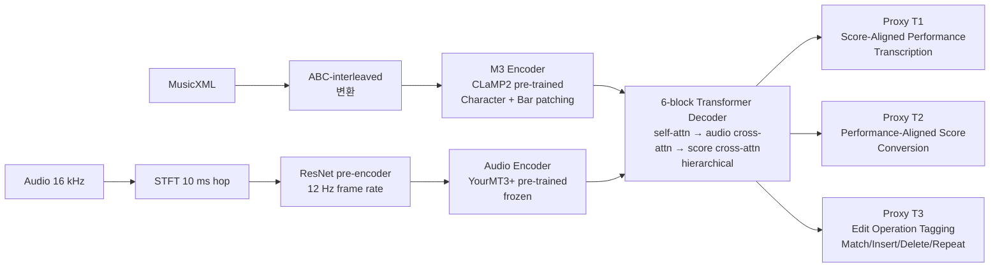

# RUMAA: Repeat-Aware Unified Music Audio Analysis for Score-Performance Alignment, Transcription, and Mistake Detection — 분석 보고서

## 핵심 요약

본 논문은 분야의 세 가지 인접 task — score-to-performance alignment, score-informed transcription, mistake detection — 가 서로의 답에서 정보를 끌어올 수 있는 상호의존 관계임에도 그동안 분리되어 다뤄져 왔다는 관찰에서 출발한다. 저자들은 이 세 task를 **하나의 transformer로 통합**한 RUMAA(ru:ma:)를 제안하며, 두 가지 구조적 결정이 핵심이다. 첫째, 입력 측에 **pre-trained score encoder(CLaMP2의 M3, ABC notation 기반 character-level + bar-level patching)와 pre-trained audio encoder(YourMT3+ 기반)를 결합**해 multimodal 정렬을 native로 가능하게 한다. 둘째, **MusicXML의 repeat 기호를 직접 처리**한다 — 기존 MIDI 기반 정렬기들이 사람이 미리 풀어 둔 repeat-unfolded score에 의존했다면, RUMAA는 ABC-interleaved 표상으로 repeat 기호를 그대로 받아 학습한다. 6-block transformer decoder는 hierarchical cross-attention(audio → score)로 self-attention 후 audio·score 컨텍스트에 차례로 조건화되며, **세 가지 proxy task**(T1: Score-Aligned Performance Transcription, T2: Performance-Aligned Score Conversion, T3: Edit Operation Tagging)에 대응하는 tri-stream parallel decoding으로 한 번에 세 task의 출력을 생성한다. 결과는 인상적이다 — 비-반복 악보에서 F_align 98.4(SOTA HMM 99.0과 1% 미만 차이), **반복이 있는 악보에서는 RUMAA 98.4 vs 베이스라인 12.7-36.4(최대 87% drop)**. 한계는 명확하다 — 약 1 분 청크 처리, 피아노 솔로 한정, 실시간 미지원. 그러나 분야가 transformer + native MusicXML 결합으로 진입할 수 있음을 정량으로 처음 보여 준 점에서 분야의 다음 10년을 가르는 이정표로 평가된다.

## 서지 정보와 접근 범위

- 저자: Sungkyun Chang, Simon Dixon, Emmanouil Benetos (모두 Centre for Digital Music, Queen Mary University of London)
- 출처: 2025 IEEE Workshop on Applications of Signal Processing to Audio and Acoustics (WASPAA 2025). arXiv:2507.12175v1, 2025년 7월 16일
- 라이선스: 본문에 명시되지 않음 (arXiv 기본 라이선스)
- 펀딩: AI Industrial Convergence Cluster (한국 과학기술정보통신부 + 광주광역시)
- 본 분석은 PDF 추출 본문(397행) 직접 정독에 기반한다.
- 본 논문 1저자 Chang은 YourMT3+(MLSP 2024) 저자이기도 하며, 본 논문이 그 audio encoder를 pre-trained 모듈로 직접 차용. 또한 RUMAA가 비교 대상으로 삼는 GlueNote(Peter-Widmer ISMIR 2024)와 hDTW+sym(Peter et al. TISMIR 2023)의 저자 Peter는 본 프로젝트의 분석 11번(transcribe-then-track) 1저자.

## 상세 요약

저자들의 출발 진단은 두 가지다. 첫째, **세 task의 상호의존성**: 정렬은 어떤 음표가 매치/누락/추가됐는지를 드러내 mistake detection의 신호가 되고, transcription은 정렬을 활용해 audio→symbol 변환의 정확도를 높인다. 둘째, **MIDI 기반 표상의 한계**: MIDI에는 repeat·D.S./D.C./Coda 같은 기호 구조가 없어, 기존 정렬 방법은 사람이 미리 풀어 둔 repeat-unfolded score에 의존해야 했다. JumpDTW(Fremerey-Müller-Clausen 2010)와 후속 Shan-Tsai(2020)가 image-domain score에서 repeat을 다루는 시도를 했지만, 일반화가 어렵고 학습된 표상을 활용하지 못했다.

RUMAA의 시스템 구조는 세 부분으로 나뉜다(Fig. 2).

**Score Encoder(섹션 4.1)**. MusicXML을 ABC notation으로 변환한 뒤(인터리브 형태로 마디당 최대 64자), CLaMP2의 사전 학습 M3 encoder를 사용한다. Character-level tokenization + bar-level patching으로 각 마디를 768-dim bar-level token 하나로 패킹한다. 12-block self-attention transformer가 long-range 음악적 구조를 보존한 채 768-dim 표상을 출력하고, 이를 1024-dim으로 선형 투영해 decoder로 보낸다. 이 표상은 dynamics·repeat·key·time signature·pedal 같은 모든 score 요소를 보존한다.

**Audio Encoder(섹션 4.2)**. 16 kHz mono를 STFT(2048 window, 10 ms hop)로 변환한 뒤, 3개 ResNet block의 pre-encoder가 12 Hz frame rate의 1024-dim feature를 생성한다(긴 시퀀스 학습의 메모리 병목 해결). 12-layer self-attention transformer가 YourMT3+(Chang et al. MLSP 2024)에서 가져온 pre-trained 가중치로 초기화되며, RUMAA에서는 frozen으로 사용된다. 단 세 가지 수정이 가해진다 — 낮은 frame rate 적응, flash attention 재구현, MIDI velocity 토큰을 예측하도록 사전 학습.

**Decoder(섹션 4.3)**. 6-block transformer로, **hierarchical cross-attention** 구조가 핵심이다. 각 block은 self-attention 후 audio cross-attention을 거치고, 그 다음 score cross-attention을 거친다 — 이 순서는 "transcribe first, then align to score"라는 인지적 절차를 그대로 모사한다. 이 구조가 단순 concatenation보다 1% 더 정확함을 ablation으로 보고. 출력 측은 1024-dim latent를 셋으로 분할해 세 채널의 multi-sequence LM head에서 parallel decoding한다.

세 proxy task는 다음과 같다(Fig. 1, Table 1).

T1(Score-Aligned Performance Transcription)은 연주 측 토큰 — onset time(62.5 ms grid), micro adjustment(6.25 ms), velocity, duration, pitch — 을 출력. T2(Performance-Aligned Score Conversion)은 score 측 토큰 — bar index, position(40-tick 32분음 grid), micro adjustment, duration, pitch, time signature — 을 동일 시간선으로 출력. T3(Edit Operation Tagging)은 매 토큰 자리에서 Match/Insert/Delete/Repeat 한 종류를 출력. 셋이 한 자리에서 동기적으로 생성되므로 — 즉 T1의 4번째 토큰이 T2의 4번째 토큰과 정렬되도록 학습되므로 — alignment, transcription, mistake detection 모두를 한 번의 forward pass로 얻는다.

학습 데이터(섹션 5.1)는 (n)ASAP의 222 MusicXML + 519 piano performances. 20 movement·50 recording을 6명의 작곡가(Bach, Beethoven, Chopin, Haydn, Liszt, Schubert)에서 따로 떼어 test set으로. 1분 audio segment를 무작위 샘플링하고 그에 해당하는 50 마디 score를 추출. 두 가지 augmentation 전략이 있다 — score-modulated(10% 음표를 ±5 semitone 또는 삭제로 변형, 5종)와 performance-modulated(Piano-SynMist + MIDI-DDSP, 5종)으로 데이터를 10배 확장. 반복 시뮬레이션을 위해 ABC 점수 중 20%에 임의 마디 반복 기호를 추가하고 audio도 함께 반복.

평가(섹션 6)는 세 task에서 모두 진행. Alignment는 revised Vienna(Gasser et al. 2023)의 piano dataset에서 note-level F_align(매치 = TP, 삽입/삭제 = TP, 미매치 예측 = FP, 미매치 GT = FN). Transcription은 (n)ASAP의 score-informed 모드와 MAESTRO의 score-free 모드에서 F_on, F_off-vel, MAE_vel. Mistake detection은 STPD(Benetos et al. 2012)에서 F_correct/extra/missed.

## 방법론과 데이터

- **Score representation**: MusicXML → ABC-interleaved (마디당 최대 64자, 인터리브). repeat·dynamics·key·time signature·pedal 보존.
- **Score Encoder**: CLaMP2의 pre-trained M3 — character-level tokenizer + bar-level patching + 12-block self-attention. 출력 768-dim → 1024-dim 선형 투영. trainable.
- **Audio Encoder**: YourMT3+ pre-trained, 16 kHz mono → STFT(2048 window, 10 ms hop) → ResNet pre-encoder(12 Hz frame rate) → 12-layer self-attention → 1024-dim. frozen.
- **Decoder**: 6-block transformer, hierarchical cross-attention(self → audio → score), GatedFFN, TorchScale 기반.
- **Output**: tri-stream multi-sequence LM head(1024//3 = 약 341-dim씩). 세 채널을 병렬 autoregressive 생성.
- **Tokenization**: T(timing 62.5 ms grid, 0:32) + T.Reset(매 2초) + T.Micro(6.25 ms 조정) + Velocity(1:32, 4-unit) + Duration(0:48, 31.25/62.5/125 ms) + Pitch(21:109) + Bar/Pos/Pos.Micro(score 측) + Match/Insert/Delete/Repeat(alignment 측). CP-Words(Hsiao 2021) 확장.
- **Training**: AdamW-Scale(YourMT3+에서 차용) + cosine schedule with warm-up. lr [1e-2, 1e-5]. 약 2일, 3 × A6000 또는 H100.
- **Test sets**: alignment — Vienna(Gasser 2023, repeat 포함 두 곡 K331과 D783) ; score-informed transcription — (n)ASAP held-out ; score-free transcription — MAESTRO ; mistake detection — STPD(Benetos 2012).
- **Metrics**: alignment F_align(±50 ms tolerance), transcription F_on/F_off-vel/MAE_vel, mistake detection F_correct/F_extra/F_missed + 각 Acc.

| Task | 비교 모델 | Metric | RUMAA | Best baseline | drop on repeat |
|---|---|---|---|---|---|
| Alignment (no repeat) | Nakamura HMM | F_align | 98.4 | **99.0** | — |
| Alignment (with repeat) | Nakamura HMM | F_align | **98.4** | 36.4 | RUMAA 0%, baseline -63% |
| Alignment (with repeat) | hDTW+sym (Peter 2023) | F_align | **98.4** | 28.2 | RUMAA 0%, baseline -71% |
| Alignment (with repeat) | GlueNote (Peter-Widmer 2024) | F_align | **98.4** | 12.7 | RUMAA 0%, baseline -86% |
| Score-informed transcription (n)ASAP | RUMAA | F_on / F_off-vel | **99.1** / **93.6** | — | — |
| Mistake detection STPD | Benetos 2012 | F_on | **92.8** | 91.1 | — |
| Mistake detection STPD (correct/extra/missed) | Wang 2017, Ewert 2016 | F | **99.5/89.2/95.3** | 99.3/77.0/94.5 | — |

(*Table 2-4 발췌. F_align 100점 만점 기준.*)

재현성: 본문에 코드 공개 명시는 없으나 모든 모듈(M3, YourMT3+, TorchScale)이 공개 라이브러리. 학습 데이터((n)ASAP, Vienna, STPD, MAESTRO)도 공개. 학습 augmentation 도구(Piano-SynMist, MIDI-DDSP)도 공개.

## 비판적 평가

**강점**

- **Repeat 처리의 해결**: MIDI 기반 정렬기들이 86% 정확도 drop을 보이는 반복 악보에서 RUMAA가 0% drop(98.4 유지)을 달성. 분야의 오랜 한계를 정량적으로 정면 돌파.
- **세 task 통합**: alignment + transcription + mistake detection을 한 모델 한 forward pass로. 세 task 각각의 SOTA에 근접하면서 세 task의 상호의존성을 활용.
- **Native MusicXML 처리**: ABC-interleaved 표상은 사람이 읽는 악보 그대로의 의미 — repeat, dynamics, key, time signature, pedal — 를 보존. MIDI 기반 시스템이 우회할 수밖에 없던 의미 정보를 직접 활용.
- **사전 학습 활용의 효과**: M3와 YourMT3+ 두 pre-trained encoder를 그대로 가져와 사용. 이 합리적 모듈 조합이 large 모델 from scratch보다 더 정확.
- **Hierarchical cross-attention의 ablation**: simple concatenation보다 1% 향상이라는 정량 근거. 단순한 design choice가 아니라 인지적으로도 자연스러운 순서(transcribe first, then align)를 알고리즘적으로 정당화.
- **Tri-stream parallel decoding**: 세 task에 대응하는 채널을 한 자리에서 동시 생성. CP-Words의 확장으로 시퀀스 길이를 3× 줄임.

**약점/한계**

- **약 1분 청크 한정**: cross-chunk memory limit으로 1분 이상 audio에서 정렬과 mistake detection 정확도가 급락. 30분짜리 콘서트 녹음에는 후처리 필요. 저자도 future work로 명시.
- **피아노 솔로 한정**: pre-training은 multi-instrument(YourMT3+)이지만 fine-tuning과 평가가 모두 (n)ASAP/Vienna/STPD/MAESTRO 솔로 피아노. 비-피아노 일반화는 별도 작업.
- **실시간 미지원**: 본 논문의 모든 모듈은 offline 처리. score following 응용에는 직접 사용 불가. 분석 11번의 transcribe-then-track 노선과 분명히 다른 트랙 — 분석 11번이 실시간 정확도 plateau 돌파라면 본 논문은 오프라인 정렬·전사·실수 검출 통합.
- **F_off-vel 약점**: score-free 모드에서 RUMAA가 76.0 / 75.8로 hFT-T(89.5)·IS-CRF(93.0)에 약 18% 뒤짐. 이를 multi-instrument pre-training의 offset annotation 일관성 문제 탓으로 명시.
- **Vienna repeat 평가의 작은 표본**: "with repeat" 평가가 K331, D783 두 곡이라는 작은 표본. 통계적 신뢰 구간이 좁지 않을 수 있다.
- **Augmentation의 합성성**: score-modulated와 performance-modulated 모두 합성 변형. 실제 인간 연주자 실수의 분포와 일치하는지는 검증되지 않음.
- **GlueNote 비교의 공정성**: GlueNote는 symbolic-only model로, audio-symbolic 정렬에 적용할 때 외부 transcription을 거치는 구조. 본 논문이 그 결합(AMT + GlueNote)을 baseline으로 보고하지만, GlueNote 자체의 강점(symbolic 정렬)을 직접 비교하기에는 unfair할 수 있다.

## 선행연구와 비교

| 인용 | 연도 | 방법 | 핵심 발견 | 본 논문과의 차이 |
|---|---|---|---|---|
| Müller [5] | 2015 | score-performance alignment 종합 | 분야 textbook | 본 논문이 분류 체계로 차용 |
| Nakamura HMM [3] | 2017 | symbolic alignment + post-processing | 비-반복 SOTA(F_align 99.0) | repeat에서 36.4로 drop. RUMAA가 한 점 차이로 비-반복 추격, repeat에서 우월 |
| Peter et al. (n)ASAP TISMIR [10] | 2023 | hDTW+sym, 자동 note-level alignment | (n)ASAP 데이터셋 + 정렬 방법 | RUMAA의 학습 데이터 출처이자 비교 대상. 같은 저자가 이 프로젝트의 분석 11번도 작성 |
| Peter-Widmer (TheGlueNote) [14] | 2024 | learned representation for note alignment | 심볼 정렬용 transformer | RUMAA가 audio-symbolic 정렬 가능, 반복 처리 |
| Fremerey-Müller-Clausen (JumpDTW) [11] | 2010 | image-domain score + DTW with jumps | repeat 처리 첫 시도 | RUMAA가 native symbolic + 학습 기반 |
| Shan-Tsai [12] | 2020 | improved repeat handling for image-audio sync | image-domain repeat | JLTR(분석 9번)과 비교 — 자동 처리 33% vs 사람 라벨링 82% — 이번 논문은 자동 98% |
| Wang-Ewert-Dixon [16] | 2017 | NMF dictionary learning, missing/extra note detection | mistake detection NMF 출발점 | RUMAA가 transformer로 통합 |
| Benetos-Klapuri-Dixon (STPD) [4] | 2012 | score-informed transcription for piano tutoring | mistake detection 데이터셋 | 본 논문 평가 데이터 |
| Hawthorne et al. (MAESTRO) [30] | 2019 | factorized piano modeling + dataset | 학습 데이터 표준 | 본 논문의 score-free 평가 |
| Chang et al. (YourMT3+) [22] | 2024 | multi-instrument transcription + cross-dataset stem aug | enhanced transformer AMT | RUMAA의 audio encoder 출처(같은 1저자) |
| Wu et al. (CLaMP2) [25] | 2024 | multimodal MIR across 101 languages | M3 score encoder | RUMAA의 score encoder 출처 |
| Hsiao et al. (CP-Words) [17] | 2021 | compound word transformer | 음악 토큰화 | RUMAA가 tri-stream으로 확장 |
| Gardner et al. (MT3) [18] | 2021 | multi-task multi-track transcription | transformer AMT | RUMAA가 score-informed로 확장 |
| Toyama et al. (hFT-T) [37] | 2023 | hierarchical frequency-time transformer | piano AMT 강한 비교 대상 | RUMAA의 score-free 평가 비교 |

## 실무적 함의와 응용

- **오프라인 데이터 큐레이션**: 분야가 그동안 의존해 온 "사람이 미리 unfold한 score"가 더 이상 필요하지 않음. (n)ASAP·MAESTRO 같은 큐레이션 데이터 외에도, 야생 IMSLP 악보 + 야생 녹음을 native MusicXML로 받아 정렬할 수 있는 가능성. JLTR(분석 9번)이 사람의 6초 라벨링으로 풀던 문제를 학습으로 해결.
- **자동 채보 + 정렬 + 실수 피드백 통합 도구**: 음악 학습용 응용에서 한 모델로 "당신이 어디를 연주 중이고, 어떤 음표를 정확히 쳤고, 어디에서 어떤 실수를 했는지"를 한 번에 알려줄 수 있음.
- **page turner 응용에서 reference data 구축**: 본 논문의 alignment 결과를 그대로 사용하기는 어렵지만(offline + 1분 한정), 실시간 score follower의 학습 데이터로 활용 가능. 사람이 라벨링한 alignment 데이터의 대량 확보를 자동화.
- **multimodal MIR baseline**: 분야가 MIDI-only 평가에서 벗어나 audio + MusicXML native 평가로 이동하는 표준의 출발점.

## 후속 연구와 핵심 참고문헌

핵심 참고문헌

1. **Wu et al. (CLaMP2, 2024)** — score encoder M3의 출처.
2. **Chang et al. (YourMT3+, MLSP 2024)** — audio encoder의 출처.
3. **Peter et al. ((n)ASAP TISMIR 2023)** — 학습 데이터 + 비교 대상.
4. **Nakamura-Yoshii-Katayose (HMM, ISMIR 2017)** — 비-반복 SOTA 비교 대상.
5. **Fremerey-Müller-Clausen (JumpDTW, ISMIR 2010), Shan-Tsai (ISMIR 2020)** — repeat 처리 선행 연구.
6. **Hsiao et al. (CP-Words, AAAI 2021)** — 토큰화 기법의 원전.
7. **Benetos-Klapuri-Dixon (STPD, EUSIPCO 2012)** — mistake detection 평가 데이터셋.

후속 방향(저자 + 분석자 종합)

- **Memory-augmented architecture**: 1분 청크 한계를 넘어 30분 콘서트 녹음 처리. Neural Turing Machine[40]·LongNet[29] 등 long-context 기법 적용.
- **Multi-instrument 확장**: 본 논문의 pre-training은 multi-instrument이지만 fine-tuning은 피아노. violin·cello·guitar로 확장하면 본 프로젝트의 페이지 터너에 직접 활용 가능.
- **Online RUMAA**: 본 논문은 offline. autoregressive decoder의 streaming 변형이 가능한지가 분야 핵심 질문 — 가능하다면 분석 11번의 transcribe-then-track와 본 논문의 통합 디코더가 결합한 다음 세대 시스템 가능.
- **JLTR과의 비교**: 본 논문은 자동 repeat 처리, JLTR(분석 9번)은 인간-기계 협업으로 같은 문제에 접근. 두 노선의 정확도 vs 비용 trade-off 비교가 분야의 다음 흥미로운 질문.
- **In-the-wild 강건성**: clean studio recordings을 넘어 holdout instrument distribution에서의 강건성. Mobile-AMT(분석 12번 reference)의 acoustic shift augmentation 사상과 결합 가능.
- **Diffusion 기반 정렬과의 비교**: 분야가 generation은 diffusion으로 가고 있으나 alignment는 transformer가 SOTA — 두 노선의 trade-off가 본 논문 이후 분야의 다음 큰 비교 축.
- **응용 데모**: 본 시스템을 turn-key 앱(연습 피드백, 자동 채보, mistake report)으로 패키징. CLaMP2·YourMT3+가 Hugging Face에 공개되어 있어 통합 데모의 진입 장벽이 낮음.
